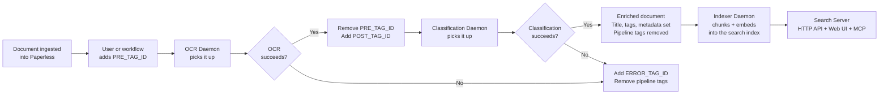

# AGENTS.md — Paperless-AI Codebase Guide

AI-powered OCR, document classification, and semantic search for [Paperless-ngx](https://github.com/paperless-ngx/paperless-ngx). Python 3.11, OpenAI/Ollama LLMs, a tag-driven processing pipeline, and two SQLite databases (a search index and an application database). The web UI is a React/TypeScript SPA under `web/`.

This file orients an agent quickly: what the system does, where each piece lives, and where to look for common tasks. Every path below has been checked against the current tree — trust it.

---

## Documentation Index

| Document | What it covers |
|:---|:---|
| [Architecture](docs/architecture.md) | Package structure, daemon lifecycle, concurrency model, thread safety, state management, project tree |
| [OCR Pipeline](docs/ocr-pipeline.md) | OCR daemon flow, image conversion, parallel page processing, vision model integration, blank-page detection, text assembly, quality gates |
| [Classification Pipeline](docs/classification-pipeline.md) | Classification daemon flow, content truncation, taxonomy cache, LLM classification, parameter compatibility, metadata application, tag enrichment |
| [Store](docs/store.md) | Search-index schema, WAL mode, StoreWriter/StoreReader split, migration runner, embedding-model rebuild, corruption recovery |
| [Indexer](docs/indexer.md) | Reconciliation daemon: incremental sync via modified watermark, content-hash gate, deletion sweep, failed-document retry/dead-letter, flock single-writer guard |
| [Search](docs/search.md) | Search server: bounded agentic pipeline (plan → hybrid retrieve → judge → synthesise), RRF fusion, HTTP JSON API, React Web UI, MCP endpoint, authentication |
| [Configuration](docs/configuration.md) | All environment variables by category, pipeline tag state diagram, performance tuning |
| [Deployment](docs/deployment.md) | Docker run/compose examples, tag setup guide, multi-instance deployments, privacy & data handling |
| [Development](docs/development.md) | Local setup, running tests, test organisation, adding tests, CI/CD pipeline, Docker image build |
| [Resilience](docs/resilience.md) | Retry strategy, model fallback chains, error isolation, processing locks, stale-lock recovery, graceful shutdown |
| [DESIGN.md](DESIGN.md) | The frontend design system: tokens, component library, screen patterns |
| [CODE_GUIDELINES.md](CODE_GUIDELINES.md) | The house coding rules. Section numbers (e.g. §3.2) are cited throughout the source |

---

## Architecture Overview

The product ships as one Docker image that can run as **four separate processes**, each launched by its own CLI command:

1. **OCR Daemon** (`src/ocr/`, CLI `paperless-ai`) — Downloads documents, converts pages to images, transcribes via a vision LLM, writes the text back to Paperless.
2. **Classification Daemon** (`src/classifier/`, CLI `paperless-classifier-daemon`) — Reads the OCR'd text, classifies it via an LLM, and applies metadata: title, correspondent, document type, tags, date, language, person.
3. **Indexer Daemon** (`src/indexer/`, CLI `paperless-indexer-daemon`) — Reconciles Paperless against the search index: chunks the text, embeds it with the configured embedding provider (OpenAI by default, or a local Ollama model), and upserts it into SQLite. **Sole writer** to the index.
4. **Search Server** (`src/search/`, CLI `paperless-search-server`) — Serves an HTTP JSON API, the React Web UI, and an MCP endpoint; runs the agentic search pipeline (plan → hybrid retrieve → judge → synthesise) over a read-only view of the index.

Two further packages are shared, not processes:

- **`src/common/`** — shared infrastructure: configuration, the Paperless API client, the daemon polling loop, the LLM wrapper, the embedding client, retry logic, tag management, and the daemon-resilience plumbing.
- **`src/appdb/`** and **`src/store/`** — the two SQLite databases (see below).

### Two databases, kept apart

| Database | Package | Owner | Holds |
|:---|:---|:---|:---|
| Search index (`index.db`) | `src/store/` | Indexer (sole writer); search server reads only | Document chunks, embeddings, taxonomy, facets, index stats |
| Application DB (`app.db`) | `src/appdb/` | Search server writes; all four daemons read | User accounts, sessions, API keys, hot-loaded config, daemon heartbeats, reconcile-activity log, recent searches |

They are deliberately separate so that **rebuilding the search index never destroys accounts or configuration**. `appdb` does not share code with `store` — the migration machinery was copied, not shared, so the two databases version independently. The OCR and classifier daemons are barred from importing `store`, but they *do* read `app.db` for hot-loaded config.

The OCR and classifier daemons use Paperless-ngx tags as their **only** state mechanism — no database, no message queue. The search subsystem is what introduces the two SQLite databases.

---

## Key File Index

Every path here exists in the current tree. Where a former single file has grown into a package (split per CODE_GUIDELINES §3.1/§3.3 once it crossed the ~500-line ceiling), the package's `__init__.py` re-exports the public names, so historical import paths such as `from indexer.daemon import main` still work.

### Entry Points

| File | CLI command | Notes |
|:---|:---|:---|
| `src/ocr/daemon.py` | `paperless-ai` | OCR daemon `main` |
| `src/classifier/daemon.py` | `paperless-classifier-daemon` | Classification daemon `main` |
| `src/indexer/daemon/` (package) | `paperless-indexer-daemon` | Indexer `main`; boot in `_boot.py`, loop in `_loop.py`, inter-cycle wait in `_wait.py` |
| `src/search/api.py` | `paperless-search-server` | FastAPI app wiring (`create_app` + `main`); mounts routers, the SPA, and the MCP app |

CLI commands are declared in `pyproject.toml` under `[project.scripts]`.

### OCR Pipeline (`src/ocr/`)

| File | Purpose |
|:---|:---|
| `worker.py` | Per-document OCR orchestrator — download, convert, OCR pages, assemble, upload |
| `provider.py` | Vision-model API calls with model fallback chain and refusal detection |
| `prompts.py` | System prompt for the transcription vision model |
| `image_converter.py` | PDF rasterisation (via Poppler), multi-frame TIFF handling |
| `text_assembly.py` | Combines per-page results with page headers and a model footer |

### Classification Pipeline (`src/classifier/`)

| File | Purpose |
|:---|:---|
| `worker.py` | Per-document classification orchestrator — validate, truncate, classify, apply metadata |
| `provider.py` | LLM classification calls with model fallback and parameter compatibility |
| `prompts.py` | Classification system prompt and JSON schema definition |
| `taxonomy.py` | Thread-safe cache of Paperless correspondents, document types, and tags |
| `content_prep.py` | Page-based and character-based content truncation |
| `metadata.py` | Date parsing, language coercion, custom-field handling |
| `tag_filters.py` | Tag blacklisting, deduplication, enrichment (year, country, model tags) |
| `quality_gates.py` | Rejects empty results and generic document types |
| `result.py` | `ClassificationResult` dataclass and JSON parser |
| `normalisers.py` | String normalisation (company-suffix stripping) |
| `constants.py` | Regex patterns, tag blacklists, generic-document-type list |

### Shared Infrastructure (`src/common/`)

| File | Purpose |
|:---|:---|
| `config/` (package) | The `Settings` dataclass and its loader. `_settings.py` defines `Settings`; `_loader.py` reads env + `app.db`; `_parsers.py` validates/coerces; `_catalogue.py` lists every key. `current_settings()` layers `app.db` config over the environment so changes hot-load |
| `paperless.py` | `PaperlessClient` — Paperless-ngx REST API client with retry |
| `paperless_types.py` | `TypedDict` wire shapes for the Paperless-ngx REST API |
| `daemon_loop.py` | Reusable polling loop over a `ThreadPoolExecutor`, with per-document isolation |
| `per_document.py` | Per-thread Paperless-client lifecycle for the tag-driven daemons |
| `llm.py` | `OpenAIChatMixin` — OpenAI SDK wrapper with retry and call stats |
| `model_compat.py` | Process-lifetime cache of parameters each model has rejected (strips unsupported params on retry) |
| `embeddings.py` | `EmbeddingClient` — batched embedding calls with retry |
| `retry.py` | `@retry` decorator — exponential backoff with jitter |
| `circuit_breaker.py` | Halts a daemon when Paperless write-backs keep failing (avoids burning LLM tokens with no way to record the result) |
| `bootstrap.py` | Startup sequence: settings → logging → LLM → signals → preflight |
| `preflight.py` | Startup validation (Paperless connectivity, tag existence) |
| `tags.py` | Tag extraction, cleanup, refresh, finalisation |
| `claims.py` | Processing-lock tag claim and release |
| `stale_lock.py` | Stale-lock recovery on startup |
| `shutdown.py` | SIGTERM/SIGINT signal handling with a thread-safe flag |
| `concurrency.py` | LLM concurrency semaphore |
| `clock.py` | Shared "now" and Paperless-timestamp normalisation helpers |
| `heartbeat.py` | Best-effort daemon heartbeat — the daemon side of the Index dashboard |
| `document_iter.py` | Document-queue filtering (skip processed, claimed, errored) |
| `content_checks.py` | OCR error/refusal marker detection |
| `prompt_fences.py` | Per-request nonce fences that isolate untrusted content in LLM prompts (`build_data_fence`) |
| `library_setup.py` | OpenAI/httpx client singleton initialisation |
| `logging_config.py` | structlog configuration (JSON or console output) |
| `constants.py` | Shared constants (refusal phrases, error markers) |

### Search Index Store (`src/store/`)

Read-only to the search server; the indexer is the sole writer.

| File | Purpose |
|:---|:---|
| `schema.py` | DDL for all tables/indexes, `connect()` factory, `ensure_schema()` |
| `migrations.py` | `StoreError`, ordered migration list, `run_migrations()` |
| `writer.py` | `StoreWriter` — all write operations; holds an internal `threading.Lock` |
| `reader/` (package) | `StoreReader` facade (`_reader.py`) delegating to `_ranked.py` (vector + keyword search), `_lookups.py` (documents, chunks, taxonomy, facets, stats, integrity), and `_browse.py` (Library browse). No write method exists |
| `models.py` | Frozen dataclasses crossing the store boundary: `DocumentMeta`, `ChunkInput`, `ChunkHit`, `IndexedDocument`, `FacetSet`, `IndexStats`, `SearchFilters`, `DocumentSummary`, `DocumentBrowseQuery`, `DocumentPage`, `FailedDocument`, `TaxonomyEntry`, `IndexState` |
| `_sql.py` | SQL-construction helpers private to the store |
| `_reembed_guard.py` | Re-embed cost guard — makes a full-index wipe loud before it happens |

### Application Database (`src/appdb/`)

`app.db` — accounts, sessions, API keys, config, daemon status. Each table gets one module.

| File | Purpose |
|:---|:---|
| `connection.py` | `connect()` factory (WAL, FK on, `Row` factory, bounded busy-timeout) and `transaction()` (BEGIN IMMEDIATE). Also exports the shared `utc_now_iso()` timestamp helper and the `RowVanishedError` typed fault used by the writer modules |
| `schema.py` | DDL for the `app.db` tables |
| `migrations.py` | Forward-only versioned migration runner (copied from `store.migrations`, versions independently) |
| `users.py` | The `users` table — accounts and RBAC roles |
| `sessions.py` | The `sessions` table — server-side sessions (`ON DELETE CASCADE` to `users`) |
| `api_keys.py` | The `api_keys` table — programmatic REST/MCP keys (hashed) |
| `passwords.py` | Argon2id password hashing |
| `config.py` | The `config` table — hot-loaded runtime configuration |
| `daemon_status.py` | The `daemon_status` table — daemon heartbeat state |
| `reconcile_activity.py` | The `reconcile_activity` table — the indexer's reconcile-cycle log |
| `recent_searches.py` | Per-user recent-search history |

### Indexer Daemon (`src/indexer/`)

| File | Purpose |
|:---|:---|
| `daemon/` (package) | Entry point. `_boot.py` — flock, preflight, construct the Reconciler; `_loop.py` — the reconciliation loop and per-cycle body; `_wait.py` — inter-cycle wait and sentinels. Re-exports `main` |
| `reconciler/` (package) | The `Reconciler` facade (`_reconciler.py`) over `_incremental.py` (watermark sync, taxonomy refresh, worker-pool fan-out), `_failed_documents.py` (bounded retry + dead-letter), `_sweep.py` (deletion sweep with "a partial enumeration prunes nothing" rule). `_fanout.py` and `_light_diff.py` are internal helpers |
| `worker.py` | `DocumentIndexer` — per-document hash gate, chunk, embed, upsert |
| `chunker.py` | Paragraph-aware text chunker |
| `lock.py` | `acquire_writer_lock` — OS flock on `<INDEX_DB_PATH>.lock` |
| `activity.py` | Records reconcile-cycle activity and the indexer heartbeat into `app.db` |

### Search Server (`src/search/`)

The agentic pipeline (`core`, `planner`, `retriever`, `synthesizer`, `refinement`) imports neither FastAPI nor MCP — those live only in `api.py` and `mcp_server.py`.

**Pipeline (pure library, testable offline):**

| File | Purpose |
|:---|:---|
| `core.py` | `SearchCore` — orchestrates the bounded agentic pipeline; `answer()` (full) and `retrieve()` (no synthesis) |
| `planner.py` | `QueryPlanner` — one LLM call → `RetrievalPlan` |
| `retriever.py` | `Retriever` — vector + keyword searches, filter resolution, RRF fusion |
| `judge.py` | `RelevanceJudge` — one LLM call screens retrieved chunks for relevance before synthesis |
| `synthesizer.py` | `Synthesizer` — one LLM call → `Answered` or `NeedsMore` |
| `refinement.py` | `broaden_plan` / `merge_chunks` / `trivial_plan` — plan mutation and chunk merging for the refinement step |
| `sources.py` | Assembles the `SourceDocument` list for a result |
| `cache.py` | Process-singleton TTL cache of successful answers; busted when the index changes |
| `models.py` | Frozen dataclasses: `RetrievalPlan`, `PlannedSpec`, `FilterCandidates`, `RetrievedChunk`, `JudgeCandidate`, `JudgeVerdict`, `SourceDocument`, `SearchStats`, `SearchResult`, `Answered`, `NeedsMore` |
| `prompts.py` | Module-constant system prompts (`PLANNER_SYSTEM_PROMPT`, `SYNTHESISER_SYSTEM_PROMPT`, `JUDGE_SYSTEM_PROMPT`) and the `build_*_user_message` builders; embeds no document content in the system prompts |
| `text.py` | Shared text-length constants for the pipeline |
| `errors.py` | Domain exception hierarchy for the pipeline |

**HTTP / MCP surfaces and wiring:**

| File | Purpose |
|:---|:---|
| `api.py` | FastAPI app wiring — builds the core, migrates `app.db`, mounts the routers, the SPA, and the `/mcp` app; uvicorn entry point. Component wiring only — no handlers live here |
| `routes.py` | The search/health router — `search`, `facets`, `stats`, `reconcile`, `healthz` |
| `account_routes.py` | The account router — setup, login/logout/me, user CRUD |
| `api_key_routes.py` | The API-key management router |
| `index_routes.py` | The Index operations-dashboard router |
| `settings_routes.py` | The admin-only Settings router |
| `document_routes/` (package) | The document router: `_documents.py` (metadata get/update/delete + summary), `_taxonomy.py` (correspondent/type/tag list + create), `_proxy.py` (PDF/thumbnail proxy from Paperless) |
| `mcp_server.py` | MCP streamable-HTTP ASGI app — two tools over `SearchCore`, behind a bearer-token + session middleware |
| `spa.py` | Serves the built React SPA from `web/dist` with a deep-link catch-all |
| `wire/` (package) | The Pydantic HTTP boundary — the only place Pydantic lives in `search`. Split per concept: `search.py`, `library.py`, `facets.py`, `accounts.py`, `api_keys.py`, `settings.py`, `index_dashboard.py`. `__init__` re-exports every name |
| `index_service.py` | Pure shaping logic for the Index dashboard |
| `settings_service.py` | Read/diff/re-index-impact logic for the Settings API |

**Auth, sessions, accounts:**

| File | Purpose |
|:---|:---|
| `auth.py` | Auth primitives — `extract_bearer`, `api_key_caller` (resolve a bearer to a user), `authorise_role`, `AuthError`, `SESSION_COOKIE_NAME` |
| `deps.py` | FastAPI auth/authorisation dependencies; opens one `app.db` connection per request (`get_app_db`) |
| `appstate.py` | The per-app account context attached to `app.state` |
| `appdb_setup.py` | Opens and prepares `app.db` for the search server |
| `setup.py` | First-run setup — create the first admin account |
| `sessions.py` | Server-side session management (opaque, hashed cookie tokens) |
| `passwords_login.py` | Credential authentication for the login endpoint |
| `cookies.py` | Session-cookie set/clear |
| `accounts.py` | Account-management guards (e.g. the last-admin guard) |
| `api_keys.py` | API-key primitives — mint `sk-pls-<random>`, SHA-256 hashing, the `api`/`mcp`/`admin` scope model, `resolve_api_key` → identity |
| `validation.py` | Account-field validation for HTTP request models |
| `login_throttle.py` | In-process failed-login throttle (per-username counter) |
| `offload.py` | `run_blocking` — offloads blocking SQLite/HTTP work off the event loop; `LazySemaphore` bounds concurrency. Used by `routes.py`, `mcp_server.py`, and `document_routes/` |

### Web Frontend (`web/src/`)

React 18 + TypeScript SPA, built with Vite. Layered: `pages/` → `features/` → `components/` (`primitives/`, `layout/`, `patterns/`). Data layer under `api/`. See [DESIGN.md](DESIGN.md) for the full component catalogue.

| Path | Purpose |
|:---|:---|
| `web/src/pages/` | Route components — compose `features/` + `layout/`; never style |
| `web/src/features/` | Domain-aware screens grouped by area: `auth/`, `search/`, `library/`, `document/`, `index/`, `settings/`, `access/`, `shell/` |
| `web/src/components/primitives/` | Atomic UI (Button, Input, Card, Badge, Icon, …) |
| `web/src/components/layout/` | Structural (Page, Container, Stack, Grid, NavBar, …) |
| `web/src/components/patterns/` | Composed (Modal, Toast, Select, UserMenu, …) |
| `web/src/api/client/` | Typed fetch client, split by area (`auth`, `search`, `library`, `settings`, `taxonomy`, `access`) |
| `web/src/api/hooks/` | React Query hooks, mirroring the client split |
| `web/src/api/types/` | Shared API request/response types |
| `web/src/lib/` | Pure helpers: `cn` (classnames), `credentials` (username/password validation — shared by Login, Setup, and the user-edit drawer), `formatDate`, `relativeTime`, `deriveInitials` |
| `web/src/hooks/` | Reusable hooks: `useAuth`, `useDebounce`, `useFocusTrap` |
| `web/src/styles/` | `tokens.css`, `themes.css`, `global.css` |
| `web/src/routes.tsx` | Route table and the protected-route guard |

### Tests (`tests/`, Python; co-located `*.test.ts(x)`, web)

| Path | Purpose |
|:---|:---|
| `tests/helpers/factories/` | Test data factories (package): `_core.py` — `make_settings_obj()`, `make_document()`, `make_classification_result()`, `make_chunk_input()`; `_search.py` — `make_source_document()`, `make_retrieval_plan()`, `make_judge_candidate()`, and others |
| `tests/helpers/mocks.py` | Mock builders: `make_mock_paperless()`, `make_mock_ocr_provider()` |
| `tests/unit/` | Unit tests mirroring the `src/` layout |
| `tests/integration/` | Cross-module pipeline integration tests |
| `tests/e2e/` | Full daemon workflow end-to-end tests |
| `web/src/**/*.test.tsx` | Web component/unit tests, co-located beside the source (Vitest) |

---

## Common Agent Tasks

### "Where is X configured?"
Every environment variable is catalogued in `src/common/config/_catalogue.py`, defined on the `Settings` dataclass in `src/common/config/_settings.py`, and validated in `src/common/config/_parsers.py`. Runtime config also layers `app.db`'s `config` table over the environment via `current_settings()`, so a change saved in the web UI hot-loads with no restart. Full reference → [docs/configuration.md](docs/configuration.md). Semantic-search variables → [README.md — Semantic Search Environment Variables](README.md#configuration).

### "How does the processing pipeline work?"
A tag-driven state machine — no database, no queue. Overview → [Architecture](docs/architecture.md#the-tag-driven-state-machine). OCR details → [docs/ocr-pipeline.md](docs/ocr-pipeline.md). Classification details → [docs/classification-pipeline.md](docs/classification-pipeline.md).

### "How does the LLM integration work?"
OpenAI SDK wrapper in `src/common/llm.py`. OCR uses vision models via `src/ocr/provider.py`; classification uses chat models via `src/classifier/provider.py`; both support model fallback chains. Parameters a model rejects are cached and stripped on retry by `src/common/model_compat.py`.

### "What prompts are used?"
OCR transcription prompt → `src/ocr/prompts.py`. Classification prompt + JSON schema → `src/classifier/prompts.py`. Search planner, judge, and synthesiser prompts → `src/search/prompts.py` (module constants `PLANNER_SYSTEM_PROMPT` / `JUDGE_SYSTEM_PROMPT` / `SYNTHESISER_SYSTEM_PROMPT`). Untrusted content (retrieved chunks, document text) is isolated with per-request nonce fences from `src/common/prompt_fences.py`.

### "How are documents processed concurrently?"
Two-level `ThreadPoolExecutor`: `DOCUMENT_WORKERS` threads at the daemon level, `PAGE_WORKERS` threads within each OCR document. LLM calls are bounded by a semaphore. Details → [Architecture — Concurrency Model](docs/architecture.md#concurrency-model).

### "How are errors handled?"
Retry with exponential backoff → `src/common/retry.py`. Model fallback → `src/ocr/provider.py`, `src/classifier/provider.py`. Per-document isolation → `src/common/daemon_loop.py`. Repeated write-back failure trips a circuit breaker → `src/common/circuit_breaker.py`. Full details → [docs/resilience.md](docs/resilience.md).

### "How do I add a new test?"
Mirror the source layout under `tests/`. Use factories from `tests/helpers/factories/` (package). Web tests are co-located beside the source as `*.test.tsx`. Details → [docs/development.md](docs/development.md#running-the-tests).

### "How does the Docker image work?"
Multi-stage build. Tests run in the builder stage. The production stage is minimal with a non-root user. Details → [docs/development.md](docs/development.md#the-image-build).

### "How do tags flow through the pipeline?"
State diagram → [docs/configuration.md](docs/configuration.md#tag-state-flow). Tag setup → [docs/deployment.md](docs/deployment.md#tag-setup).

### "How does the search index stay in sync with Paperless?"
Incremental sync via a `modified__gt` watermark plus a periodic deletion sweep. Details → [docs/indexer.md](docs/indexer.md#incremental-sync-indexing-only-what-changed). The indexer is the sole writer, enforced by `flock` — see [docs/indexer.md](docs/indexer.md#the-single-writer-lock).

### "How does the search pipeline work?"
Bounded agentic loop: plan (1 LLM call) → hybrid retrieve (vector + FTS5, fused with RRF) → judge (1 optional LLM call) → synthesise (1 LLM call); up to 3 LLM calls per pass (planner + judge + synthesiser), plus optional refinement passes (re-plan → re-retrieve → re-judge → re-synthesise). Details → [docs/search.md](docs/search.md).

### "How is the search server authenticated?"
There is **no shared-secret env var** — the legacy `SEARCH_API_KEY` was retired. Two credential types:
- **Browser** — username/password login (`POST /api/auth/login`) sets a signed, `HttpOnly` session cookie. A `401` from any protected endpoint redirects the SPA to `/login`.
- **REST/MCP** — minted `sk-pls-<random>` API keys, stored only as a SHA-256 hash in `app.db`, presented as `Authorization: Bearer <key>`. Each key carries a subset of the `api` / `mcp` / `admin` scopes. Logic in `src/search/auth.py` and `src/search/api_keys.py`; the MCP bearer middleware is in `src/search/mcp_server.py`. Details → [docs/search.md](docs/search.md).

### "The search index is corrupt — what do I do?"
Stop the indexer, delete `index.db` and `index.db.lock`, restart. The index rebuilds from scratch (it is a derived artefact). The `app.db` is untouched, so accounts and config survive. Full runbook → [README.md](README.md#corruption-recovery-runbook) and [docs/store.md](docs/store.md#corruption-recovery).

### "How does a database schema get updated?"
Versioned, forward-only migrations run automatically on startup. Search index → `src/store/migrations.py`. Application DB → `src/appdb/migrations.py`. The two run independently. Details → [docs/store.md](docs/store.md#migration-runner).
