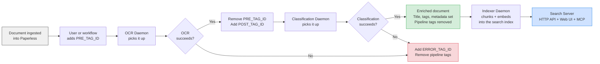

# Paperless-ngx AI — OCR, Classification & Semantic Search

AI-powered document transcription, classification, and semantic search for [Paperless-ngx](https://github.com/paperless-ngx/paperless-ngx), using OpenAI or Ollama vision/language models.

[](https://hub.docker.com/r/rossetv/paperless-ai)
[](https://github.com/rossetv/paperless-ai/actions)
[](https://www.python.org/)

---

## What This Project Does

This project adds **AI-powered OCR, document classification, and semantic search** to your Paperless-ngx instance. It ships as **one Docker image** that runs as any of four daemons — pick the command, run as many as you need:

**OCR Daemon** — Polls Paperless for documents tagged for OCR, converts pages to images, transcribes them using a vision AI model, and uploads the text back into Paperless.

**Classification Daemon** — Polls Paperless for OCR'd documents, sends the text to an LLM, and enriches the document's metadata: title, correspondent, document type, tags, date, language, and person name.

**Indexer Daemon** — Reconciles Paperless-ngx into a local SQLite search index: chunks and embeds document text, keeps the index in sync with new, changed, and deleted documents.

**Search Server** — Serves a JSON API, a React Web UI, and an MCP endpoint (`search_documents`, `ask_documents`) backed by an agentic search pipeline (plan → hybrid retrieve → synthesise); refinement depth is operator-configurable (`SEARCH_MAX_REFINEMENTS`).

The OCR and classification daemons use a **tag-driven pipeline** (no external database), support **model fallback chains**, and work with both **OpenAI** and **Ollama**. The search subsystem keeps two SQLite databases on the shared volume: the **search index** (`index.db`, a derived artefact, rebuildable from Paperless) and the **application database** (`app.db`, holding accounts, sessions, API keys, and hot-loaded config) — kept separate so rebuilding the index never touches your accounts.

---

## How It Works

The OCR and classification daemons run a **tag-driven state machine** — a document's tags are the only state, so there is no database or queue between them. Once a document is classified, the indexer picks it up and the search server makes it searchable.



You can run any subset of the four daemons. OCR + classification alone enriches documents in Paperless; add the indexer and search server to get semantic search and the web UI. All four share one `/data` volume.

---

## Quick Start

### Prerequisites

1. A running **Paperless-ngx** instance with API access
2. A **Paperless API token** (Settings > Users & Groups > API Token)
3. An **OpenAI API key** or a running **Ollama instance**
4. At least **two tags** created in Paperless (e.g. "OCR Queue" and "OCR Complete") — note their numeric IDs

### OCR Daemon

```bash
docker run -d --name paperless-ocr \
  -v paperless-index:/data \
  -e PAPERLESS_URL="http://your-paperless:8000" \
  -e PAPERLESS_TOKEN="your_paperless_api_token" \
  -e OPENAI_API_KEY="sk-your-openai-key" \
  -e PRE_TAG_ID="443" \
  -e POST_TAG_ID="444" \
  rossetv/paperless-ai:latest
```

For Ollama, add these alongside the OpenAI key:
```bash
  -e LLM_PROVIDER="ollama" \
  -e OLLAMA_BASE_URL="http://your-ollama:11434/v1/" \
```

`OPENAI_API_KEY` is still required even with `LLM_PROVIDER=ollama` — it is
loaded by every process so the embedding client can use OpenAI (see the note
under [Semantic Search](#semantic-search--additional-services) below).

### Classification Daemon

Same image, different command:

```bash
docker run -d --name paperless-classifier \
  -e PAPERLESS_URL="http://your-paperless:8000" \
  -e PAPERLESS_TOKEN="your_paperless_api_token" \
  -e OPENAI_API_KEY="sk-your-openai-key" \
  -e CLASSIFY_PRE_TAG_ID="444" \
  -e ERROR_TAG_ID="552" \
  rossetv/paperless-ai:latest \
  paperless-classifier-daemon
```

#### Classification Environment Variables

In addition to the shared variables (`PAPERLESS_URL`, `PAPERLESS_TOKEN`, `OPENAI_API_KEY`, `LLM_PROVIDER`, `OLLAMA_BASE_URL`):

| Variable | Type | Default | Purpose |
|:---|:---|:---|:---|
| `CLASSIFY_REASONING_EFFORT` | string | `medium` | Reasoning effort for reasoning-capable models on the classify call. One of `minimal`, `low`, `medium`, `high`. The default `medium` matches the models' own default effort (a zero-cost no-op); lower it to `low` or `minimal` to spend fewer (invisible) reasoning tokens — classification is structured extraction and rarely needs more than `low`. Models that do not accept the parameter have it stripped automatically. |
| `CLASSIFY_TAXONOMY_LIMIT` | int | `40` | Maximum existing names per kind (correspondents, document types, tags) injected into the classify prompt as reuse hints. Names are usage-ranked; a lower limit shrinks every classify prompt. `0` means unlimited. |

### Docker Compose

```yaml
services:
  paperless-ocr:
    image: rossetv/paperless-ai:latest
    restart: unless-stopped
    volumes:
      - paperless-index:/data            # required: holds app.db (accounts, sessions, config)
    environment:
      PAPERLESS_URL: "http://paperless:8000"
      PAPERLESS_TOKEN: "${PAPERLESS_TOKEN}"
      OPENAI_API_KEY: "${OPENAI_API_KEY}"
      PRE_TAG_ID: "443"
      POST_TAG_ID: "444"
      ERROR_TAG_ID: "552"

  paperless-classifier:
    image: rossetv/paperless-ai:latest
    restart: unless-stopped
    command: ["paperless-classifier-daemon"]
    volumes:
      - paperless-index:/data            # required: shared with OCR/indexer/search
    environment:
      PAPERLESS_URL: "http://paperless:8000"
      PAPERLESS_TOKEN: "${PAPERLESS_TOKEN}"
      OPENAI_API_KEY: "${OPENAI_API_KEY}"
      CLASSIFY_PRE_TAG_ID: "444"
      ERROR_TAG_ID: "552"
```

> **All four daemons share the same `/data` volume.** Configuration (`app.db`)
> is read from there by every process so a settings change made in the web UI
> hot-loads across the stack with no restart. The volume is declared once at
> the bottom of the compose file (see the search-server stack below).

---

## Semantic Search — Additional Services

The indexer and search server require a shared volume for the SQLite index file. Add the following services to your Docker Compose stack:

```yaml
services:
  paperless-indexer:
    image: rossetv/paperless-ai:latest
    restart: unless-stopped
    command: ["paperless-indexer-daemon"]
    volumes:
      - paperless-index:/data
    environment:
      PAPERLESS_URL: "http://paperless:8000"
      PAPERLESS_TOKEN: "${PAPERLESS_TOKEN}"
      OPENAI_API_KEY: "${OPENAI_API_KEY}"      # always required — see note below
      INDEX_DB_PATH: "/data/index.db"
      RECONCILE_INTERVAL: "300"
      DELETION_SWEEP_INTERVAL: "3600"

  paperless-search:
    image: rossetv/paperless-ai:latest
    restart: unless-stopped
    command: ["paperless-search-server"]
    volumes:
      - paperless-index:/data
    ports:
      - "8080:8080"
    environment:
      PAPERLESS_URL: "http://paperless:8000"
      PAPERLESS_TOKEN: "${PAPERLESS_TOKEN}"
      OPENAI_API_KEY: "${OPENAI_API_KEY}"      # always required — see note below
      INDEX_DB_PATH: "/data/index.db"
    depends_on:
      paperless-indexer:
        condition: service_healthy
    healthcheck:
      test: ["CMD", "curl", "-f", "http://localhost:8080/api/healthz"]
      interval: 30s
      timeout: 5s
      retries: 3

volumes:
  paperless-index:
```

> **Note on `OPENAI_API_KEY` with Ollama:** even when `LLM_PROVIDER=ollama`, the embedding client always uses OpenAI (`text-embedding-3-small`) — local Ollama embeddings are not supported. `OPENAI_API_KEY` is therefore **required by every process** (OCR, classifier, indexer, and search server) regardless of the LLM provider setting: configuration loading fails closed at startup if it is missing. With `LLM_PROVIDER=ollama`, the LLM (vision and chat) calls go to Ollama while embeddings go to OpenAI.

---

## Accessing the Web UI

There is no shared-secret env var — the search server has **no `SEARCH_API_KEY`**. Access is created on first run:

1. Start the search server. With no accounts yet, it enters **setup mode** and prints a one-off **setup token** to the container logs:
   ```bash
   docker logs paperless-search 2>&1 | grep "SETUP TOKEN"
   ```
2. Open `http://your-host:8080/setup` and complete the first-run setup form, pasting that token to create the first **admin** account. The token is invalidated the moment setup completes.
3. From then on, sign in with username and password. A successful login sets a signed, `HttpOnly` session cookie (lifetime `SEARCH_SESSION_TTL`, default 7 days).

**Two credential types:**

| Surface | Credential |
|:---|:---|
| Web UI (browser) | Username/password login → session cookie |
| REST API and MCP | A minted `sk-pls-…` API key, created in the UI under **Settings → API Keys**, sent as `Authorization: Bearer <key>`. Each key carries a subset of the `api` / `mcp` / `admin` scopes |

Admins manage further accounts and API keys from the web UI. Configuration changed in the UI is written to `app.db` and **hot-loads across all four daemons** with no restart. See [docs/search.md](docs/search.md) for the full authentication model.

---

## Semantic Search — Environment Variables

These variables are read by the indexer daemon and the search server, in addition to the shared variables (`PAPERLESS_URL`, `PAPERLESS_TOKEN`, `OPENAI_API_KEY`, `LLM_PROVIDER`, `OLLAMA_BASE_URL`, `DOCUMENT_WORKERS`, `LOG_LEVEL`, `LOG_FORMAT`).

### Indexer and Store

| Variable | Type | Default | Purpose |
|:---|:---|:---|:---|
| `INDEX_DB_PATH` | string | `/data/index.db` | Path to the SQLite search index file |
| `APP_DB_PATH` | string | `/data/app.db` | Path to the SQLite application database (accounts, sessions, config) — kept separate from the index so rebuilding the index never destroys accounts |
| `EMBEDDING_MODEL` | string | `text-embedding-3-small` | OpenAI embedding model (always OpenAI; see note above) |
| `EMBEDDING_DIMENSIONS` | int | `1536` | Vector dimensions — must match the model |
| `EMBEDDING_MAX_CONCURRENT` | int | `4` | Maximum concurrent embedding API calls |
| `RECONCILE_INTERVAL` | int | `300` | Seconds between incremental-sync cycles |
| `DELETION_SWEEP_INTERVAL` | int | `3600` | Seconds between full deletion sweeps |
| `CHUNK_SIZE` | int | `2000` | Characters per text chunk |
| `CHUNK_OVERLAP` | int | `256` | Overlap between adjacent chunks (characters) |

### Search Server

| Variable | Type | Default | Purpose |
|:---|:---|:---|:---|
| `SEARCH_TOP_K` | int | `10` | Documents fed to the synthesiser |
| `SEARCH_MAX_REFINEMENTS` | int | `1` | Agentic refinement passes; no hard cap. Each adds one LLM call (per-query budget = 2 + this) |
| `SEARCH_PLANNER_MODEL` | string | `gpt-5.4-mini` / `gemma3:12b` | Query-planning + adequacy-judging model (cheap, structured extraction) |
| `SEARCH_ANSWER_MODEL` | string | `gpt-5.5` / `gemma3:27b` | Answer-synthesis model (stronger, user-facing prose) |
| `SEARCH_SERVER_HOST` | string | `0.0.0.0` | Bind address for the search server |
| `SEARCH_SERVER_PORT` | int | `8080` | Port for the search server |
| `SEARCH_FORWARDED_ALLOW_IPS` | string | `*` | Peers uvicorn trusts the `X-Forwarded-For` / `X-Forwarded-Proto` headers from. `*` trusts every peer — correct when the search server's port is reachable **only** through your reverse proxy. If that port can be reached directly, pin this to the proxy's IP or CIDR (e.g. `10.0.0.0/8`, or a single `172.18.0.2`): otherwise an attacker reaching the port directly can spoof those headers to forge the client IP recorded in audit logs / sessions and to flip the session-cookie `Secure` flag. Comma-separated for multiple values |
| `SEARCH_SESSION_TTL` | int | `604800` | Web UI session-cookie lifetime in seconds (default: 7 days) |
| `SEARCH_MAX_CONCURRENT` | int | `4` | Maximum concurrent `/api/search` requests |
| `SEARCH_PLANNER_REASONING_EFFORT` | string | `medium` | Planner `reasoning_effort` (one of `minimal`/`low`/`medium`/`high`). `medium` is the models' default, so it does **not** lower spend on its own — set `low` or `minimal` to save tokens on the planner. Invalid values are rejected at startup; stripped automatically for models that don't support it |
| `SEARCH_ANSWER_REASONING_EFFORT` | string | `medium` | Synthesiser `reasoning_effort` (one of `minimal`/`low`/`medium`/`high`). `medium` is the models' default, so it does **not** lower spend on its own — set `low` or `minimal` to save tokens on synthesis. Invalid values are rejected at startup; stripped automatically for unsupporting models |
| `SEARCH_CACHE_TTL_SECONDS` | int | `14400` | TTL (seconds) for the in-process result cache; `0` disables it. Busted automatically when the index changes |
| `SEARCH_SKIP_PLANNER_FOR_TRIVIAL` | bool | `false` | When true, skip the planner LLM call for short, signal-free keyword queries |
| `SEARCH_MIN_QUERY_CHARS` | int | `2` | **Layer 0** — reject queries shorter than this (after trimming whitespace) before any LLM call; `0` disables it |
| `SEARCH_GATE_ADEQUACY` | bool | `true` | **Layer 1** — let the planner return a "too vague, please clarify" outcome instead of a plan (folded into the existing planner call, no extra spend) |
| `SEARCH_GATE_RELEVANCE` | bool | `true` | **Layer 2** — skip synthesis and return "no matches" when retrieval is clearly irrelevant |
| `SEARCH_RELEVANCE_MIN_SIMILARITY` | float | `0.60` | Absolute vector-similarity floor for Layer 2. Reject only when the best match is below this **and** there is no keyword hit. Calibrated against the live index (good queries ≥ 0.666, off-topic ≈ 0.567) |
| `SEARCH_RELEVANCE_TIER_STRONG` | float | `0.70` | Badge cut-point: a shown result at or above this similarity is labelled "Strong match". Independent of the gate floor above |
| `SEARCH_RELEVANCE_TIER_GOOD` | float | `0.66` | Badge cut-point for "Good match". Validated `partial ≤ good ≤ strong` |
| `SEARCH_RELEVANCE_TIER_PARTIAL` | float | `0.60` | Badge cut-point for "Partial match"; below this a shown result is labelled "Weak match" |

---

## Corruption Recovery Runbook

If `GET /api/healthz` returns `{"status": "index-corrupt"}`:

1. Stop the indexer daemon container.
2. Delete the index file and its companion lock file:
   ```bash
   rm /data/index.db /data/index.db.lock
   ```
3. Restart the indexer daemon. The next reconciliation cycle rebuilds the index from an empty store. At 10,000 documents this takes a few hours and costs approximately $0.60 in embedding API calls.
4. Monitor `GET /api/stats` for an advancing `last_reconcile_at`. The search server returns `503 index-not-ready` until the first reconciliation completes.

The index is a derived artefact — every byte is reconstructable from Paperless-ngx. There is no backup requirement.

The three health states:

| `status` | Meaning |
|:---|:---|
| `ok` | Schema present, at least one reconciliation completed, integrity check passed |
| `index-not-ready` | Database absent, schema not yet applied, or reconciliation has never run |
| `index-corrupt` | Database exists with a schema and reconciliation history, but integrity check failed |

---

## Documentation

| Guide | What it covers |
|:---|:---|
| [Architecture](docs/architecture.md) | Package structure, daemon lifecycle, concurrency model, state management |
| [OCR Pipeline](docs/ocr-pipeline.md) | Image conversion, parallel processing, vision model integration, quality gates |
| [Classification Pipeline](docs/classification-pipeline.md) | Content truncation, taxonomy cache, LLM classification, tag enrichment |
| [Store](docs/store.md) | SQLite search index: schema, writer/reader split, migrations, embedding-model rebuild, corruption recovery |
| [Indexer](docs/indexer.md) | Reconciliation daemon: incremental sync, deletion sweep, failed-document retry, flock single-writer guard |
| [Search](docs/search.md) | Search server: agentic pipeline, RRF fusion, HTTP API, Web UI, MCP endpoint, authentication |
| [Configuration Reference](docs/configuration.md) | All environment variables, pipeline tags, performance tuning |
| [Deployment](docs/deployment.md) | Docker examples, tag setup, multi-instance, privacy |
| [Development](docs/development.md) | Local setup, tests, CI/CD |
| [Resilience](docs/resilience.md) | Retry strategy, fallback chains, error isolation, graceful shutdown |

**Contributing & internals:**

- [AGENTS.md](AGENTS.md) — a structured codebase guide with a file index and common-task lookup (written for AI agents, useful to humans too).
- [DESIGN.md](DESIGN.md) — the frontend design system: tokens, the component library, and screen patterns.
- [CODE_GUIDELINES.md](CODE_GUIDELINES.md) — the house coding rules, cited by section number throughout the source.
