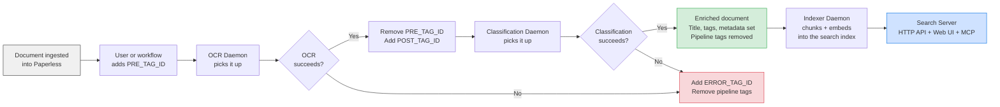

# Paperless-ngx AI — OCR, Classification & Semantic Search

[Paperless-ngx](https://github.com/paperless-ngx/paperless-ngx) is a great place to store your scanned documents — but it can only file what it can read, and it can only find what you remember to tag. This project fixes both. It reads the text off your scans with a vision AI, fills in the title, sender, type, and tags for you, and lets you search the whole archive by *meaning* — ask "when does my passport expire?" and get the answer, not a list of filenames.

It runs entirely as containers next to your existing Paperless-ngx, works with either OpenAI or a local Ollama, and stores nothing you can't throw away and rebuild.

[](https://hub.docker.com/r/rossetv/paperless-ai)
[](https://github.com/rossetv/paperless-ai/actions)
[](https://www.python.org/)

---

## The gist

The project ships as **one Docker image**. That image can run as any of four small programs ("daemons"), and you pick which one by passing a command. Run as many as you need:

- **OCR daemon** — watches Paperless for documents you've tagged for OCR, turns each page into an image, transcribes it with a vision AI model, and writes the text back.
- **Classification daemon** — picks up freshly-OCR'd documents, reads the text, and fills in the metadata: title, correspondent, document type, tags, date, language, and person name.
- **Indexer daemon** — keeps a local search index in step with Paperless. It chops each document's text into chunks, turns those chunks into embeddings (vectors that capture meaning), and tracks new, changed, and deleted documents.
- **Search server** — serves a JSON API, a React web UI, and an [MCP](https://modelcontextprotocol.io) endpoint (`search_documents`, `ask_documents`). Behind them sits an *agentic* search pipeline: it plans the query, retrieves candidates, and synthesises an answer.

The two enrichment daemons (OCR and classification) coordinate purely through **Paperless tags** — there's no database or queue between them. A document's tags *are* its state: which stage it's in, whether it's done, whether it failed. That design has three happy consequences: you can run several copies of a daemon at once without them treading on each other, a settings change takes effect on the next poll with no restart, and there's nothing to migrate or back up on that side.

Here is the journey a document takes from ingestion to searchable:



You don't have to run all four. OCR plus classification alone enriches documents inside Paperless; add the indexer and search server when you also want semantic search and the web UI. All four share one `/data` volume.

---

## Quick Start

### Prerequisites

1. A running **Paperless-ngx** instance with API access
2. A **Paperless API token** (Settings > Users & Groups > API Token)
3. An **OpenAI API key** or a running **Ollama instance**
4. At least **two tags** created in Paperless (e.g. "OCR Queue" and "OCR Complete") — note their numeric IDs

The fastest useful setup is the OCR daemon on its own: tag a document, watch the text appear. Add the others once that works.

### OCR Daemon

```bash
docker run -d --name paperless-ocr \
  -v paperless-ai-data:/data \
  -e PAPERLESS_URL="http://your-paperless:8000" \
  -e PAPERLESS_TOKEN="your_paperless_api_token" \
  -e OPENAI_API_KEY="sk-your-openai-key" \
  -e PRE_TAG_ID="443" \
  -e POST_TAG_ID="444" \
  rossetv/paperless-ai:latest
```

To use Ollama instead of OpenAI for the vision and chat calls, add these alongside the OpenAI key:
```bash
  -e LLM_PROVIDER="ollama" \
  -e OLLAMA_BASE_URL="http://your-ollama:11434/v1/" \
```

By default `LLM_PROVIDER=ollama` also embeds locally (`EMBEDDING_PROVIDER` defaults to `LLM_PROVIDER`), so a fully-local deployment needs **no** `OPENAI_API_KEY`. Keep `OPENAI_API_KEY` only if you still want OpenAI embeddings (set `EMBEDDING_PROVIDER=openai` explicitly) — see the note under [Semantic Search](#semantic-search--additional-services) below.

### Classification Daemon

Same image, different command — the trailing `paperless-classifier-daemon` is what selects it:

```bash
docker run -d --name paperless-classifier \
  -e PAPERLESS_URL="http://your-paperless:8000" \
  -e PAPERLESS_TOKEN="your_paperless_api_token" \
  -e OPENAI_API_KEY="sk-your-openai-key" \
  -e CLASSIFY_PRE_TAG_ID="444" \
  -e ERROR_TAG_ID="552" \
  rossetv/paperless-ai:latest \
  paperless-classifier-daemon
```

`CLASSIFY_PRE_TAG_ID` is the tag the classifier waits for; pointing it at the OCR daemon's `POST_TAG_ID` (here, `444`) chains the two stages so a document flows from OCR straight into classification.

### Docker Compose

For anything beyond a quick test, Compose is easier. This stack runs the two enrichment daemons:

```yaml
services:
  paperless-ocr:
    image: rossetv/paperless-ai:latest
    restart: unless-stopped
    volumes:
      - paperless-ai-data:/data            # required: holds app.db (accounts, sessions, config)
    environment:
      PAPERLESS_URL: "http://paperless:8000"
      PAPERLESS_TOKEN: "${PAPERLESS_TOKEN}"
      OPENAI_API_KEY: "${OPENAI_API_KEY}"
      PRE_TAG_ID: "443"
      POST_TAG_ID: "444"
      ERROR_TAG_ID: "552"

  paperless-classifier:
    image: rossetv/paperless-ai:latest
    restart: unless-stopped
    command: ["paperless-classifier-daemon"]
    volumes:
      - paperless-ai-data:/data            # required: shared with OCR/indexer/search
    environment:
      PAPERLESS_URL: "http://paperless:8000"
      PAPERLESS_TOKEN: "${PAPERLESS_TOKEN}"
      OPENAI_API_KEY: "${OPENAI_API_KEY}"
      CLASSIFY_PRE_TAG_ID: "444"
      ERROR_TAG_ID: "552"
```

> **All four daemons share the same `/data` volume.** Configuration (`app.db`)
> is read from there by every process so a settings change made in the web UI
> hot-loads across the stack with no restart. The volume is declared once at
> the bottom of the compose file (see the search-server stack below).

---

## Semantic Search — Additional Services

The two daemons above are enough to enrich documents inside Paperless. To add semantic search — the web UI, the API, and the "ask a question, get an answer" experience — run two more services: the **indexer**, which keeps the local search index current, and the **search server**, which answers queries against it. Both need the shared volume so they can read and write the index file.

Add these to the same Compose stack:

```yaml
services:
  paperless-indexer:
    image: rossetv/paperless-ai:latest
    restart: unless-stopped
    command: ["paperless-indexer-daemon"]
    volumes:
      - paperless-ai-data:/data
    environment:
      PAPERLESS_URL: "http://paperless:8000"
      PAPERLESS_TOKEN: "${PAPERLESS_TOKEN}"
      OPENAI_API_KEY: "${OPENAI_API_KEY}"      # always required — see note below
      INDEX_DB_PATH: "/data/index.db"
      RECONCILE_INTERVAL: "300"
      DELETION_SWEEP_INTERVAL: "3600"

  paperless-search:
    image: rossetv/paperless-ai:latest
    restart: unless-stopped
    command: ["paperless-search-server"]
    volumes:
      - paperless-ai-data:/data
    ports:
      - "8080:8080"
    environment:
      PAPERLESS_URL: "http://paperless:8000"
      PAPERLESS_TOKEN: "${PAPERLESS_TOKEN}"
      OPENAI_API_KEY: "${OPENAI_API_KEY}"      # always required — see note below
      INDEX_DB_PATH: "/data/index.db"
    depends_on:
      paperless-indexer:
        condition: service_healthy
    healthcheck:
      test: ["CMD", "curl", "-f", "http://localhost:8080/api/healthz"]
      interval: 30s
      timeout: 5s
      retries: 3

volumes:
  paperless-ai-data:
```

The search subsystem keeps **two** SQLite databases on that shared volume, and the split matters:

- The **search index** (`index.db`) is a derived artefact — it holds chunks and embeddings, and every byte of it can be rebuilt from Paperless.
- The **application database** (`app.db`) holds the things you can't rebuild: user accounts, sessions, API keys, and the hot-loaded configuration.

They're kept apart so that wiping and rebuilding the index never touches your accounts.

> **Note on `OPENAI_API_KEY` with Ollama:** embeddings follow `EMBEDDING_PROVIDER`, which defaults to `LLM_PROVIDER`. So `LLM_PROVIDER=ollama` embeds locally via Ollama by default and needs **no** `OPENAI_API_KEY` — a fully-local deployment where no document chunk leaves the box. `OPENAI_API_KEY` is **required** whenever OpenAI is used by either provider: any deployment with `LLM_PROVIDER=openai`, or one that sets `EMBEDDING_PROVIDER=openai` to keep OpenAI embeddings while the LLM runs on Ollama. Configuration loading fails closed at startup if the key is missing in those cases. For a local embedding setup set `EMBEDDING_MODEL` to an Ollama embedding model (e.g. `nomic-embed-text`) with a matching `EMBEDDING_DIMENSIONS`. **Switching `EMBEDDING_PROVIDER` forces a full re-embed** of the whole index (OpenAI and Ollama vectors are not comparable) — run a full re-index from the Index page after changing it.

---

## Accessing the Web UI

There's no shared password to set — the search server has **no `SEARCH_API_KEY`**. Instead, the first account is created on first run via a one-off token:

1. Start the search server. With no accounts yet, it enters **setup mode** and prints a one-off **setup token** to the container logs:
   ```bash
   docker logs paperless-search 2>&1 | grep "SETUP TOKEN"
   ```
2. Open `http://your-host:8080/setup` and complete the first-run setup form, pasting that token to create the first **admin** account. The token is invalidated the moment setup completes.
3. From then on, sign in with username and password. A successful login sets a signed, `HttpOnly` session cookie that lasts eight hours — or as long as `SEARCH_SESSION_TTL` (default seven days) if you tick "keep me signed in".

There are **two kinds of credential**, one for humans and one for machines:

| Surface | Credential |
|:---|:---|
| Web UI (browser) | Username/password login → session cookie |
| REST API and MCP | A minted `sk-pls-…` API key, created in the UI under **Settings → API Keys**, sent as `Authorization: Bearer <key>`. Each key carries a subset of the `api` / `mcp` / `admin` scopes |

Admins manage further accounts and API keys from the web UI. Configuration changed in the UI is written to `app.db` and **hot-loads across all four daemons** with no restart. See [docs/search.md](docs/search.md) for the full authentication model.

---

## Configuration

Most setups run on the defaults. The tables below are the dials you can turn when you need to — each daemon reads them on top of the shared variables (`PAPERLESS_URL`, `PAPERLESS_TOKEN`, `OPENAI_API_KEY`, `LLM_PROVIDER`, `OLLAMA_BASE_URL`, plus the logging and worker settings). The full reference, including every shared variable and pipeline tag, is in [docs/configuration.md](docs/configuration.md).

### Classification

Two extra knobs control how the classifier spends tokens and how much taxonomy it sees:

| Variable | Type | Default | Purpose |
|:---|:---|:---|:---|
| `CLASSIFY_REASONING_EFFORT` | string | `medium` | Reasoning effort for reasoning-capable models on the classify call. One of `minimal`, `low`, `medium`, `high`. The default `medium` matches the models' own default effort (a zero-cost no-op); lower it to `low` or `minimal` to spend fewer (invisible) reasoning tokens — classification is structured extraction and rarely needs more than `low`. Models that do not accept the parameter have it stripped automatically. |
| `CLASSIFY_TAXONOMY_LIMIT` | int | `40` | Maximum existing names per kind (correspondents, document types, tags) injected into the classify prompt as reuse hints. Names are usage-ranked; a lower limit shrinks every classify prompt. `0` means unlimited. |

### Indexer and Store

These govern where the index lives, how text is chunked, and how embeddings are produced. They're read by the indexer daemon and the search server:

| Variable | Type | Default | Purpose |
|:---|:---|:---|:---|
| `INDEX_DB_PATH` | string | `/data/index.db` | Path to the SQLite search index file |
| `APP_DB_PATH` | string | `/data/app.db` | Path to the SQLite application database (accounts, sessions, config) — kept separate from the index so rebuilding the index never destroys accounts |
| `EMBEDDING_PROVIDER` | `openai`/`ollama` | `LLM_PROVIDER` | Provider that vectorises chunks. Defaults to `LLM_PROVIDER` (so `ollama` embeds locally). Under `ollama` no `OPENAI_API_KEY` is needed and `EMBEDDING_MODEL` must name a local model. **Switching it forces a full re-embed** (see note above) |
| `EMBEDDING_MODEL` | string | `text-embedding-3-small` | Embedding model (an OpenAI model under `openai`; a local Ollama embedding model under `ollama`) |
| `EMBEDDING_DIMENSIONS` | int | `1536` | Vector dimensions — must match the model |
| `EMBEDDING_MAX_CONCURRENT` | int | `4` | Maximum concurrent embedding API calls |
| `RECONCILE_INTERVAL` | int | `300` | Seconds between incremental-sync cycles |
| `DELETION_SWEEP_INTERVAL` | int | `3600` | Seconds between full deletion sweeps |
| `CHUNK_SIZE` | int | `2000` | Characters per text chunk |
| `CHUNK_OVERLAP` | int | `256` | Overlap between adjacent chunks (characters) |

### Search Server

The search server has the most dials because the search pipeline has the most stages. You can leave nearly all of them alone; the ones worth knowing are `SEARCH_MAX_REFINEMENTS` (how hard the pipeline retries before answering) and `SEARCH_FORWARDED_ALLOW_IPS` (a security setting if your server's port is reachable without a reverse proxy in front). For the pipeline these dials tune, stage by stage, see [docs/search-pipeline.md](docs/search-pipeline.md).

| Variable | Type | Default | Purpose |
|:---|:---|:---|:---|
| `SEARCH_TOP_K` | int | `10` | Documents fed to the synthesiser |
| `SEARCH_MAX_REFINEMENTS` | int | `1` | Agentic refinement passes before the pipeline answers. Each pass re-plans, retrieves and re-synthesises, so it adds several LLM calls per pass (not one) — see the per-query budget breakdown in [docs/search-pipeline.md](docs/search-pipeline.md) |
| `SEARCH_PLANNER_MODEL` | string | `gpt-5.4-mini` / `gemma3:12b` | Query-planning + adequacy-judging model (cheap, structured extraction) |
| `SEARCH_ANSWER_MODEL` | string | `gpt-5.5` / `gemma3:27b` | Answer-synthesis model (stronger, user-facing prose) |
| `SEARCH_SERVER_HOST` | string | `0.0.0.0` | Bind address for the search server |
| `SEARCH_SERVER_PORT` | int | `8080` | Port for the search server |
| `SEARCH_FORWARDED_ALLOW_IPS` | string | `*` | Peers uvicorn trusts the `X-Forwarded-For` / `X-Forwarded-Proto` headers from. `*` trusts every peer — correct when the search server's port is reachable **only** through your reverse proxy. If that port can be reached directly, pin this to the proxy's IP or CIDR (e.g. `10.0.0.0/8`, or a single `172.18.0.2`): otherwise an attacker reaching the port directly can spoof those headers to forge the client IP recorded in audit logs / sessions and to flip the session-cookie `Secure` flag. Comma-separated for multiple values |
| `SEARCH_SESSION_TTL` | int | `604800` | Lifetime of the "keep me signed in" session cookie, in seconds. An un-ticked login gets a fixed 8-hour session |
| `SEARCH_MAX_CONCURRENT` | int | `4` | Maximum concurrent `/api/search` requests |
| `SEARCH_KEY_DAILY_TOKEN_QUOTA` | int | `0` | Per-API-key cumulative LLM-token cap **per UTC calendar day** across the search endpoints (`/api/search`, `/api/search/stream`, and the MCP `ask_documents`/`search_documents` tools). `0` (the default) means **unlimited** — the quota is disabled and the search path does **no** extra database I/O. A positive value caps a single API key's daily spend: once a key reaches the quota, further search requests are rejected (HTTP 429 with a `Retry-After` pointing at the next UTC midnight on REST; an error on MCP) until the UTC day rolls over. Cookie/browser (logged-in human) users are **not** limited — the cap targets programmatic keys, the credential a leak exposes. It is a **soft** cap (usage is recorded after each query, so concurrent queries can each pass the check and slightly overshoot) |
| `SEARCH_PLANNER_REASONING_EFFORT` | string | `medium` | Planner `reasoning_effort` (one of `minimal`/`low`/`medium`/`high`). `medium` is the models' default, so it does **not** lower spend on its own — set `low` or `minimal` to save tokens on the planner. Invalid values are rejected at startup; stripped automatically for models that don't support it |
| `SEARCH_ANSWER_REASONING_EFFORT` | string | `medium` | Synthesiser `reasoning_effort` (one of `minimal`/`low`/`medium`/`high`). `medium` is the models' default, so it does **not** lower spend on its own — set `low` or `minimal` to save tokens on synthesis. Invalid values are rejected at startup; stripped automatically for unsupporting models |
| `SEARCH_CACHE_TTL_SECONDS` | int | `14400` | TTL (seconds) for the in-process result cache; `0` disables it. Busted automatically when the index changes |
| `SEARCH_SKIP_PLANNER_FOR_TRIVIAL` | bool | `false` | When true, skip the planner LLM call for short, signal-free keyword queries |
| `SEARCH_MIN_QUERY_CHARS` | int | `2` | **Layer 0** — reject queries shorter than this (after trimming whitespace) before any LLM call; `0` disables it |
| `SEARCH_GATE_ADEQUACY` | bool | `true` | **Layer 1** — let the planner return a "too vague, please clarify" outcome instead of a plan (folded into the existing planner call, no extra spend) |
| `SEARCH_GATE_RELEVANCE` | bool | `true` | **Layer 2** — skip synthesis and return "no matches" when retrieval is clearly irrelevant |
| `SEARCH_RELEVANCE_MIN_SIMILARITY` | float | `0.60` | Absolute vector-similarity floor for Layer 2. Reject only when the best match is below this **and** there is no keyword hit. Calibrated against the live index (good queries ≥ 0.666, off-topic ≈ 0.567) |
| `SEARCH_RELEVANCE_TIER_STRONG` | float | `0.70` | Badge cut-point: a shown result at or above this similarity is labelled "Strong match". Independent of the gate floor above |
| `SEARCH_RELEVANCE_TIER_GOOD` | float | `0.66` | Badge cut-point for "Good match". Validated `partial ≤ good ≤ strong` |
| `SEARCH_RELEVANCE_TIER_PARTIAL` | float | `0.60` | Badge cut-point for "Partial match"; below this a shown result is labelled "Weak match" |
| `SEARCH_GATE_JUDGE` | bool | `true` | **Layer 3** — an LLM relevance judge screens the retrieved documents and drops the irrelevant ones before the answer is written. On by default; each judging pass costs one extra (cheap) LLM call |
| `SEARCH_JUDGE_MODEL` | string | `gpt-5.4-mini` / `gemma3:12b` | Model for the Layer 3 relevance judge (defaults to the planner model) |
| `SEARCH_JUDGE_REASONING_EFFORT` | string | `low` | Judge `reasoning_effort` (one of `minimal`/`low`/`medium`/`high`) |

---

## Corruption Recovery Runbook

The search index is the one piece you might ever have to repair, and because it's a derived artefact, repairing it is simply rebuilding it. If `GET /api/healthz` returns `{"status": "index-corrupt"}`:

1. Stop the indexer daemon container.
2. Delete the index file and its companion lock file:
   ```bash
   rm /data/index.db /data/index.db.lock
   ```
3. Restart the indexer daemon. The next reconciliation cycle rebuilds the index from an empty store. At 10,000 documents this takes a few hours and costs approximately $0.60 in embedding API calls.
4. Monitor `GET /api/stats` for an advancing `last_reconcile_at`. The search server returns `503 index-not-ready` until the first reconciliation completes.

The index is a derived artefact — every byte is reconstructable from Paperless-ngx. There is no backup requirement.

`GET /api/healthz` reports one of three states:

| `status` | Meaning |
|:---|:---|
| `ok` | Schema present, at least one reconciliation completed, integrity check passed |
| `index-not-ready` | Database absent, schema not yet applied, or reconciliation has never run |
| `index-corrupt` | Database exists with a schema and reconciliation history, but integrity check failed |

---

## Documentation

Start with the README you're reading; reach for these when you want the detail behind a particular subsystem:

| Guide | What it covers |
|:---|:---|
| [Architecture](docs/architecture.md) | Package structure, daemon lifecycle, concurrency model, state management |
| [OCR Pipeline](docs/ocr-pipeline.md) | Image conversion, parallel processing, vision model integration, quality gates |
| [Classification Pipeline](docs/classification-pipeline.md) | Content truncation, taxonomy cache, LLM classification, tag enrichment |
| [Store](docs/store.md) | SQLite search index: schema, writer/reader split, migrations, embedding-model rebuild, corruption recovery |
| [Indexer](docs/indexer.md) | Reconciliation daemon: incremental sync, deletion sweep, failed-document retry, flock single-writer guard |
| [Search](docs/search.md) | Search server: agentic pipeline, RRF fusion, HTTP API, Web UI, MCP endpoint, authentication |
| [Search Pipeline (deep dive)](docs/search-pipeline.md) | The agentic pipeline stage-by-stage: planner, retrieve, judge, synthesise, refinement, worked example |
| [Result Cache](docs/cache.md) | What search caches, the cache key, lifetimes, what isn't cached and why, invalidation |
| [Configuration Reference](docs/configuration.md) | All environment variables, pipeline tags, performance tuning |
| [Deployment](docs/deployment.md) | Docker examples, tag setup, multi-instance, privacy |
| [Development](docs/development.md) | Local setup, tests, CI/CD |
| [Resilience](docs/resilience.md) | Retry strategy, fallback chains, error isolation, graceful shutdown |

**Contributing & internals:**

- [AGENTS.md](AGENTS.md) — a structured codebase guide with a file index and common-task lookup (written for AI agents, useful to humans too).
- [DESIGN.md](DESIGN.md) — the frontend design system: tokens, the component library, and screen patterns.
- [CODE_GUIDELINES.md](CODE_GUIDELINES.md) — the house coding rules, cited by section number throughout the source.
