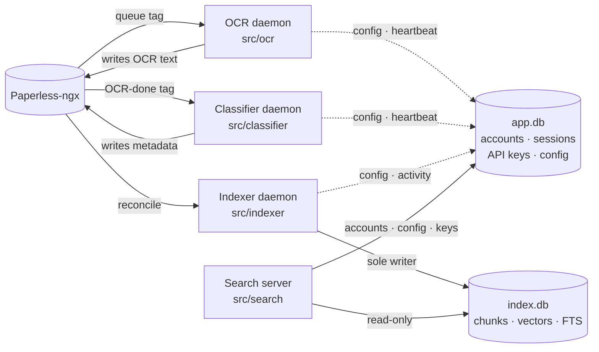
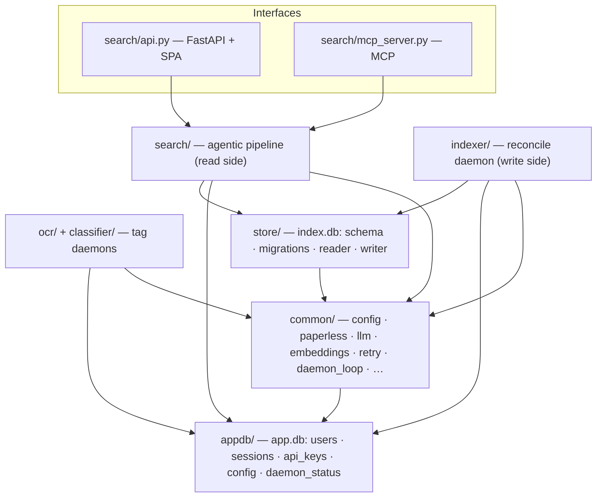
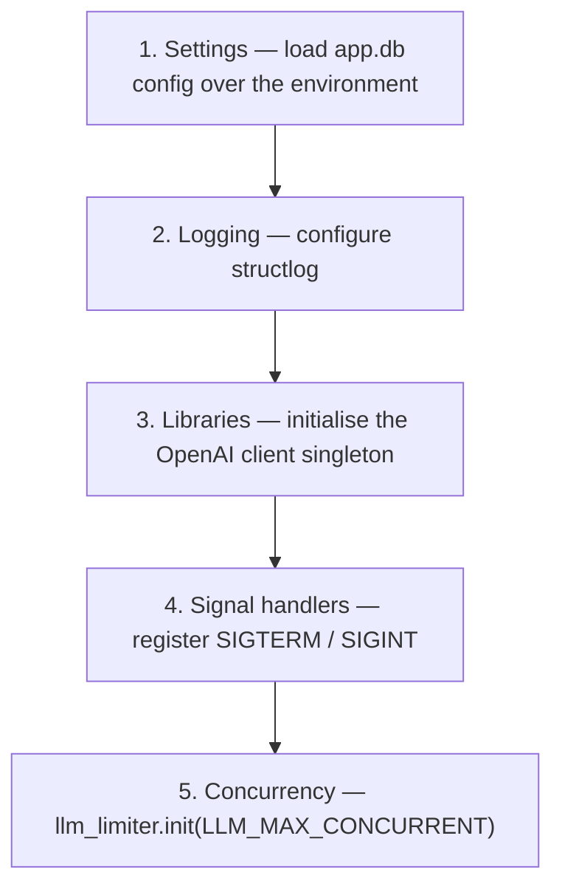
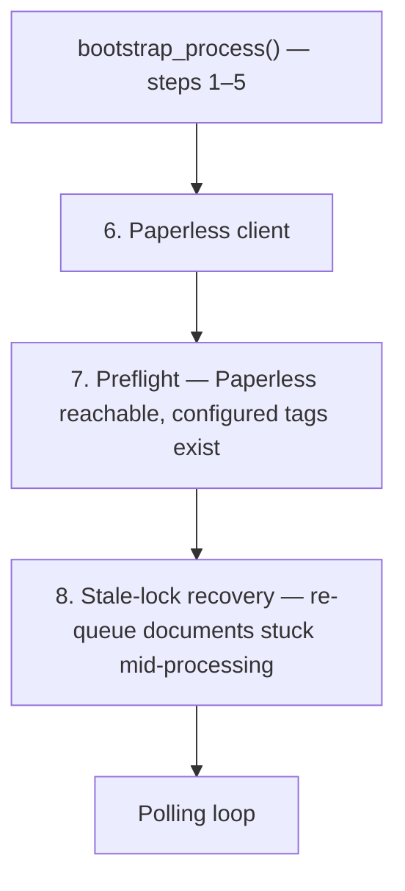
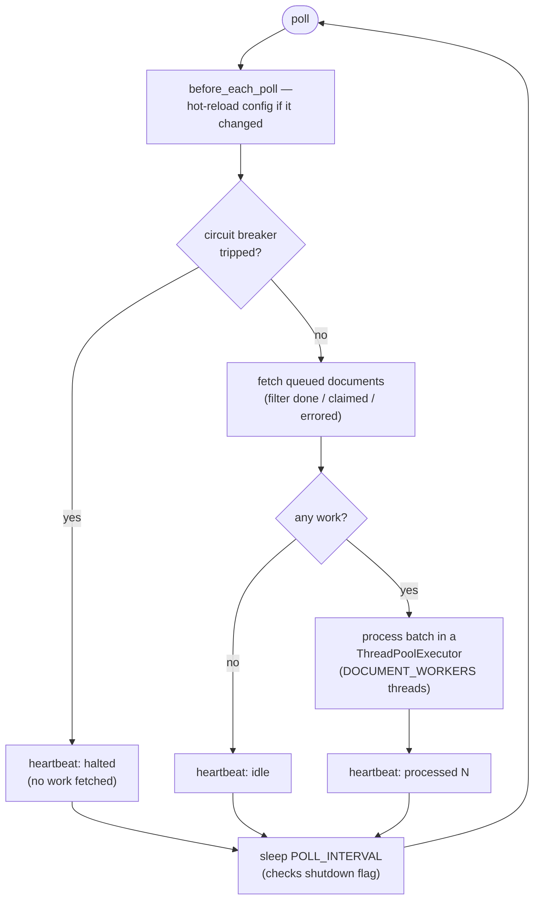
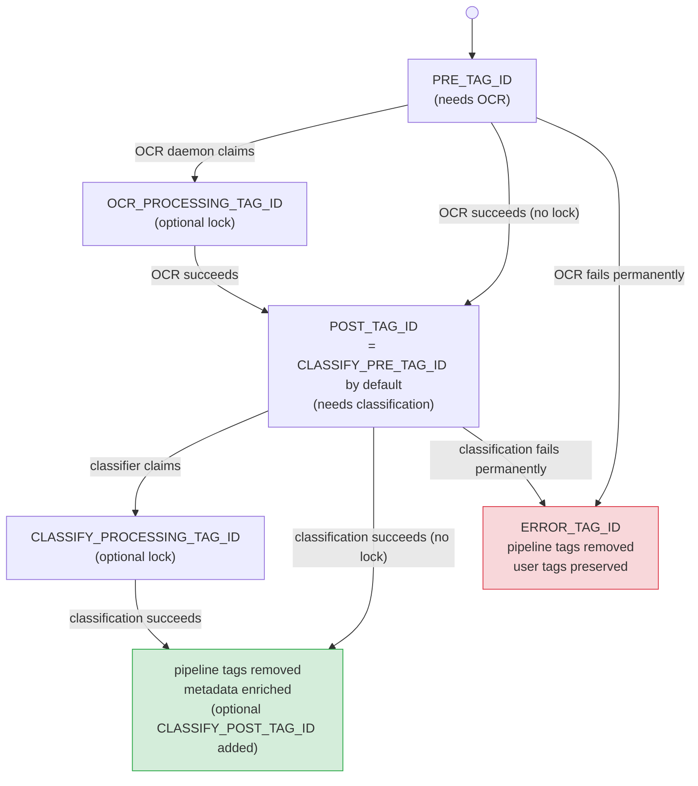

# Architecture

`paperless-ai` bolts AI onto a [Paperless-ngx](https://docs.paperless-ngx.com/) document archive: it reads the text off your scans, files them automatically, and lets you ask questions of the whole collection in plain language. This document is the map — read it first, then follow the links into each subsystem.

## In a nutshell

A document flows through four stages, each run by its own long-lived background process (a **daemon**):

1. **OCR** — reads the text off a scanned page using a vision model, so the rest of the system works with words instead of pixels.
2. **Classify** — asks an LLM for a title, correspondent, document type, date and tags, and writes that metadata back to Paperless.
3. **Index** — chunks each document, turns the chunks into vectors, and stores them so they can be searched by meaning.
4. **Search** — a web app and API that answers natural-language questions by retrieving the right chunks and asking an LLM to synthesise an answer.

The single most important idea: **the first two stages keep no state of their own.** A document's position in the pipeline is recorded entirely as Paperless **tags** — a "needs OCR" tag, a "done" tag, an "error" tag. The daemons just watch for tags and act. That makes them safe to restart, safe to run several copies of, and means a configuration change takes effect on the next poll with no restart. We call this **tag-driven**.



Four processes share one Paperless-ngx instance and two SQLite databases on the `/data` volume:

- The **OCR daemon** finds documents tagged for OCR, sends each page to a vision model, and writes the transcription back to Paperless.
- The **classifier daemon** picks up OCR'd documents, asks an LLM for a title, correspondent, type, date and tags, and writes that metadata back.
- The **indexer daemon** continuously **reconciles** Paperless against the search index: it chunks new and changed documents, embeds the chunks, and upserts them into `index.db`. It is the **only** process that writes the index.
- The **search server** is one process hosting the HTTP API, the React web UI, and the [MCP](https://modelcontextprotocol.io/) endpoint. It reads the index through a read-only API and never writes it.

The two databases are split for a reason: `app.db` holds the things you cannot afford to lose (accounts, API keys, configuration), while `index.db` is *derived* — the indexer can rebuild it from Paperless at any time. Wiping and rebuilding the search index never touches your accounts or settings.

For each subsystem in depth, follow the links: [OCR](ocr-pipeline.md), [classification](classification-pipeline.md), [indexer](indexer.md), [store](store.md), and [search](search.md) (with its stage-by-stage companion, [the search pipeline deep-dive](search-pipeline.md)). For the failure-handling model shared across all of them, see [Resilience](resilience.md); for every configuration value, see [Configuration](configuration.md). For the rules every change is held to, see [`CODE_GUIDELINES.md`](../CODE_GUIDELINES.md).

---

## Which processes can run as many copies, and which cannot

This is the rule that shapes everything below, so it is worth stating plainly:

- The **OCR and classifier daemons** are tag-driven and stateless, so they are safe to run as **several instances** at once. Two copies will not trip over each other because the work queue is just Paperless tags.
- The **indexer** and the **search server** are **single-instance**. The indexer because exactly one writer may hold the index (it takes an exclusive lock on startup; a second copy refuses to run rather than corrupt the data). The search server because it is the one network-facing process.

---

## Packages

The backend is seven Python packages under `src/`. The one rule that keeps them untangled: **imports flow downward only**. A package may import the ones below it, never one above or beside it — an upward or sideways cross-package import is a review blocker (`CODE_GUIDELINES.md` §2). The two leaves at the bottom — `common/` and `appdb/` — may be imported by anything above them.



| Package | Owns | May import |
|:---|:---|:---|
| `common/` | Config, the Paperless client, the LLM and embedding wrappers, retry, the polling loop, tags, claims, logging, shutdown, concurrency | stdlib, runtime deps, `appdb/` |
| `appdb/` | All SQL for `app.db` — accounts, sessions, API keys, config, daemon status, reconcile activity, recent searches | stdlib, `argon2`, `structlog` (a leaf — no internal package) |
| `store/` | All SQL for `index.db` — schema, migrations, `StoreReader`, `StoreWriter`, `sqlite-vec` + FTS5 | `sqlite3`, `sqlite-vec`, `common/` |
| `ocr/` | The OCR daemon — page rasterisation, vision calls, page assembly | `common/`, `appdb/` |
| `classifier/` | The classifier daemon — content prep, LLM call, metadata write-back | `common/`, `appdb/` |
| `indexer/` | The reconcile daemon — chunking, embedding, upsert, pruning, the writer flock | `store/`, `common/`, `appdb/` |
| `search/` | The agentic pipeline (plan → retrieve → refine → synthesise) and the two interface processes | `store/`, `appdb/`, `common/` |

Two design choices fall out of the import rule. First, the two databases are **separate on purpose**: rebuilding the search index must never destroy accounts, API keys, or configuration. `store/` and `appdb/` never import each other; their migration runners are deliberately duplicated, not shared, so the two databases version independently (`CODE_GUIDELINES.md` §2.2.1). Second, the OCR and classifier daemons are barred from `store/` entirely — they hold no index state — but read `app.db` config through `appdb/`.

### Entry points

Four scripts, declared in `pyproject.toml` under `[project.scripts]`, are the four processes:

| Command | Module | Process |
|:---|:---|:---|
| `paperless-ai` | `ocr.daemon:main` | OCR daemon (the image's default `CMD`) |
| `paperless-classifier-daemon` | `classifier.daemon:main` | Classifier daemon |
| `paperless-indexer-daemon` | `indexer.daemon:main` | Indexer daemon |
| `paperless-search-server` | `search.api:main` | Search server |

---

## Daemon lifecycle

Every process starts the same way, then the daemons add a few steps before settling into their loop. This section walks that startup, then the polling loop the two tag daemons run.

### Shared startup

All four processes share the same five-step startup, defined once in `src/common/bootstrap.py` as `bootstrap_process()`:



Steps 3 and 5 set up module-global singletons that raise `RuntimeError` if used before init, so a dropped step fails loudly rather than silently degrading. Defining the order in exactly one place is what stops an entry point from quietly omitting a step.

The **OCR and classifier daemons** then run `bootstrap_daemon()`, which adds three more steps before the polling loop:



If preflight fails, the daemon logs the error and exits without entering the loop — it **fails closed** rather than running half-configured. Stale-lock recovery (`src/common/stale_lock.py`) sweeps any documents left carrying a processing-lock tag from a prior crash and puts the queue tag back so they are retried.

### The polling loop

The polling loop (`run_polling_threadpool` in `src/common/daemon_loop.py`) repeats until a shutdown signal arrives:



Three behaviours are worth naming:

- **Config hot-load.** At the top of every poll, `before_each_poll` calls `current_settings()`, which returns the *same* cached `Settings` object until the `config` table changes; the cheap `is` check is the steady-state cost. On a change the daemon closes its Paperless client, rebuilds logging, the OpenAI client, the LLM limiter and the client from the new config, and resets the circuit breaker. A saved setting takes effect on the next cycle with **no restart** — except `POLL_INTERVAL` and `DOCUMENT_WORKERS`, which set the loop's cadence and pool size and so are fixed for the loop's life.
- **Per-document fault isolation.** Each document is processed in its own thread with its own Paperless client; one document's failure is logged with its traceback and isolated so the rest of the batch completes (`CODE_GUIDELINES.md` §6.4, site 2). A single bad document never crashes the daemon.
- **The write-back circuit breaker.** After a run of *consecutive* failed write-backs the daemon **halts** and stops pulling work, so a systemic fault (a deleted tag, a misconfigured field) cannot burn one LLM call per queued document. See [Resilience](resilience.md).

### The indexer is different

The **indexer daemon** does not use the polling-threadpool loop — it runs a sequential reconcile loop (`src/indexer/daemon/`). Its lifecycle: acquire the exclusive writer `flock`, run preflight (Paperless reachable, store writable, embedding model responds, embedding-model compatibility check), then loop — re-check config, run an incremental sync, run a deletion sweep when due, checkpoint the WAL, and wait `RECONCILE_INTERVAL` (waking early on shutdown or a manual trigger). See [the indexer doc](indexer.md) for the full cycle.

### Graceful shutdown

Every daemon honours **SIGTERM and SIGINT** via a thread-safe flag (`src/common/shutdown.py`): the loop checks it before each sleep, lets in-flight work finish, closes HTTP sessions and database handles, and exits 0.

---

## Concurrency model

The daemons fan work out across threads but keep the total number of outbound API calls under tight, configurable caps. This is the shape:

```
Tag daemon (OCR / classifier)
├── Main thread — polling loop
│   └── ThreadPoolExecutor (DOCUMENT_WORKERS, default 4)
│       ├── Document → own PaperlessClient → process()
│       │   └── [OCR only] ThreadPoolExecutor (PAGE_WORKERS, default 8)
│       │       └── page → vision API call
│       └── …
└── llm_limiter — BoundedSemaphore across all threads (LLM_MAX_CONCURRENT)
```

- **OCR has two levels of parallelism.** Up to `DOCUMENT_WORKERS` documents at once, and within each document up to `PAGE_WORKERS` pages at once. The theoretical ceiling on concurrent vision calls is `DOCUMENT_WORKERS × PAGE_WORKERS` (default 4 × 8 = 32) — but see the next point.
- **Classification has one level.** Up to `DOCUMENT_WORKERS` documents at once; one LLM call per document.
- **The LLM limiter is the real cap.** `LLM_MAX_CONCURRENT` (default **4**) bounds total concurrent LLM calls across every thread via a bounded semaphore (`src/common/concurrency.py`). `0` means unbounded. It is initialised at bootstrap and re-sized on a config change.
- **Embeddings have their own cap.** The indexer's `EmbeddingClient` uses a separate `ConcurrencyGuard` from `EMBEDDING_MAX_CONCURRENT` (default 4).
- **The search server** bounds in-flight `/api/search` work with an asyncio semaphore (`SEARCH_MAX_CONCURRENT`, default 4), so an exposed endpoint cannot be turned into a billing-denial attack.

### Thread safety

| Component | Approach |
|:---|:---|
| `PaperlessClient` | **Not** thread-safe. Each worker thread builds its own (its own `httpx` session). `src/common/per_document.py` owns the construct-process-close lifecycle. |
| OpenAI client | Thread-safe singleton, initialised once in `src/common/library_setup.py`, shared across threads. |
| `TaxonomyCache` | Thread-safe via a `threading.RLock`. Refreshed once per batch on the main thread; workers read snapshots and create-on-miss under the lock. Its one shared Paperless client is touched only under that lock — the documented exception to the per-thread-client rule. |
| `StoreWriter` | One writer process (the `flock`); within it, every transaction is serialised by an internal `threading.Lock`. |
| `StoreReader` | Read-only API; SQLite WAL gives many concurrent readers. |
| `llm_limiter` / `ConcurrencyGuard` | `threading.BoundedSemaphore`. |
| Write-back circuit breaker | One per daemon, every state change under a `threading.Lock`. |
| Shutdown flag | `threading.Event`. |

Both databases run in **WAL mode** with `synchronous=NORMAL`, `foreign_keys=ON`, and a bounded `busy_timeout` — one writer plus concurrent readers across processes. The pragmas are set centrally when a connection opens (`src/store/schema.py`, `src/appdb/connection.py`), never per call.

---

## The tag-driven state machine

This is the mechanism behind the "no state of their own" claim from the top. The OCR and classifier daemons track a document's position in the pipeline *entirely* by which Paperless tags it carries — which is exactly why they can restart at any time and run as multiple instances.



Reading the diagram:

- By default `CLASSIFY_PRE_TAG_ID` equals `POST_TAG_ID`, so a document that finishes OCR is **automatically** picked up by the classifier — no extra wiring.
- The **processing-lock** tags are optional and only needed when running several instances of the same daemon. The claim is a best-effort optimistic lock (refresh → check → patch → verify); see [Resilience](resilience.md).
- A document is **quarantined** to `ERROR_TAG_ID` only on a *permanent* failure (a Paperless 4xx on write-back). Transient failures are retried with backoff and never error-tag the document. Tag IDs set to `0` or negative are treated as unset.

The **search index** is the system's other piece of state, but it is *derived*: the indexer rebuilds it from Paperless, and it can be wiped and rebuilt at any time without data loss. Accounts, sessions, API keys and configuration live in `app.db` and survive an index rebuild.

---

## Key data shapes

Anything structured that crosses a function boundary travels as a frozen dataclass, never a raw dict or `sqlite3.Row` (`CODE_GUIDELINES.md` §5.2). The ones worth knowing:

| Shape | Defined in | Carries |
|:---|:---|:---|
| `Settings` | `src/common/config/_settings.py` | Every config value for one process; built once, immutable, secrets masked in its repr |
| `ClassificationResult` | `src/classifier/result.py` | The parsed LLM classification — title, correspondent, tags, date, type, language, person |
| `TaxonomyContext` | `src/classifier/taxonomy.py` | The correspondent / type / tag name lists fed to the classifier prompt |
| `RetrievalPlan`, `SearchResult`, `SourceDocument` | `src/search/models.py` | The search pipeline's plan, result, and per-document hit |
| `Chunk`, document/index rows | `src/store/models.py` | The store's typed read/write shapes (never raw `sqlite3.Row`) |

`Settings` is the single configuration object; see the [Configuration Reference](configuration.md) for every field.

---

## Project tree

```
paperless-ai/
├── Dockerfile               Multi-stage: frontend build → wheel build + tests → lean runtime
├── pyproject.toml           Package metadata, runtime deps, the four entry-point scripts
├── requirements-dev.txt     Test/lint/type/security tooling
├── CODE_GUIDELINES.md       The canonical engineering standard
├── .github/workflows/ci.yml CI: tests · ruff · bandit · pip-audit · frontend · multi-arch image
├── docs/                    This documentation
├── web/                     React + Vite + TypeScript SPA (built into the image)
│   └── src/
│       ├── styles/          Design tokens — the single source of design values
│       ├── components/      The component library (primitives, layout, patterns)
│       ├── features/        Domain components (search, document, auth, settings, index, access)
│       ├── pages/           Route compositions
│       └── api/             The typed API layer (client, types, hooks)
├── src/
│   ├── common/              Shared infrastructure
│   │   ├── config/          Settings, parsers, the config-key catalogue, the DB-backed loader
│   │   ├── paperless.py     Paperless-ngx REST client (per-thread, retry-wrapped)
│   │   ├── llm.py           OpenAI chat wrapper — model fallback, adaptive param compat
│   │   ├── embeddings.py    Embedding client — batching, retry, concurrency guard
│   │   ├── retry.py         Exponential-backoff-with-jitter decorator
│   │   ├── daemon_loop.py   The polling + thread-pool loop for the tag daemons
│   │   ├── bootstrap.py     The shared startup sequences
│   │   ├── concurrency.py   The LLM/embedding concurrency guards
│   │   ├── circuit_breaker.py  The write-back circuit breaker
│   │   ├── claims.py        Processing-lock claim/verify
│   │   ├── stale_lock.py    Startup stale-lock recovery
│   │   ├── per_document.py  Per-thread client lifecycle + the write-back outcome enum
│   │   ├── document_iter.py Pipeline-tag queue filtering
│   │   ├── heartbeat.py     Daemon-status heartbeat to app.db
│   │   ├── shutdown.py      SIGTERM/SIGINT handling
│   │   └── …                tags, content_checks, logging_config, clock, preflight, prompt_fences
│   ├── appdb/               app.db: connection · schema · migrations · users · sessions ·
│   │                        api_keys · passwords · config · daemon_status · reconcile_activity
│   ├── store/               index.db: schema · migrations · writer · reader/ · models
│   ├── ocr/                 OCR daemon: daemon · worker · provider · prompts ·
│   │                        image_converter · text_assembly
│   ├── classifier/          Classifier daemon: daemon · worker · provider · prompts · result ·
│   │                        taxonomy · content_prep · metadata · tag_filters · quality_gates ·
│   │                        normalisers · constants
│   ├── indexer/             Indexer daemon: daemon/ · reconciler/ · chunker · activity · lock
│   └── search/              Search server: api · mcp_server · core · planner · retriever ·
│                            synthesizer · refinement · auth · sessions · deps · the route
│                            modules · wire/ (Pydantic boundary) · spa
└── tests/
    ├── conftest.py          Root fixtures, markers, path setup
    ├── helpers/             Factories and mock builders
    ├── unit/                Unit tests (mirrors src/ layout)
    ├── integration/         Cross-module integration tests
    └── e2e/                 Full-workflow end-to-end tests
```
