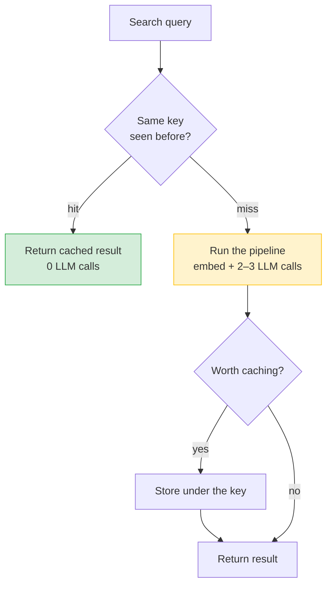

# The Search Result Cache

`src/search/cache.py` is a small in-memory cache that remembers the answer to a
search so an identical repeat doesn't re-run the whole pipeline. A search is
expensive — one query embedding plus two or three LLM calls — and that cost is
pure waste if the same question, over the same documents, was just asked.

## In a nutshell

When a search finishes, its result is filed away under a key built from *what was
asked* and *what could change the answer*. Ask the exact same thing again and the
cache hands back the previous result instantly, making **zero LLM calls** — the
UI shows a "Served from cache" step instead of the usual planning/retrieval
phases.

The cache lives **inside the search server process**, in memory. It is shared by
both ways of searching — the web UI (`/api/search`) and the MCP tool
(`ask_documents`) — because both run through the same `SearchCore.answer`.

> **What this cache is *not*.** It does **not** remember results in your browser.
> The web UI keeps the current search only in page memory, and the query lives in
> the URL (`?q=…`). Navigate away and back and the page re-runs the search from
> the URL — that's expected. This cache only makes that re-run *instant and free*
> when the question and the documents haven't changed. It saves cost and time on
> the server; it is not a "restore my last results" feature.

## What counts as "the same search"

Two searches share a cache entry only when **all four** of these match:

| Part of the key | Why it's in the key |
|---|---|
| **The query text** | The actual question. Whitespace is collapsed and case is ignored, so `"Show My  Invoices"` and `"show my invoices"` are the same. |
| **The UI filters** | A correspondent/type/date/tag filter changes the answer, so a filtered search never reuses an unfiltered one. |
| **The index version** | A cheap signal of the corpus: `document_count:chunk_count`. When the indexer adds, re-chunks, or prunes a document, this number moves — and every old entry silently stops matching. This is how the cache notices the library changed. |
| **Who is asking** | The signed-in user's (sanitised) display name. Answers can be personalised ("my passport"), so one person's cached answer is never served to another. |

## What gets cached, and for how long

Everything is bounded by `SEARCH_CACHE_TTL_SECONDS` — the maximum lifetime,
**4 hours** by default.

| Result | Cached? | Lifetime | Why |
|---|---|---|---|
| **Answered** (a real answer with at least one source) | ✅ | up to the TTL (4 h) | The expensive, valuable case — exactly what you want to reuse. |
| **Clarify** ("that's a bit too broad…") | ✅ | up to the TTL (4 h) | Re-asking the *identical* vague query can't make it clearer. If you reword it, that's a different key anyway — so caching is safe and skips a needless planner call. |
| **No match** ("couldn't find anything") | ✅ | up to the TTL, **but** evicted the moment the corpus changes | Nothing in the library matches, and that stays true until you add something. See below. |
| **Degraded answer** (the synthesiser's fallback when a model call fails) | ❌ | — | A failure must never stick. Not caching it means the next query gets a fresh attempt the instant the model recovers. |
| **Answered but empty / sourceless** | ❌ | — | Not a real answer; nothing worth keeping. |

### Why a "no match" is safe to cache

It sounds wrong to cache a *failure* — but a no-match isn't a failure, it's a
fact: *this isn't in the library yet*. That fact only stops being true when the
library gains a matching document, and **the index version handles that for you**:

- You add the document → the indexer reconciles → `document_count:chunk_count`
  changes → the cached no-match no longer matches its key → the next search runs
  fresh and finds it.
- A reconcile that indexes **nothing** leaves those counts untouched, so the
  no-match stays cached — which is correct, because the library is unchanged and
  searching again would only return the same "no match" at full cost.

So there's no timer racing the indexer: a no-match is cleared by *real corpus
change*, not by the clock.

## What clears the cache

| Trigger | Effect |
|---|---|
| **The corpus changes** | The index version moves; all entries for the old version stop matching (this is what frees stale no-matches). |
| **A config change** | The whole cache is dropped, so an edited model, prompt, top-k, or TTL never serves a pre-change answer. |
| **The TTL expires** | An entry older than `SEARCH_CACHE_TTL_SECONDS` is discarded on next access (default 4 h). |
| **The cache is full** | A hard ceiling of 512 entries; the oldest is evicted first. It's a memory guard, not a tuning knob — homelab query volume never gets near it. |
| **The process restarts** | The cache is in memory only. A redeploy/restart (e.g. an auto-update) starts it empty — the next searches repopulate it. |

## Turning it off

Set `SEARCH_CACHE_TTL_SECONDS=0` to disable the cache entirely: every search is a
miss and nothing is stored. That's the kill-switch; any positive value is the
lifetime in seconds.

> **Why in-memory and not Redis?** The search server is a single process, the
> saving only exists for a byte-identical repeat, and a lost cache costs nothing
> but a recompute. A shared store would add a dependency and a network hop for no
> real gain at this scale.

**Source:** `src/search/cache.py` · used from `src/search/core.py`
(`SearchCore.answer`)

---
