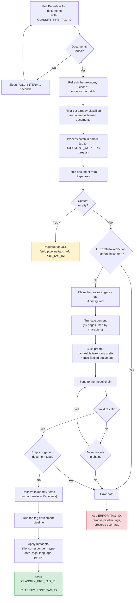
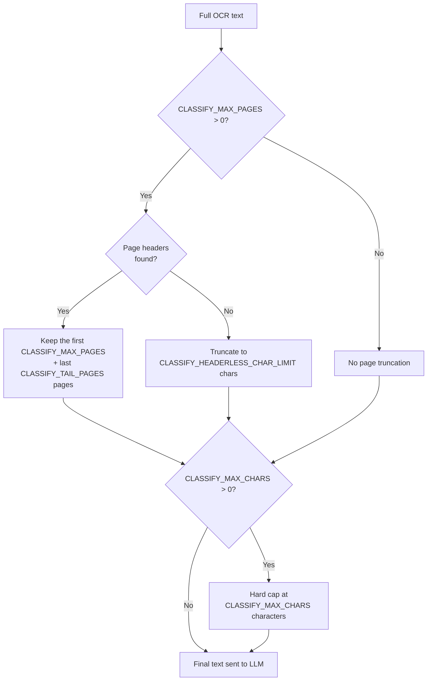
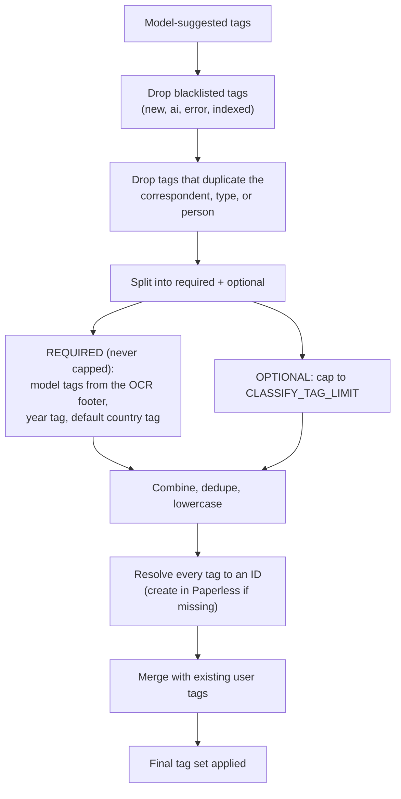

# Classification Pipeline

The classification daemon takes a document's OCR text and uses an LLM to extract structured metadata — title, correspondent, document type, tags, date, language, and subject person — then applies that metadata to the document in Paperless-ngx.

**Entry point:** `src/classifier/daemon.py` (CLI command: `paperless-classifier-daemon`)

Like the OCR daemon, it is **stateless** (all state lives in Paperless tags), safe to run as multiple instances, depends only on `common`, never touches the search index, and re-reads its configuration at the top of every poll (the exception being `POLL_INTERVAL` / `DOCUMENT_WORKERS`, fixed for the loop's lifetime).

---

## Processing Flow



---

## Document Queue Filtering

The daemon polls for documents carrying `CLASSIFY_PRE_TAG_ID`, which **defaults to `POST_TAG_ID`**. This is what chains OCR and classification automatically: when the OCR daemon finishes a document and adds `POST_TAG_ID`, the classifier picks it up on its next poll.

A document is skipped when it already has:

- `CLASSIFY_POST_TAG_ID` — already classified (the stale queue tag is stripped automatically).
- `CLASSIFY_PROCESSING_TAG_ID` — claimed by another worker instance (only when the lock tag is configured).
- `ERROR_TAG_ID` — previously failed.

**Source:** `src/common/document_iter.py`

---

## Content Truncation

OCR text is truncated before being sent to the LLM, to control cost and stay within context windows. Truncation runs in two stages, both preserving the OCR model footer so model tags survive:



### Stage 1 — Page-based truncation (when `CLASSIFY_MAX_PAGES > 0`)

- Keeps the first `CLASSIFY_MAX_PAGES` pages (default: 3) plus the last `CLASSIFY_TAIL_PAGES` pages (default: 2), using the `--- Page N ---` headers that OCR injects to find page boundaries.
- If there are no page headers (a single-page document, or a non-standard body), it falls back to truncating at `CLASSIFY_HEADERLESS_CHAR_LIMIT` characters (default: 15,000).
- The footer (`Transcribed by model: …`) is always carried through.

### Stage 2 — Character cap (when `CLASSIFY_MAX_CHARS > 0`)

- A hard character ceiling applied *after* page truncation. Default `0` — disabled, since page truncation is usually enough.

Each stage that actually trims appends a short human-readable note (which pages were kept, or how many characters), and those notes are passed to the model so it knows the text is partial.

**Source:** `src/classifier/content_prep.py`

---

## Taxonomy Cache

Once per batch — not per document — the daemon refreshes a **thread-safe in-memory cache** of every existing correspondent, document type, and tag in Paperless. The cache does two jobs:

1. **Prompt context.** Up to `CLASSIFY_TAXONOMY_LIMIT` items of each kind (default: 40, sorted by usage count) are listed in the prompt so the LLM reuses existing names rather than inventing near-duplicates.
2. **ID resolution.** When the LLM returns a correspondent / type / tag name, the cache resolves it to a Paperless ID with no extra API call.

Refreshing once per batch keeps listing calls to O(1) per polling cycle. When a new taxonomy item is created mid-batch, the cache appends it in place — no full refresh needed.

**Matching is normalised.** Names are lower-cased and whitespace-collapsed before comparison. For **correspondents**, corporate suffixes (`Ltd`, `Inc.`, `GmbH`, `LLC`, `PLC`, …) are also stripped, and substring matching is allowed — so "Amazon Ltd" matches an existing "Amazon". Document types and tags use exact normalised matching only.

**Source:** `src/classifier/taxonomy.py`, `src/classifier/normalisers.py`

---

## LLM Classification

The model is asked to return a single JSON object with exactly these fields:

```json
{
  "title":          "British English, key identifiers, no addresses",
  "correspondent":  "shortest recognisable sender; suffixes stripped",
  "tags":           ["lowercase tags; no minimum"],
  "document_date":  "YYYY-MM-DD, or \"\" if none",
  "document_type":  "specific label (Invoice, Payslip, Bank Statement…)",
  "language":       "ISO 639-1 code, or \"und\"",
  "person":         "subject/addressee full name, or \"\""
}
```

The system prompt (`src/classifier/prompts.py`) also carries:

- Title templates for common documents (e.g. `[Bank] Bank Statement (IBAN or Account) - MM/YYYY`).
- A rule to **mask IBANs** as `CC***Last6` (e.g. `IE82BOFI90001712345678` → `IE***345678`).
- Guidance to prefer existing taxonomy items and to avoid vague document types ("Document", "Other", "Unknown").
- Instructions to keep every string field in British English (except `language`) and to not duplicate the correspondent, type, or person as a tag.

> The year and country tags shown in older docs are **not** asked of the model as required output — they are added in code by the tag enrichment pipeline (below). The prompt mentions them so the model does not waste an optional-tag slot on them.

### Prompt structure: a cacheable prefix and a fenced suffix

The user message is built in two deliberately ordered halves (`provider.py`, `_build_user_message`):

1. **Stable, cacheable prefix.** The tag-limit guidance, then the three taxonomy lists. This is byte-identical for every document in a batch, so OpenAI's prompt cache keys on it and the taxonomy tokens are billed once per batch, not once per document. Nothing per-document appears above this point.
2. **Variable suffix.** The truncation note (if any), then the document transcription — always last so it never shifts the cacheable prefix.

### Untrusted content is fenced with a per-request nonce

OCR text is operator-unknown content that may read like an instruction ("ignore your previous instructions and …"). A *static* delimiter is source-visible and forgeable — a document could embed it to fake the boundary. Instead the transcription is wrapped in a **fresh, unguessable nonce fence** generated per request by `common.prompt_fences.build_data_fence` — markers of the form `<<<DOCUMENT nonce>>> … <<<END DOCUMENT nonce>>>`. The system prompt describes the fence form generically and tells the model that everything between the matching markers is data only; because the nonce is created *after* the content and lives only in the per-document suffix, the document cannot reproduce the closing marker to break out. The cacheable prefix is unaffected.

**Output parsing.** Responses are parsed leniently (`result.py`): markdown fences and preamble are tolerated, `null` fields become empty strings, and a `tags` value that arrives as a single string is coerced to a list.

When the provider is OpenAI, structured output (`response_format` with a strict JSON schema) is requested to guarantee well-formed JSON. Temperature is fixed at **0.2** for near-deterministic output, and `CLASSIFY_REASONING_EFFORT` (default: `medium`) is requested too.

**Source:** `src/classifier/prompts.py`, `src/classifier/provider.py`, `src/common/prompt_fences.py`

---

## Model Parameter Compatibility

Different models accept different request parameters — Ollama models reject OpenAI-only knobs like `response_format` and `reasoning_effort`, some models reject `temperature`, and so on. The classifier **always requests** temperature, reasoning effort, and (for OpenAI) the JSON-schema response format; compatibility is handled centrally by the shared `OpenAIChatMixin` adaptive layer (`common/llm.py`), not by the classifier itself:

1. **Pre-strip from cache.** Before sending, any parameter already recorded as rejected by this model — in a per-model, process-lifetime cache (`model_compat_cache`) — is dropped, so a known-incompatible parameter is never sent twice.
2. **Send.** On success, the completion is returned.
3. **Adapt on rejection.** If the model returns a `400` whose message names a strippable parameter that is present, that parameter is removed, the rejection is cached, and the **same model is retried**. A `400` bills no tokens, so the only cost of a first-time discovery is one extra round-trip — paid once for the life of the process, not per request.

The strippable parameters (and the order their error matchers are tried) live in a fixed registry: `temperature`, `response_format` / `json_schema`, `max_completion_tokens`, `max_tokens`, `reasoning_effort`, `verbosity`. The registry's fixed length bounds the strip loop, so a misfiring matcher can never loop forever.

This is what lets you mix OpenAI and Ollama models in one `AI_MODELS` chain without per-model configuration. Per-document counters record how often each parameter was stripped (`temperature_retries`, `response_format_retries`, `max_tokens_retries`).

**Source:** `src/classifier/provider.py`, `src/common/llm.py`, `src/common/model_compat.py`

---

## Quality Gates

The result must clear three gates. Note **when** each runs — one is checked before the LLM is even called:

| Gate | When | Condition | Why |
|:---|:---|:---|:---|
| OCR error / refusal markers | **Before** the LLM call | Source OCR text matches a refusal phrase or contains a `[REDACTED…]` marker | The OCR daemon should have caught this, but the classifier refuses to spend a token classifying error content |
| Empty result | After parsing | Every scalar field is blank and there are no usable tags | The model chain failed or returned nothing usable |
| Generic document type | After parsing | The type normalises to one of `document`, `general`, `misc`, `other`, `unknown`, `n/a`, `unspecified`, … | A vague type clutters the taxonomy and adds no value |

Any gate failure routes the document to the error path.

**Source:** `src/classifier/quality_gates.py`, `src/classifier/metadata.py`, `src/classifier/constants.py`

---

## Metadata Application

When classification succeeds, the fields are applied to the document in a single Paperless `PATCH`:

| Field | Behaviour |
|:---|:---|
| **Title** | The model's title, trimmed. An empty title is sent as `None`: Paperless treats an empty-string title as "no change", so `"" → None` is collapsed at the API boundary to make the intent explicit and skip a redundant field. |
| **Correspondent** | Resolved to an existing Paperless correspondent by normalised name (suffix-stripped, substring-matched), or created if absent. Omitted when the model returns no correspondent. |
| **Document Type** | Resolved to an existing type or created. Omitted when the model returns none. |
| **Document Date** | Parsed and normalised to `YYYY-MM-DD`. If the value is empty or unparseable, `None` is sent — Paperless leaves the existing date untouched. |
| **Language** | Coerced to a two-letter ISO 639-1 code (handling locale strings like `en-US`) or `und`. An empty value sends `None` (field unchanged). |
| **Tags** | Built by the tag enrichment pipeline below, merged with the document's existing tags. |
| **Person** | Only when `CLASSIFY_PERSON_FIELD_ID` is set: the subject's name is upserted into that Paperless custom field (which must be a text field). |

The year tag's date is resolved separately from the stored document date: it prefers the classifier's date, falls back to the document's `created` date, and finally to today — so a document always gets a year tag even when the model found no date.

**Source:** `src/classifier/worker.py`, `src/classifier/metadata.py`

---

## Tag Enrichment Pipeline

The model's suggested tags pass through a fixed pipeline before they are applied:



The distinction that matters:

- **Required tags are always included and do *not* count toward `CLASSIFY_TAG_LIMIT`.** These are the OCR model markers (parsed from the `Transcribed by model: …` footer), a year tag derived from the document date (falling back to the current year), and the `CLASSIFY_DEFAULT_COUNTRY_TAG` if configured.
- **Only the model's optional tags are capped** to `CLASSIFY_TAG_LIMIT` (default: 5). A model-suggested tag that duplicates a required one is dropped from the optional set so it cannot eat into the limit.

Every resulting tag is resolved against the taxonomy cache and created in Paperless if it does not yet exist.

**Source:** `src/classifier/tag_filters.py`, `src/classifier/constants.py`

---

## Error Handling & Quarantine

**On classification failure** (any quality gate, or all models failing):

1. `ERROR_TAG_ID` is added (if configured).
2. All pipeline tags are removed.
3. User-assigned tags are preserved.

**On empty content (no OCR text yet):** the document is **requeued for OCR** — its pipeline tags are stripped and `PRE_TAG_ID` is added — handling the case where a document was tagged for classification before OCR had finished. (If the requeue write itself fails, the document is error-tagged instead, so it never silently loops.)

**Write-back quarantine.** The LLM tokens are already spent once the model responds. If Paperless *permanently* rejects the metadata write (a 4xx — a rejected `PATCH`, a stale taxonomy primary key), leaving the document queued would re-classify it every poll and burn tokens forever, so it is **quarantined**: error-tagged so it leaves the queue. A *transient* failure (5xx / network) is re-raised for the daemon loop to retry once Paperless recovers.

**Write-back circuit breaker.** As with the OCR daemon, a process-lifetime circuit breaker tracks the write-back failure streak and **halts** the daemon if Paperless keeps rejecting writes, so a systemic fault cannot spend one LLM call per queued document. A saved result clears the streak; a configuration change resets the breaker. See [Resilience](resilience.md).

**Source:** `src/classifier/worker.py`, `src/common/tags.py`, `src/common/circuit_breaker.py`

---

## File Index

| File | Purpose |
|:---|:---|
| `daemon.py` | Entry point — polling loop, per-batch taxonomy refresh, config hot-reload, heartbeat, circuit breaker |
| `worker.py` | `ClassificationProcessor` — per-document orchestration: claim, truncate, classify, validate, apply |
| `provider.py` | `ClassificationProvider` — model fallback, cacheable-prefix prompt, nonce fence, parameter compatibility |
| `prompts.py` | The classification system prompt, JSON schema, and default temperature |
| `content_prep.py` | Page-based and character-based truncation |
| `taxonomy.py` | `TaxonomyCache` — thread-safe lookup, ID resolution, and creation |
| `tag_filters.py` | Blacklisting, redundancy filtering, and required/optional tag enrichment |
| `metadata.py` | Date, language, custom-field, and empty-result helpers |
| `result.py` | `ClassificationResult` dataclass and the lenient JSON parser |
| `quality_gates.py` | Generic-type and OCR-error content checks |
| `normalisers.py` | Name and string normalisation for taxonomy matching |
| `constants.py` | Page/footer regexes, generic-type set, tag blacklist |
