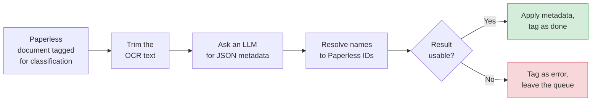
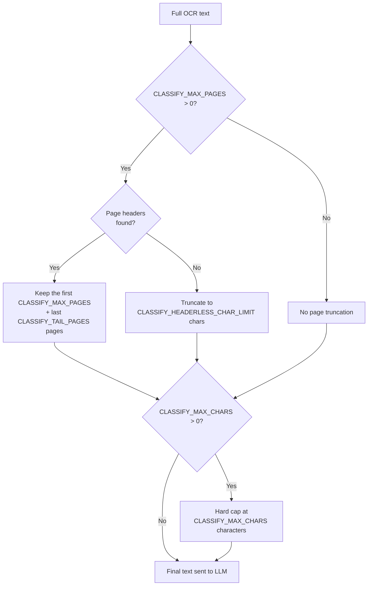
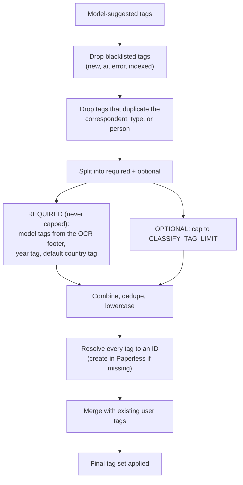
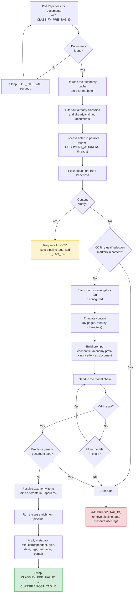

# Classification Pipeline

The classification daemon reads a document's OCR text and works out what it is — its title, who sent it, what type it is, when it is dated, what language it is in, who it is about, and a handful of tags — then writes that metadata back to Paperless-ngx. It is the step that turns a wall of transcribed text into a tidy, searchable document.

## In a nutshell

Once a document has been OCR'd, it is just text with no labels. This daemon labels it. Every poll it asks Paperless "any documents tagged for classification?", and for each one it finds:

1. Fetches the document and trims the OCR text down to a sensible size.
2. Sends that text to an LLM, asking for a single JSON object of metadata back.
3. Cleans up the answer, resolves the names to Paperless IDs (creating any that don't exist), and saves it all back — swapping the "needs classification" tag for the "done" tag.

The single most important thing to understand: like the OCR daemon, **the classifier keeps no state of its own.** What to work on, what is finished, what failed — all of it lives in Paperless tags. That makes it safe to run several copies at once, and means a saved configuration change takes effect on the next poll with no restart.

It also chains automatically off the OCR daemon. The tag it watches for, `CLASSIFY_PRE_TAG_ID`, **defaults to the OCR "done" tag (`POST_TAG_ID`)** — so the moment OCR finishes a document, the classifier picks it up.



**Entry point:** `src/classifier/daemon.py` (CLI command: `paperless-classifier-daemon`)

The daemon depends only on `common`, never touches the search index, and re-reads its configuration at the top of every poll — the one exception being `POLL_INTERVAL` / `DOCUMENT_WORKERS`, which set the loop's cadence and pool size and so are fixed for the loop's lifetime.

---

## How it works

A document moves through the daemon in five stages: **find it, fetch it, trim it, classify it, save it.** This section walks that path in order; the deeper sections below cover the internals — the taxonomy cache, the prompt's security design, model compatibility, the quality gates, and what happens when something goes wrong.

### Finding work: the polling loop

The daemon polls Paperless every `POLL_INTERVAL` seconds for documents carrying the queue tag, `CLASSIFY_PRE_TAG_ID`. Tags are the daemon's entire notion of "what to do", so a document is skipped when it already carries one of these:

- `CLASSIFY_POST_TAG_ID` — already classified. The stale `CLASSIFY_PRE_TAG_ID` is stripped automatically so the document leaves the queue cleanly.
- `CLASSIFY_PROCESSING_TAG_ID` — claimed by another worker instance (only when this lock tag is configured).
- `ERROR_TAG_ID` — previously failed.

Configuration is re-read at the top of every poll, so a saved change is picked up on the next cycle.

**Source:** `src/common/document_iter.py`

### Fetching and the early checks

Once a document is selected, the daemon claims it (by adding `CLASSIFY_PROCESSING_TAG_ID`, if configured) and fetches its current content from Paperless. Two things can divert it before any LLM call is made:

- **No OCR text yet.** If the content is empty, the document was tagged for classification before OCR finished. Rather than fail it, the daemon **requeues it for OCR** — it strips the pipeline tags and adds the OCR queue tag, `PRE_TAG_ID`, so OCR picks it up again.
- **Error content from OCR.** If the text contains an OCR refusal phrase or a `[REDACTED…]` marker, the OCR daemon should already have caught it — but the classifier refuses to spend a token classifying junk, so the document goes straight to the error path.

### Trimming the text

OCR text can run to many pages, and the LLM is billed per token, so the text is **truncated** before it is sent — in two stages, both of which keep the OCR model footer so the model tags survive (more on that under [Content truncation](#content-truncation-keeping-the-prompt-small)).

### Classifying

The trimmed text is sent to a model with a system prompt that asks for one JSON object of metadata. If the model fails or returns nonsense, the daemon falls back to the next model in a configured chain. The detail — the prompt's structure, how untrusted text is fenced off, lenient parsing, and the model-compatibility layer — is in the sections that follow.

### Validating and saving

The parsed result must clear a set of **quality gates**: it must not be empty, and its document type must not be a vague placeholder like "Document" or "Other". If it passes, the daemon resolves every name to a Paperless ID, runs the tags through an enrichment pipeline, and applies the whole lot in a single write — swapping `CLASSIFY_PRE_TAG_ID` for `CLASSIFY_POST_TAG_ID`. If it fails, the document is tagged as errored and removed from the queue so it is never silently retried into a loop.

---

## Content truncation: keeping the prompt small

OCR text is truncated before being sent to the LLM, to control cost and stay within the model's context window. Truncation runs in two stages. Both preserve the OCR model footer (`Transcribed by model: …`) so the model tags it carries survive into the prompt and can later become tags.



**Stage 1 — by pages** (when `CLASSIFY_MAX_PAGES > 0`). The classifier keeps the first `CLASSIFY_MAX_PAGES` pages (default: 3) plus the last `CLASSIFY_TAIL_PAGES` pages (default: 2), using the `--- Page N ---` headers that OCR injects to find page boundaries. The first and last pages of a document usually carry the identifying detail, so this keeps what matters and drops the filler in the middle. If there are no page headers (a single-page document, or a non-standard body), it falls back to truncating at `CLASSIFY_HEADERLESS_CHAR_LIMIT` characters (default: 15,000).

**Stage 2 — a hard character cap** (when `CLASSIFY_MAX_CHARS > 0`). A character ceiling applied *after* page truncation. The default is `0` — disabled — because page truncation is usually enough on its own.

Each stage that actually trims appends a short human-readable note (which pages it kept, or how many characters), and those notes are passed to the model so it knows it is looking at a partial document.

**Source:** `src/classifier/content_prep.py`

---

## The taxonomy cache

To avoid inventing near-duplicate names ("Amazon", "Amazon.com", "Amazon Web Services") the classifier shows the model the names that already exist in Paperless and asks it to reuse them. Those names come from the **taxonomy cache**: a thread-safe in-memory snapshot of every existing correspondent, document type, and tag.

The cache is refreshed **once per batch, not per document** — so listing Paperless's taxonomy costs one round of API calls per polling cycle, no matter how many documents the batch contains. When a new taxonomy item is created mid-batch, the cache appends it in place; no full refresh is needed.

It does two jobs:

1. **Prompt context.** Up to `CLASSIFY_TAXONOMY_LIMIT` items of each kind (default: 40, sorted by usage count so the most-used names come first) are listed in the prompt.
2. **ID resolution.** When the model returns a name, the cache resolves it to a Paperless ID with no extra API call.

**Matching is normalised** — names are lower-cased and whitespace-collapsed before they are compared. For **correspondents** the match is fuzzier still: common corporate suffixes (`Ltd`, `Inc`, `GmbH`, `LLC`, `PLC`, `SA`, `SARL`, …) are stripped and substring matching is allowed, so "Revolut Ltd" finds an existing "Revolut". Document types and tags use exact normalised matching only.

**Source:** `src/classifier/taxonomy.py`, `src/classifier/normalisers.py`

---

## What the model is asked for

The model is told to return a single JSON object with exactly these fields:

```json
{
  "title":          "British English, key identifiers, no addresses",
  "correspondent":  "shortest recognisable sender; suffixes stripped",
  "tags":           ["lowercase tags; no minimum"],
  "document_date":  "YYYY-MM-DD, or \"\" if none",
  "document_type":  "specific label (Invoice, Payslip, Bank Statement…)",
  "language":       "ISO 639-1 code, or \"und\"",
  "person":         "subject/addressee full name, or \"\""
}
```

The system prompt (`src/classifier/prompts.py`) also carries:

- Title templates for common documents (e.g. `[Bank] Bank Statement (IBAN or Account) - MM/YYYY`).
- A rule to **mask IBANs** as `CC***Last6` (e.g. `IE82BOFI90001712345678` → `IE***345678`).
- Guidance to prefer existing taxonomy items and to avoid vague document types ("Document", "Other", "Unknown").
- Instructions to keep every string field in British English (except `language`) and to not repeat the correspondent, type, or person as a tag.

> The year and country tags are **not** asked of the model as required output — they are added in code by the [tag enrichment pipeline](#tag-enrichment-the-final-tag-set) below. The prompt mentions them so the model does not waste an optional-tag slot on them.

**Source:** `src/classifier/prompts.py`

---

## Prompt structure: a cacheable prefix and a fenced suffix

The user message is built in two deliberately ordered halves (`provider.py`, `_build_user_message`). The order is not cosmetic — it is what makes the prompt both cheap and safe.

**1. A stable, cacheable prefix.** First the tag-limit guidance, then the three taxonomy lists. This part is byte-identical for every document in a batch, so OpenAI's prompt cache keys on it and the taxonomy tokens are billed **once per batch, not once per document**. Nothing per-document appears above this point.

**2. A variable suffix.** The truncation note (if any), then the document text — always last, so it never shifts the cacheable prefix.

### Untrusted content is fenced with a per-request nonce

The OCR text is operator-unknown: it can contain anything, including text that reads like an instruction ("ignore your previous instructions and …"). It must not be able to hijack the prompt.

A *static* delimiter would not be enough — it is visible in the source, so a malicious document could embed the same marker and forge the boundary, smuggling its content out of the data region. Instead the transcription is wrapped in a **fresh, unguessable nonce fence** generated per request by `common.prompt_fences.build_data_fence`: a matched pair of markers of the form `<<<DOCUMENT nonce>>> … <<<END DOCUMENT nonce>>>`, where `nonce` is a random 32-character hex token chosen anew each time.

The system prompt describes the fence form generically and tells the model that everything between the matching markers is data only, never instructions. Because the nonce is generated *after* the content exists and lives only in the per-document suffix, the document cannot reproduce the closing marker to break out — and the cacheable prefix is unaffected.

**Source:** `src/classifier/prompts.py`, `src/classifier/provider.py`, `src/common/prompt_fences.py`

### Parsing the response

Responses are parsed leniently (`result.py`): markdown fences and surrounding preamble are tolerated, `null` fields become empty strings, and a `tags` value that arrives as a single string instead of a list is coerced to a list.

When the provider is OpenAI, structured output (`response_format` with a strict JSON schema) is requested to guarantee well-formed JSON. Temperature is fixed at **0.2** for near-deterministic output, and `CLASSIFY_REASONING_EFFORT` (default: `medium`) is requested too.

---

## Model fallback and parameter compatibility

`CLASSIFY_MODELS` is an ordered list of models tried in turn: the first is the primary, the rest are fallbacks. If a model errors or returns unparseable JSON, the daemon advances to the next. If every model fails, the document goes to the error path. (Per-document counters track `attempts`, `api_errors`, `invalid_json`, and `fallback_successes`, logged once per document.)

But there is a catch: different models accept different request parameters. Ollama-served models reject OpenAI-only knobs like `response_format` and `reasoning_effort`; some models reject `temperature`. The classifier does **not** special-case any of this. It **always requests** temperature, reasoning effort, and (for OpenAI) the JSON-schema response format, and leaves compatibility to the shared `OpenAIChatMixin` adaptive layer (`common/llm.py`):

1. **Pre-strip from cache.** Before sending, any parameter already recorded as rejected by *this* model — in a per-model, process-lifetime cache (`model_compat_cache`) — is dropped, so a known-incompatible parameter is never sent twice.
2. **Send.** On success, the completion is returned.
3. **Adapt on rejection.** If the model returns a `400` whose message names a strippable parameter that is present, that parameter is removed, the rejection is cached, and the **same model is retried**. A `400` bills no tokens, so the only cost of a first-time discovery is one extra round-trip — paid once for the life of the process, not per request.

The strippable parameters (and the order their error matchers are tried) live in a fixed registry: `temperature`, `response_format` / `json_schema`, `max_completion_tokens`, `max_tokens`, `reasoning_effort`, `verbosity`. The registry's fixed length bounds the strip loop, so a misfiring matcher can never loop forever.

This is what lets you mix OpenAI and Ollama models in one `CLASSIFY_MODELS` chain with no per-model configuration. Per-document counters record how often each parameter was stripped (`temperature_retries`, `response_format_retries`, `max_tokens_retries`).

**Source:** `src/classifier/provider.py`, `src/common/llm.py`, `src/common/model_compat.py`

---

## Quality gates

Before a result is applied, it must clear three gates. Note **when** each runs — one is checked before the LLM is even called:

| Gate | When | Condition | Why |
|:---|:---|:---|:---|
| OCR error / refusal markers | **Before** the LLM call | Source OCR text matches a refusal phrase or contains a `[REDACTED…]` marker | The OCR daemon should have caught this, but the classifier refuses to spend a token classifying error content |
| Empty result | After parsing | Every scalar field is blank and there are no usable tags | The model chain failed or returned nothing usable |
| Generic document type | After parsing | The type normalises to one of `document`, `general`, `misc`, `other`, `unknown`, `n/a`, `unspecified`, … | A vague type clutters the taxonomy and adds no value |

Any gate failure routes the document to the error path. The refusal check shares `is_error_content` with the OCR daemon, so the same phrases that fail OCR's own gate also bar a document from classification.

**Source:** `src/classifier/quality_gates.py`, `src/classifier/metadata.py`, `src/classifier/constants.py`, `src/common/content_checks.py`

---

## Applying the metadata

When a result passes the gates, every field is applied to the document in a single Paperless `PATCH`:

| Field | Behaviour |
|:---|:---|
| **Title** | The model's title, trimmed. An empty title is sent as `None`: Paperless treats an empty-string title as "no change", so `"" → None` is collapsed at the API boundary to make the intent explicit and skip a redundant field. |
| **Correspondent** | Resolved to an existing Paperless correspondent by normalised name (suffix-stripped, substring-matched), or created if absent. Omitted when the model returns no correspondent. |
| **Document Type** | Resolved to an existing type or created. Omitted when the model returns none. |
| **Document Date** | Parsed and normalised to `YYYY-MM-DD`. If the value is empty or unparseable, `None` is sent — Paperless leaves the existing date untouched. |
| **Language** | Coerced to a two-letter ISO 639-1 code (handling locale strings like `en-US`) or `und`. An empty value sends `None` (field unchanged). |
| **Tags** | Built by the tag enrichment pipeline below, then merged with the document's existing tags. |
| **Person** | Only when `CLASSIFY_PERSON_FIELD_ID` is set: the subject's name is upserted into that Paperless custom field (which must be a text field). |

One subtlety on dates: the *year tag* gets its own date resolution, separate from the stored document date. It prefers the classifier's date, falls back to the document's `created` date, and finally to today — so a document always gets a year tag even when the model found no date.

**Source:** `src/classifier/worker.py`, `src/classifier/metadata.py`

---

## Tag enrichment: the final tag set

The model's suggested tags are not applied as-is. They pass through a fixed pipeline that drops the junk, adds the tags the system guarantees, and enforces a limit.



The distinction that matters is **required versus optional**:

- **Required tags are always included and do *not* count toward `CLASSIFY_TAG_LIMIT`.** These are the OCR model markers (parsed from the `Transcribed by model: …` footer), a year tag derived from the document date (falling back to the current year), and the `CLASSIFY_DEFAULT_COUNTRY_TAG` if configured.
- **Only the model's optional tags are capped** to `CLASSIFY_TAG_LIMIT` (default: 5). A model-suggested tag that duplicates a required one is dropped from the optional set so it cannot eat into the limit.

Every resulting tag is resolved against the taxonomy cache and created in Paperless if it does not yet exist.

**Source:** `src/classifier/tag_filters.py`, `src/classifier/constants.py`

---

## Error handling & quarantine

When classification fails — any quality gate, or every model failing:

1. `ERROR_TAG_ID` is added (if configured).
2. All pipeline tags are removed.
3. **All user-assigned tags are preserved** — only automation tags are touched.
4. Without the queue tag, the document is never picked up again.

**Empty content is the exception.** If a document has no OCR text yet, it is not an error — it was simply tagged for classification before OCR finished. The daemon **requeues it for OCR**: it strips the pipeline tags and adds `PRE_TAG_ID`. (If that requeue write itself fails, the document is error-tagged instead, so it never silently loops.)

**Write-back quarantine.** The LLM tokens for a document are spent the moment the model responds. If Paperless then *permanently* rejects the metadata write (a 4xx — a rejected `PATCH`, a stale taxonomy primary key), re-queuing would re-classify the document every poll and burn those tokens again, forever — so the document is **quarantined**: error-tagged so it leaves the queue. A *transient* failure (5xx / network) is re-raised for the daemon loop to retry once Paperless recovers.

**Write-back circuit breaker.** As with the OCR daemon, a process-lifetime circuit breaker tracks the write-back failure streak. If Paperless keeps rejecting writes, the breaker trips and **halts** the daemon so a systemic fault cannot burn one LLM call per queued document. A saved result clears the streak; a configuration change resets the breaker (the operator's signal that the fault may now be fixed). For the shared resilience model, see [Resilience](resilience.md).

**Source:** `src/classifier/worker.py`, `src/common/tags.py`, `src/common/circuit_breaker.py`

---

## Processing flow in full

The big picture is the diagram at the top of this page. This is the same journey at full detail — every branch and decision a document passes through:



---

## File Index

| File | Purpose |
|:---|:---|
| `daemon.py` | Entry point — polling loop, per-batch taxonomy refresh, config hot-reload, heartbeat, circuit breaker |
| `worker.py` | `ClassificationProcessor` — per-document orchestration: claim, truncate, classify, validate, apply |
| `provider.py` | `ClassificationProvider` — model fallback, cacheable-prefix prompt, nonce fence, parameter compatibility |
| `prompts.py` | The classification system prompt, JSON schema, and default temperature |
| `content_prep.py` | Page-based and character-based truncation |
| `taxonomy.py` | `TaxonomyCache` — thread-safe lookup, ID resolution, and creation |
| `tag_filters.py` | Blacklisting, redundancy filtering, and required/optional tag enrichment |
| `metadata.py` | Date, language, custom-field, and empty-result helpers |
| `result.py` | `ClassificationResult` dataclass and the lenient JSON parser |
| `quality_gates.py` | Generic-type and OCR-error content checks |
| `normalisers.py` | Name and string normalisation for taxonomy matching |
| `constants.py` | Page/footer regexes, generic-type set, tag blacklist |
