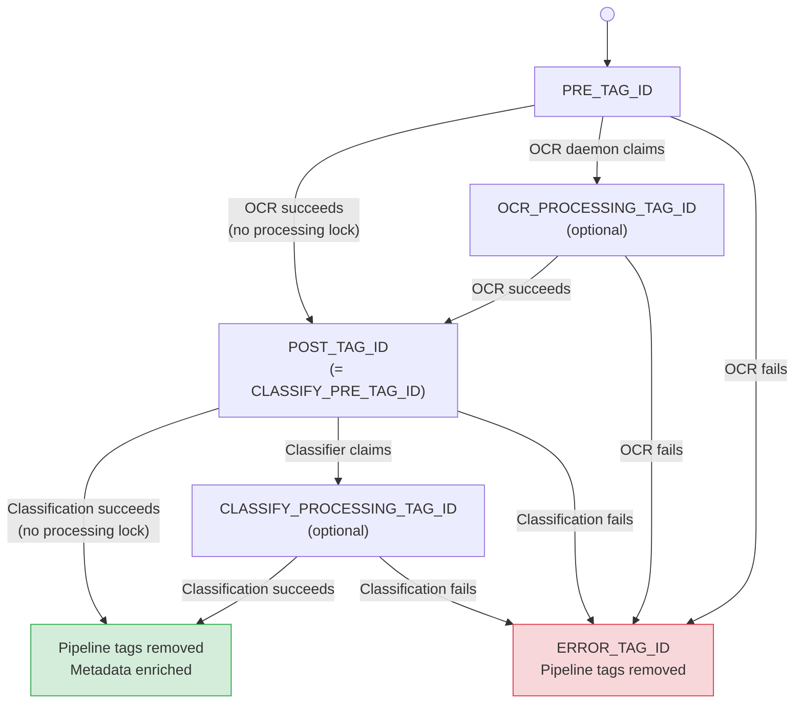

# Configuration Reference

paperless-ai has a lot of knobs, but you only need a handful to get going. This page is the full reference — every setting, what it does, and its default. Read the next two sections first; they tell you how configuration works and the short list you actually have to set. Everything after that is optional tuning you can ignore until you need it.

## In a nutshell

Configuration lives in a database, not a file. The values sit in the **application database** (`app.db`), in a `config` table, and you edit them from the **Settings** screen in the web UI. There is no `.env` file to manage and **no restart** when you change something — saving a value takes effect within seconds. All four daemons (OCR, classifier, indexer, search) read this table and hot-load any change.

You can still set values as **environment variables** — they seed the database on first run and act as a fallback — but the database always wins once a value is set there.

Two settings are the exception. `APP_DB_PATH` and `INDEX_DB_PATH` are *bootstrap* variables: they tell each process where its databases live, so they cannot themselves live in a database. They stay environment variables. See [Application & Index Databases](#application--index-databases).

## What you actually need to set

To get a working install, you need just a few values. Everything else has a sensible default.

| Setting | Why you need it |
|:---|:---|
| `PAPERLESS_URL` | Where your Paperless-ngx instance lives (defaults to `http://paperless:8000`, which is correct for the standard Docker setup). |
| `PAPERLESS_TOKEN` | The API token paperless-ai uses to talk to Paperless. **Required.** |
| `OPENAI_API_KEY` | The OpenAI key. **Required even if you run Ollama** — the search indexer always embeds with OpenAI. |
| `PRE_TAG_ID`, `POST_TAG_ID`, `ERROR_TAG_ID` | The Paperless tag IDs that drive the pipeline: which documents need OCR, which are done, which failed. They have defaults (`443` / `444` / `552`), but those are example IDs — set them to match the tags in *your* Paperless. |

Set those, save, and the pipeline runs. Everything below is for tuning: model choice, concurrency, classification behaviour, the search server, cost controls, logging. Skip it until you have a reason to change it.

---

## How configuration works

**Precedence.** For every setting, the value is resolved in this order:

1. the `config` table in `app.db` — set from the Settings screen;
2. the matching environment variable, if set;
3. the coded default shown in the tables below.

A value in the database always wins over an environment variable.

**First run.** When `app.db` has no configuration yet — a fresh install, or
the first start after upgrading from an environment-only deployment — the
`config` table is seeded from the current environment. An existing deployment
therefore keeps its `.env` configuration unchanged through the upgrade, and
every value then becomes editable in the Settings screen.

**Secrets.** `OPENAI_API_KEY` and `PAPERLESS_TOKEN` are stored in `app.db`,
which sits on the protected `/data` volume. They are masked in the Settings
screen until explicitly revealed.

**Applying changes — hot-load.** Saving configuration takes effect with **no
restart**. Each save bumps a `config_version` counter; every daemon re-checks
it between documents and the search server re-checks it per request, then
rebuilds its settings (and config-derived clients) only when the counter
moved. A change is live within one poll cycle on the daemons and on the next
request on the search server.

**Re-indexing.** A few settings — the embedding model and the chunk size /
overlap — change *how documents are indexed*. Saving one hot-loads like any
other setting, but the existing index stays on the old chunking until you run
a full re-index from the **Index** page. The Settings screen flags exactly
these settings with a re-index note.

The variable names in the tables below are the keys used in the `config`
table and as environment-variable names; the descriptions and defaults are
the reference for every setting.

---

## Paperless-ngx Connection

How paperless-ai reaches your Paperless instance, and how it authenticates.

| Variable | Description | Default | Required |
|:---|:---|:---|:---|
| `PAPERLESS_URL` | URL of your Paperless-ngx instance, as the daemons reach the API (often an internal address). Stored stripped of any trailing slash. | `http://paperless:8000` | No |
| `PAPERLESS_PUBLIC_URL` | Browser-facing base URL for the document deep-links the search UI renders. Set this when the API is reached over an internal address the user's browser cannot resolve. Falls back to `PAPERLESS_URL` when unset. | Value of `PAPERLESS_URL` | No |
| `PAPERLESS_TOKEN` | Paperless-ngx API authentication token | — | **Yes** |

---

## Application & Index Databases

paperless-ai keeps two separate SQLite databases on the `/data` volume. They
are kept apart so that rebuilding the search index never destroys user
accounts or configuration.

| Variable | Description | Default | Required |
|:---|:---|:---|:---|
| `INDEX_DB_PATH` | Path to the search index database (`index.db`) — chunks, embeddings and taxonomy. Recreated by an index rebuild. | `/data/index.db` | No |
| `APP_DB_PATH` | Path to the application database (`app.db`) — user accounts and sessions. Survives an index rebuild. | `/data/app.db` | No |

Both are bootstrap variables: they are read from the environment at startup
and cannot be moved into the in-database configuration, because they tell the
process where that database lives.

**`SEARCH_API_KEY` is retired (Wave 3).** This environment variable was the
legacy shared-secret bearer credential for programmatic and MCP access. It is
no longer read by the search server. Programmatic access is now by minted API
keys (Settings → API Keys in the web UI); a deployment with `SEARCH_API_KEY`
set will see no effect — the variable is silently ignored.

---

## LLM Provider

Which AI provider runs OCR and classification, and the model fallback chains.
`openai` is the default; `ollama` runs everything locally — except embeddings,
which always use OpenAI.

| Variable | Description | Default | Required |
|:---|:---|:---|:---|
| `LLM_PROVIDER` | AI provider for OCR and classification: `openai` or `ollama` | `openai` | No |
| `OPENAI_API_KEY` | OpenAI API key. **Required regardless of `LLM_PROVIDER`** — the embedding step (used by the indexer) always uses OpenAI. | — | **Yes** |
| `OLLAMA_BASE_URL` | Ollama API base URL (must end with `/v1/`). Used only when `LLM_PROVIDER=ollama`. | `http://localhost:11434/v1/` | No |
| `OCR_MODELS` | Comma-separated model fallback chain for OCR. Tried in order; first success wins. | OpenAI: `gpt-5.4-mini,gpt-5.4,gpt-5.5`; Ollama: `gemma3:27b,gemma3:12b` | No |
| `CLASSIFY_MODELS` | Comma-separated model fallback chain for classification. Tried in order; first success wins. | OpenAI: `gpt-5.4-mini,gpt-5.4,gpt-5.5`; Ollama: `gemma3:27b,gemma3:12b` | No |

> **Deprecated:** `AI_MODELS` is still honoured as an environment-variable fallback for both `OCR_MODELS` and `CLASSIFY_MODELS` when neither new key is set, but it is no longer the canonical key. Migrate to `OCR_MODELS` / `CLASSIFY_MODELS` — the `AI_MODELS` alias will be removed in a future release.

---

## OCR Settings

How scanned pages are rasterised and sent to the vision model. The defaults
match the request shape paperless-ai used before these knobs existed; the
cheaper options trade a little accuracy for lower cost.

| Variable | Description | Default |
|:---|:---|:---|
| `OCR_DPI` | DPI for rasterising PDF pages to images. Higher = better accuracy, larger images. | `300` |
| `OCR_MAX_SIDE` | Max pixel dimension of the longest side. Images are thumbnailed to fit within this before being sent to the vision API. | `1600` |
| `OCR_IMAGE_DETAIL` | The OpenAI vision `image_url.detail` level: `high`, `auto`, or `low`. `high` keeps the request identical to before this setting existed; `auto`/`low` are cheaper. | `high` |
| `OCR_REASONING_EFFORT` | Reasoning effort for the OCR call (OpenAI only): `minimal`, `low`, `medium`, `high`. `medium` is the model's own default; tune *down* to cut the reasoning-token premium on this high-volume call. | `medium` |
| `OCR_REFUSAL_MARKERS` | Comma-separated phrases (case-insensitive) that indicate a model refused to transcribe. If detected, the next model in the chain is tried. | `i can't assist, i cannot assist, i can't help with transcrib, i cannot help with transcrib, CHATGPT REFUSED TO TRANSCRIBE` |
| `OCR_INCLUDE_PAGE_MODELS` | If `true`, page headers include the model name (e.g. `--- Page 2 (gpt-5.5) ---`). | `false` |

---

## Classification Settings

How much of each document's text the classifier sees, and how it enriches the
metadata it writes back (tags, correspondents, document types, a person field).

| Variable | Description | Default |
|:---|:---|:---|
| `CLASSIFY_MAX_PAGES` | Max OCR pages sent to the classifier. Keeps first N pages (+ tail pages). `0` = no limit. | `3` |
| `CLASSIFY_TAIL_PAGES` | Additional pages included from the end of the document when truncating. | `2` |
| `CLASSIFY_HEADERLESS_CHAR_LIMIT` | Character limit used as fallback when OCR text has no `--- Page N ---` headers. | `15000` |
| `CLASSIFY_MAX_CHARS` | Hard character cap on OCR text sent to classifier. Applied after page truncation. `0` = no limit. | `0` |
| `CLASSIFY_MAX_TOKENS` | Max output tokens for the LLM response. `0` = use provider default. | `0` |
| `CLASSIFY_TAG_LIMIT` | Max number of **optional** tags to keep after enrichment. Required tags (year, country, model markers) don't count toward this. | `5` |
| `CLASSIFY_TAXONOMY_LIMIT` | Max number of existing correspondents, document types, and tags included in the LLM prompt as context. Sorted by usage. `0` = no limit. | `40` |
| `CLASSIFY_REASONING_EFFORT` | Reasoning effort for the classification call (OpenAI only): `minimal`, `low`, `medium`, `high`. `medium` is the model's own default. | `medium` |
| `CLASSIFY_PERSON_FIELD_ID` | Paperless custom field ID (integer) for storing the person/subject name. Must be a text-type custom field. Leave unset to skip. | — |
| `CLASSIFY_DEFAULT_COUNTRY_TAG` | Country tag name always added to every classified document (e.g. `Ireland`). Leave empty to skip. | — |

---

## Pipeline Tags

These integer tag IDs are how paperless-ai tracks each document's stage. They
hold no state of their own — a document's tags *are* its state. The OCR daemon
picks up anything tagged `PRE_TAG_ID`, swaps it for `POST_TAG_ID` when done;
the classifier then picks up `CLASSIFY_PRE_TAG_ID` (which defaults to
`POST_TAG_ID`), and a failure anywhere lands the document on `ERROR_TAG_ID`.

| Variable | Description | Default |
|:---|:---|:---|
| `PRE_TAG_ID` | Tag marking documents that need OCR | `443` |
| `POST_TAG_ID` | Tag applied after successful OCR | `444` |
| `OCR_PROCESSING_TAG_ID` | Tag added while OCR is in progress (processing lock). Only needed for [multi-instance deployments](deployment.md#multi-instance-deployments). | — |
| `CLASSIFY_PRE_TAG_ID` | Tag marking documents that need classification | Value of `POST_TAG_ID` |
| `CLASSIFY_POST_TAG_ID` | Tag applied after successful classification. If unset, pipeline tags are simply removed. | — |
| `CLASSIFY_PROCESSING_TAG_ID` | Tag added while classification is in progress (processing lock). Only needed for [multi-instance deployments](deployment.md#multi-instance-deployments). | — |
| `ERROR_TAG_ID` | Tag applied when OCR or classification fails | `552` |

Tag IDs set to `0` or negative values are treated as unset/disabled.

### Tag State Flow

---

## Performance Tuning

How wide the daemons run and how they handle slow or flaky API calls. The
defaults are conservative and safe; raise the concurrency knobs only when you
know your provider can take it.

| Variable | Description | Default |
|:---|:---|:---|
| `DOCUMENT_WORKERS` | Number of documents processed in parallel per daemon | `4` |
| `PAGE_WORKERS` | Number of pages OCR'd in parallel within a single document (OCR daemon) | `8` |
| `POLL_INTERVAL` | Seconds between polling Paperless for new work (tag daemons) | `15` |
| `MAX_RETRIES` | Total attempts for a retryable network/API error before giving up (1 = no retry) | `3` |
| `MAX_RETRY_BACKOFF_SECONDS` | Maximum sleep duration between retries (exponential backoff is capped here) | `30` |
| `REQUEST_TIMEOUT` | HTTP request timeout in seconds for model API calls | `180` |
| `LLM_MAX_CONCURRENT` | Max concurrent LLM API calls across all threads of a process. `0` = unlimited. | `4` |

> `POLL_INTERVAL` and `DOCUMENT_WORKERS` are the one class of setting that does
> **not** hot-load on the tag daemons — the polling loop fixes its cadence and
> pool size for its lifetime, so a change to either needs a restart. Every other
> setting hot-loads.

### Tuning Recommendations

- The theoretical ceiling on concurrent vision API calls is `DOCUMENT_WORKERS × PAGE_WORKERS` (defaults 4 × 8 = 32), **but `LLM_MAX_CONCURRENT` (default 4) is the real cap** — it bounds total concurrent LLM calls across all threads. Raise it, or set it to `0`, to let the worker pools run wider.
- For **Ollama on a single GPU**, keep concurrency low — set `LLM_MAX_CONCURRENT` to `1` or `2` (or lower `PAGE_WORKERS`), since Ollama processes sequentially.
- For **high-throughput OpenAI** deployments, raise `LLM_MAX_CONCURRENT` (and `DOCUMENT_WORKERS`) together while watching your rate limits.

---

## Embedding & Indexing

These drive the indexer daemon, which builds the search index. The **embedding
step always uses OpenAI**, so `OPENAI_API_KEY` is required even when
`LLM_PROVIDER=ollama`.

| Variable | Description | Default |
|:---|:---|:---|
| `EMBEDDING_MODEL` | OpenAI embedding model used to vectorise chunks. **Changing this requires a full re-index** (see [Re-indexing](#how-configuration-works)). | `text-embedding-3-small` |
| `EMBEDDING_DIMENSIONS` | Vector dimensionality. Locked to the embedding model and pinned in the index schema on first reconcile — a lone change is rejected, not warned. | `1536` |
| `EMBEDDING_MAX_CONCURRENT` | Max concurrent embedding API calls. `0` = unlimited. | `4` |
| `CHUNK_SIZE` | Target characters per text chunk. **Changing this requires a full re-index.** | `2000` |
| `CHUNK_OVERLAP` | Characters of overlap between adjacent chunks. Must be `≥ 0` and `< CHUNK_SIZE`. **Changing this requires a full re-index.** | `256` |
| `RECONCILE_INTERVAL` | Seconds between incremental reconciliation cycles. | `300` |
| `DELETION_SWEEP_INTERVAL` | Seconds between deletion sweeps (pruning documents removed from Paperless). | `3600` |

---

## Search Server

These drive the search server (HTTP API, web UI, MCP endpoint): where it
binds, how long sessions last, the models it uses, and how hard it reasons.

| Variable | Description | Default |
|:---|:---|:---|
| `SEARCH_SERVER_HOST` | Interface to bind. `0.0.0.0` is deliberate — the server is auth-gated; restrict exposure at the reverse proxy. | `0.0.0.0` |
| `SEARCH_SERVER_PORT` | TCP port to listen on (1–65535). | `8080` |
| `SEARCH_FORWARDED_ALLOW_IPS` | Which peers uvicorn trusts `X-Forwarded-For/-Proto` from. Pin to the proxy CIDR if the uvicorn port is directly reachable. | `*` |
| `SEARCH_SESSION_TTL` | Lifetime of the "keep me signed in" Web-UI session cookie, in seconds. An un-ticked login gets a fixed 8-hour session. | `604800` |
| `SEARCH_MAX_CONCURRENT` | Max in-flight `/api/search` requests (abuse/cost guard). `0` = unlimited. | `4` |
| `SEARCH_TOP_K` | Number of documents returned from retrieval to synthesis. | `10` |
| `SEARCH_MAX_REFINEMENTS` | Agentic refinement passes (≥ 0) before the pipeline answers. Each pass re-plans, retrieves and re-synthesises, so it adds several LLM calls per pass — the per-query budget is `2 + j + R×(2 + j)` (R = this value, j = 1 when the relevance judge is on), i.e. 6 with the defaults. See [search-pipeline.md](search-pipeline.md). Cost and latency scale with it. | `1` |
| `SEARCH_PLANNER_MODEL` | LLM model for the query planner (also judges query adequacy for Layer 1). | OpenAI: `gpt-5.4-mini`; Ollama: `gemma3:12b` |
| `SEARCH_ANSWER_MODEL` | LLM model for the synthesiser. | OpenAI: `gpt-5.5`; Ollama: `gemma3:27b` |
| `SEARCH_PLANNER_REASONING_EFFORT` | Reasoning effort for the planner call: `minimal`/`low`/`medium`/`high`. | `medium` |
| `SEARCH_ANSWER_REASONING_EFFORT` | Reasoning effort for the synthesiser call. | `medium` |
| `SEARCH_IDENTITY_AWARE` | If `true`, the logged-in user's display name is sanitised and passed to the planner and answer model, so first-person queries ("my passport") resolve to that person and answers address them as "you". The cache key includes the asker, so personalised answers never leak across users. Inert until an account has a display name. | `true` |

### Multi-spec retrieval

The planner can split one question into several retrieval specs and search them
in parallel, then merge the results. These cap that fan-out so a single query
or a single large document cannot dominate.

| Variable | Description | Default |
|:---|:---|:---|
| `SEARCH_PLANNER_MAX_SPECS` | Maximum retrieval specs the planner may emit per query. `1` degrades to the legacy single-spec path. Clamped to `≥ 1`. | `8` |
| `SEARCH_PLANNER_TAXONOMY_LIMIT` | Maximum names per taxonomy list (correspondents, document types, tags) shown to the planner so it picks real names instead of guessing. The lists sit in the cacheable prompt prefix; `0` means no cap. | `100` |
| `SEARCH_PER_SPEC_K` | Candidate chunks pulled from the store per retrieval spec. Defaults to the resolved `SEARCH_TOP_K`, so the total candidate budget is unchanged in the single-spec case. Clamped to `≥ 1`. | Value of `SEARCH_TOP_K` |
| `SEARCH_MAX_CHUNKS_PER_DOC` | Maximum chunks per document admitted to the synthesiser after the chunk-union step. Stops one large document from filling the context window. Clamped to `≥ 1`. | `3` |

### Search cost controls

A search answer can run several LLM calls, so each one costs money. These knobs
short-circuit the cheap-to-decide cases before the expensive synthesis call —
the four "layers" that reject a degenerate, vague, or off-topic query early —
and cap the result cache. For how the layers fit together, see
[The Search Server](search.md).

| Variable | Description | Default |
|:---|:---|:---|
| `SEARCH_CACHE_TTL_SECONDS` | Result-cache lifetime. `0` disables the cache entirely (the kill-switch). Default is 4 hours. | `14400` |
| `SEARCH_SKIP_PLANNER_FOR_TRIVIAL` | If `true`, skip the planner LLM call for trivial queries (saves one call). | `false` |
| `SEARCH_MIN_QUERY_CHARS` | Layer 0: reject queries shorter than this (after trimming) before any LLM call. `0` disables it. | `2` |
| `SEARCH_GATE_ADEQUACY` | Layer 1: let the planner return a "too vague, please clarify" outcome instead of a plan (no extra LLM call). | `true` |
| `SEARCH_GATE_RELEVANCE` | Layer 2: skip synthesis and return "no matches" when retrieval is clearly irrelevant. | `true` |
| `SEARCH_RELEVANCE_MIN_SIMILARITY` | Layer 2 floor: reject only when the best vector similarity is below this **and** there is no keyword hit. Calibrated (good ≥ 0.666, off-topic ≈ 0.567). | `0.60` |
| `SEARCH_GATE_JUDGE` | Layer 3: run a cheap relevance judge over the retrieved documents before synthesis. It bails to "no matches" when nothing is relevant, otherwise filters the chunk set to the relevant documents. Recall-biased and fail-open — any judge failure proceeds to synthesis over all chunks. | `true` |
| `SEARCH_JUDGE_MODEL` | LLM model for the Layer 3 relevance judge. Defaults to the planner model for the provider; set it independently to run the judge on a cheaper or sharper model than the planner. | OpenAI: `gpt-5.4-mini`; Ollama: `gemma3:12b` |
| `SEARCH_JUDGE_REASONING_EFFORT` | Reasoning effort for the judge call: `minimal`/`low`/`medium`/`high`. Default `low` — a coarse on-topic classification that needs no deep reasoning; raise it if the judge bails or filters too aggressively. | `low` |
| `SEARCH_JUDGE_RATIONALES` | If `true`, the judge writes a one-line reason (`≤ 200` chars) per document, shown in the live trace UI. Costs a few extra tokens per query; set `false` to suppress the rationale and save them. | `true` |
| `SEARCH_RELEVANCE_TIER_STRONG` | Relevance-badge cut-point: a shown result with similarity at or above this is labelled "Strong match". Independent of the gate floor; validated `partial ≤ good ≤ strong`. | `0.70` |
| `SEARCH_RELEVANCE_TIER_GOOD` | Relevance-badge cut-point for "Good match". | `0.66` |
| `SEARCH_RELEVANCE_TIER_PARTIAL` | Relevance-badge cut-point for "Partial match"; below it a shown result is labelled "Weak match". | `0.60` |

For how the pipeline uses these — the per-query LLM-call budget, RRF fusion,
filter resolution — see [The Search Server](search.md).

---

## Logging

Verbosity and output format. Use `console` while watching logs by eye, `json`
when shipping them to an aggregator.

| Variable | Description | Default |
|:---|:---|:---|
| `LOG_LEVEL` | Minimum log level: `DEBUG`, `INFO`, `WARNING`, `ERROR` | `INFO` |
| `LOG_FORMAT` | Output format: `console` (coloured human-readable) or `json` (one JSON object per line, for log aggregation) | `console` |

Noisy third-party loggers (`httpx`, `openai`) are automatically suppressed to `WARNING` so they don't drown out application logs.

**Source:** `src/common/logging_config.py`
