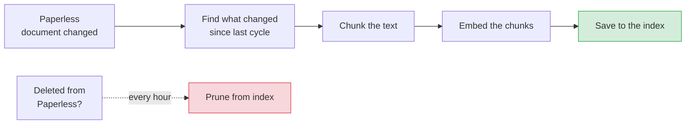

# The Indexer Daemon

The indexer is the one process that keeps the search index in step with Paperless-ngx. When you add, change, or delete a document in Paperless, the indexer is what notices and updates the search side to match. It is also the **only** thing allowed to write to the index — nothing else touches it.

## In a nutshell

Search needs its own copy of your documents — chunked into small passages and turned into embeddings (numeric vectors a computer can compare for meaning). The indexer builds and maintains that copy. Every five minutes it runs one cycle:

1. Ask Paperless "what changed since I last looked?" — and fetch just those documents.
2. For each one: split its text into chunks, embed the chunks, and save them to the index.
3. Once an hour, also check for documents deleted from Paperless and prune them from the index.

The single most important thing to understand: **only one indexer may write the index at a time.** It takes an exclusive lock on startup, so a second copy refuses to run rather than corrupt the data. Everything else — what to work on next, what failed, when the last sweep ran — is recorded in the index itself, so the daemon holds no important state in memory and a saved config change takes effect on the next cycle with no restart.



**Entry point:** `indexer.daemon:main` (CLI command: `paperless-indexer-daemon`)

The indexer writes the index (`src/store/`); the search server only ever reads it. It also writes a best-effort heartbeat and a per-cycle activity record to the application database (`app.db`) so the web UI's Index dashboard can show what it is doing. If `app.db` is unreachable the indexer still runs — only the dashboard tile goes stale.

---

## How it works

The daemon's life has two phases: a **startup** that gets it safely running (take the lock, run preflight, build the clients), and then a **loop** that runs one reconciliation cycle every `RECONCILE_INTERVAL` seconds until it is asked to stop. The sections below walk that path in order — startup first, then the cycle, then the harder parts: how the incremental sync decides what to fetch, how deletions are handled, what happens when a document keeps failing, and how concurrency and shutdown work.

```
paperless-indexer-daemon  (indexer.daemon)
├── current_settings()                          ← app.db config layered over env
├── acquire_writer_lock(<INDEX_DB_PATH>.lock)   ← fails fast if already held
├── open app.db (best-effort)                   ← dashboard heartbeat + activity
├── SIGTERM / SIGINT handlers
├── Preflight
│   ├── PaperlessClient.ping()
│   └── EmbeddingClient.embed(["ping"])
├── StoreWriter(settings)                        ← runs migrations on construction
├── StoreWriter.check_embedding_model()          ← may trigger a full rebuild
├── Reconciler(settings, paperless, store_writer, embedding_client)
└── _run_loop  (per cycle)
    ├── current_settings() re-check              ← config change rebuilds clients
    ├── consume reconcile.request sentinel       ← forces a deletion sweep
    ├── consume rebuild.request sentinel         ← wipes the index, then re-indexes
    ├── incremental_sync()                        [every cycle]
    ├── deletion_sweep()                          [every DELETION_SWEEP_INTERVAL, or on manual trigger]
    ├── store_writer.checkpoint()                 ← PRAGMA optimize + WAL truncate
    └── _interruptible_wait(RECONCILE_INTERVAL)   ← wakes early on shutdown or a new sentinel
```

### The single-writer lock

Before doing anything else, the daemon calls `acquire_writer_lock(INDEX_DB_PATH)`. This opens `<INDEX_DB_PATH>.lock` and takes a non-blocking exclusive `flock` (`LOCK_EX | LOCK_NB`). If another indexer process already holds the lock, `flock` raises `BlockingIOError` immediately (surfaced as `IndexerLockError`); the daemon logs `CRITICAL` and exits with code 1. The file handle stays open for the whole process lifetime — closing it is what releases the lock.

This is a structural guarantee, not a convention. The search server reaches the index only through `StoreReader`, which has no write methods. The lock plus the read-only reader together make "exactly one writer" true without any database-level coordination.

**Source:** `indexer/lock.py`

### Preflight: refuse to start with a broken configuration

After taking the lock, the daemon registers its shutdown handlers and constructs the long-lived `PaperlessClient` and `EmbeddingClient` **once** — so preflight tests the exact instances the daemon will go on to use, not a throwaway. Then it checks three things in order:

1. `PaperlessClient.ping()` — is Paperless reachable? A failure exits code 2.
2. `EmbeddingClient.embed(["ping"])` — does the embedding model respond? A failure exits code 2.
3. `StoreWriter(settings)` (which runs the index migrations on construction), then `StoreWriter.check_embedding_model()` — does the configured `EMBEDDING_MODEL` / `EMBEDDING_DIMENSIONS` still match what the index was built with? On a mismatch (or first run) every chunk is wiped and the watermark is cleared, which forces a full re-embed on the next cycle (see [Embedding-model change](store.md#embedding-model-change-rebuild)). A `StoreError` here exits code 3.

Any fatal condition logs `CRITICAL` with the traceback and exits non-zero. The daemon never silently starts in a bad state.

**Source:** `indexer/daemon/_boot.py`

### The reconciliation loop

Once running, the daemon settles into a sequential loop — cycles never overlap, and the next one begins `RECONCILE_INTERVAL` seconds (default 300) after the previous one *finishes*. Each iteration does the same handful of steps:

1. Re-read the configuration (more on this just below) — rebuild the reconciler if it changed.
2. Consume the `reconcile.request` sentinel if present (a manual "reconcile now" — forces a deletion sweep this cycle).
3. Consume the `rebuild.request` sentinel if present.
4. If a rebuild was requested, wipe the index via `StoreWriter.rebuild_index()`. A `StoreError` from the wipe is logged and swallowed so a failed wipe never crashes the daemon — the cycle's normal sync then just runs as an ordinary incremental sync.
5. Run `reconciler.incremental_sync()` — the main event, covered next.
6. Run `reconciler.deletion_sweep()` if the sweep interval has elapsed *or* a manual trigger was pending at cycle start.
7. `store_writer.checkpoint()` — `PRAGMA optimize` then a WAL `TRUNCATE` checkpoint, to keep the database tidy.
8. `_interruptible_wait(RECONCILE_INTERVAL)` — sleep until the next cycle, waking early on shutdown or a new sentinel, and beating the dashboard heartbeat periodically so an idle indexer is never reported as "stopped".

Steps 4–7 run inside a single cycle-level `except Exception` (the documented outer-boundary catch). If anything in the cycle throws — a network blip refreshing the taxonomy, a dropped page mid-sync, a malformed document, a `StoreError` — the traceback is logged with `log.exception(...)` and the loop falls through to the wait. **A failed cycle never crashes the daemon**, and it never advances the deletion-sweep clock (`last_sweep_at` is set only after a sweep actually completes, so a missed sweep is simply retried next cycle).

State between iterations is carried as an immutable `_LoopState` — the current reconciler, the current settings, and the monotonic time of the last completed sweep. Each cycle returns a fresh `_LoopState` rather than mutating in place, which makes the hot-reload swap and the sweep-clock advance explicit.

**Source:** `indexer/daemon/_loop.py`

### Configuration hot-reload

Configuration comes from `app.db`'s `config` table layered over the environment (via `common.config.current_settings`). At the top of every cycle the loop re-checks it. When `config_version` has moved, `_rebuild_reconciler` re-applies logging and library setup (so a changed OpenAI key or base URL takes effect), resizes the LLM concurrency limiter, and rebuilds the Paperless and embedding clients from the new settings — closing the old clients explicitly first.

The `StoreWriter` is the one thing **not** rebuilt: the index database path is a bootstrap-only environment variable, so the same writer is carried across. The upshot is that an operator's change on the Settings screen propagates with no restart. The two intervals — `RECONCILE_INTERVAL` and `DELETION_SWEEP_INTERVAL` — are also re-read live, so a changed cadence takes effect from the next wait onwards.

**Source:** `indexer/daemon/_loop.py` (`_rebuild_reconciler`)

---

## Incremental sync: indexing only what changed

This is the heart of each cycle. The goal is to touch only documents that actually changed since last time, never the whole archive — except on the very first run, when there is no "last time" and everything is new.

The mechanism is a **watermark**: a timestamp stored in the index marking how far the sync has caught up. Each cycle pages Paperless for documents modified after the watermark, indexes them, and advances the watermark.

**Source:** `indexer/reconciler/_incremental.py`

### Two paths: backfill and steady state

Which path the sync takes depends on whether a watermark exists yet:

- **First-run backfill** (`modified_watermark` is `None`, so no server-side filter): every document is new, so its full text is needed anyway. The sync pages **full** documents and indexes them.
- **Steady state** (a watermark exists): the sync pages only a **light `{id, modified}` projection** (`fields=("id", "modified")`, so Paperless transfers no document text), compares each row against the index, and fetches the full document only for the ones that genuinely changed. This is the [light diff](#steady-state-the-light-diff), below.

In both paths the document stream is **never loaded whole**. `iter_all_documents` is a lazy generator at `page_size=100`; on a first-run backfill that generator is the entire archive. The sync consumes it in fixed batches of 100 — each batch is indexed and then dropped so its OCR bodies are freed before the next page is fetched. Peak memory is the size of one batch, not the whole archive.

Before any document work, the sync reads the index state once — `id → (modified, content_hash)` for every document, which is cheap because it carries no OCR bodies — and shares it across every batch's worker fan-out. It also refreshes the [taxonomy](#taxonomy-refresh) up front, so a rename is reflected even on a cycle that indexes nothing.

After a page is consumed, the watermark advances to `(max modified seen) − OVERLAP_MARGIN` (10 seconds) — but **only if the page held at least one document**. The small overlap absorbs timestamp-boundary races between two documents saved in the same instant; re-processing that overlap is free because the content-hash gate (below) turns it into a no-op. Only the watermark-page documents feed that maximum; out-of-band retries do not.

Crucially, the watermark advances **regardless of how many documents failed**. Failures are tracked and retried separately (see [failed-document retry](#failed-document-retry-and-dead-letter)), not by freezing the watermark — so one poison document can neither stall forward progress nor force the changed tail to be re-paged forever.

### Steady state: the light diff

In normal running, the classifier daemon `PATCH`es metadata constantly (titles, tags). Every such edit bumps Paperless's `modified` and pulls the document back into the watermark window next cycle — even though its text is unchanged. Re-embedding all of those would be pure waste. The light diff skips them without paying to transfer the body:

- For each `{id, modified}` row, fold its `modified` into the running watermark maximum (so the watermark advances *past* skipped documents too — otherwise a skipped boundary document would re-enter forever), then compare its **normalised** `modified` against the stored `IndexState.modified`.
- If the document already has an index row and the normalised `modified` is unchanged → **skip**: no text is fetched, no write happens.
- Otherwise (new id, or `modified` advanced) → fetch the full document via `get_document` and run it through the worker, whose hash gate decides metadata-only versus re-embed.

The skip is **fail-safe by construction**: two different `modified` instants cannot normalise to the same string, so a genuinely-changed document is never skipped. A normalisation that fails to match merely costs a redundant full fetch — exactly the old behaviour — never a wrong skip. The hash gate is therefore never bypassed for any document whose content actually reaches the index.

**Source:** `indexer/reconciler/_light_diff.py`

Both paths compute the watermark maximum through one shared fold, `_fold_modified`, which parses a single raw `modified` string and returns the new running maximum. An absent or empty value leaves the maximum unchanged; an unparseable value is logged at `WARNING` and skipped, so a malformed upstream timestamp never aborts the watermark advance. The batch full-document path (`_fold_latest_modified`) and the per-row steady-state diff (`_diff_light_page`) both call it, so the maximum is computed identically — and without ever holding more than one batch in memory.

### Indexing one document

`DocumentIndexer` is stateless and shared across the worker pool. For each document it runs four steps:

1. **Gate** — skip the document if its `content` is empty or whitespace (OCR has not run yet) or it carries `ERROR_TAG_ID`. There is a subtle case here: a document that *was* indexed but has now become un-indexable is **pruned** from the index in this step. Otherwise search would keep serving chunks for content that no longer exists, and the deletion sweep can't reach it because the document still exists in Paperless. Both the prune and the plain no-op return `SKIPPED`; the log event distinguishes them (`worker.stale_document_pruned` vs `worker.document_skipped`).
2. **Hash** — compute the SHA-256 of the OCR content.
3. **Hash gate** — the optimisation that avoids needless re-embedding:
   - *Hash unchanged* (e.g. the classifier touched a title or tag, but the text is identical): call `StoreWriter.update_metadata` to refresh title, `correspondent_id`, `document_type_id`, `tag_ids`, and `modified`. **No re-chunking, no re-embedding.**
   - *Hash changed, or a brand-new document*: the full path — chunk, embed, upsert.
4. **Chunk → embed → upsert** — split the text (see below), embed the chunks via `EmbeddingClient.embed(texts)` (which batches them into API-sized requests), then `StoreWriter.upsert_document(meta, chunks)` in one atomic transaction.

The whole upsert is a single transaction: delete the document's old chunks from `chunks` and `chunks_fts`, insert the new ones, write the `documents` row. A crash mid-upsert leaves the previous version fully intact.

**Source:** `indexer/worker.py`

#### Chunking the text

`indexer/chunker.py` splits OCR text into paragraph-aware windows of roughly `CHUNK_SIZE` characters (default 2000) with `CHUNK_OVERLAP` characters of overlap between adjacent windows (default 256). Page hints are parsed from the OCR page markers (`--- Page N ---`, optionally `--- Page N (model-name) ---`) that the **OCR daemon** writes into the assembled text (`ocr.text_assembly`).

Chunking is character-based, not token-based. After the paragraph-aware pass, a defensive 6000-character ceiling is enforced as a conservative upper bound that keeps any chunk well inside OpenAI's 8191-token embedding input limit — even for dense, non-Latin OCR where one character can be close to one token. A normal `CHUNK_SIZE`-2000 chunk is far below the cap and passes through untouched. If you use a local embedding model with a smaller context window than OpenAI's, you may need to reduce `CHUNK_SIZE` and/or `CHUNK_OVERLAP` accordingly.

**Source:** `indexer/chunker.py`

### The worker pool

One `ThreadPoolExecutor` (named `indexer-document`, `DOCUMENT_WORKERS` threads, default 4) is built **once per cycle** and reused across every batch and the retry pass — not one pool per 100-document batch, which on a backfill of N documents would spin up `ceil(N/100)` pools and fragment the thread-name numbering. Each document is dispatched through `_index_one`, which catches and isolates that one document's failure (the documented per-worker outer-boundary catch): a raise is logged with its traceback, recorded as a `None` outcome, and the batch continues.

**Source:** `indexer/reconciler/_fanout.py`

### Failed-document retry and dead-letter

Forward progress (the watermark) is deliberately decoupled from failure retry. A document that fails is tracked in a `failed_documents` map — a JSON object in index meta mapping `str(doc_id) → consecutive_failure_count` — and retried on its own schedule:

- On each cycle, every id in the map that the watermark page did **not** already cover is re-attempted out-of-band: fetched fresh and indexed through the same pool. An id confirmed gone from Paperless (via `document_exists`) is dropped from the map — the deletion sweep removes it from the index. A transport error re-fetching one id is isolated: the id keeps its count and is retried next cycle.
- After indexing, the map is rebuilt from the cycle's outcomes: a document that succeeded is cleared; a document that failed has its count incremented.
- After `MAX_CONSECUTIVE_DOCUMENT_FAILURES` (5) consecutive failures, the document is **dead-lettered**: logged at `CRITICAL`, dropped from the map, and not retried until Paperless modifies it again (which advances its `modified` back into the watermark window). This bounds the per-document retry cost so one poison document cannot consume embedding budget indefinitely.

**Source:** `indexer/reconciler/_failed_documents.py`

### What a cycle reports: `SyncReport`

Each `incremental_sync` returns a `SyncReport`, counting both the watermark page and the out-of-band retries:

| Field | Meaning |
|:---|:---|
| `indexed` | Documents fully chunked, embedded, and upserted |
| `metadata_only` | Documents whose hash was unchanged — metadata updated, no re-embed |
| `skipped` | Documents gated out (empty content or error tag), including stale-prunes |
| `failed` | Documents that raised this cycle (isolated and counted) |
| `given_up` | Documents dead-lettered this cycle (a subset of `failed`) |

`last_reconcile_at` is written at the end of **every** completed cycle — including cycles where Paperless returned zero documents — because an empty-but-reconciled index is genuinely ready to serve. Without this the search server's healthz check would return `503 index-not-ready` forever.

---

## Taxonomy refresh

Every cycle, before processing documents, the reconciler fetches the complete correspondent, document-type, and tag lists from Paperless and calls `StoreWriter.refresh_taxonomy(entries)`, which atomically replaces the entire `taxonomy` table (DELETE all, INSERT new). A malformed upstream row (missing `id` or `name`) is skipped with a warning rather than persisted.

A correspondent or tag rename in Paperless therefore takes effect immediately for all search and facet queries — zero document rewrites required.

**Source:** `indexer/reconciler/_incremental.py` (`_refresh_taxonomy`)

---

## Deletion sweep: pruning what Paperless deleted

Inferring "this document was deleted" from its absence is a data-loss footgun if the enumeration is incomplete — treat a half-finished list as authoritative and you delete every not-yet-seen document the moment Paperless blips mid-pagination. The sweep is therefore conservative:

1. Every `DELETION_SWEEP_INTERVAL` seconds (default 3600), enumerate **all** Paperless document ids by paging the full list endpoint with `fields=("id",)` — the sweep needs only the id set, so every other field (notably the OCR body) is projected away.
2. If *any* page raises during enumeration, **abort the sweep and prune nothing** — a partial list is never authoritative. An aborted sweep sets `SweepReport.aborted = True` and logs a warning.
3. On a verified-complete enumeration, compute `store_ids − paperless_ids`.
4. For each candidate id, confirm it is gone with a second `document_exists` check before pruning — guarding against a create-during-enumeration race. A confirmation that itself raises conservatively *keeps* the document.
5. Prune the confirmed-absent set with `StoreWriter.delete_documents`, then record `last_full_sweep_at`.

A `SweepReport` is returned:

| Field | Meaning |
|:---|:---|
| `pruned` | Documents removed from the store |
| `candidates` | Documents in the store but not in Paperless's id set (zero when aborted) |
| `aborted` | True if the enumeration failed |

**Source:** `indexer/reconciler/_sweep.py`

---

## Manual triggers

Two operations let an operator nudge the indexer without waiting for the next scheduled cycle. Both reach it through a **sentinel file** on the shared `/data` volume — not a store write or a new network port — because the indexer and the search server are separate processes and the indexer is the sole store writer.

**Reconcile now.** `POST /api/reconcile` (Member or above) touches `<data-dir>/reconcile.request` and returns `202 Accepted`. The indexer's `_interruptible_wait` detects it on its next slice, deletes it, and starts the next cycle immediately — including a deletion sweep regardless of the sweep interval. Multiple requests during one running cycle coalesce into a single follow-up cycle. The caller tracks completion by polling `GET /api/stats` (or the Index dashboard) for an advancing `last_reconcile_at`.

**Rebuild index.** `POST /api/index/rebuild` (Admin only) touches `<data-dir>/rebuild.request`. The indexer consumes it at cycle entry, wipes the index via `StoreWriter.rebuild_index()`, and the same cycle's incremental sync re-indexes the whole archive (watermark cleared → no server-side filter).

**Source:** `indexer/daemon/_wait.py`, `indexer/daemon/_loop.py`

---

## Concurrency model

```
indexer process
├── Main thread (reconciliation loop — sequential)
│   └── ThreadPoolExecutor("indexer-document", DOCUMENT_WORKERS threads) — one per cycle
│       ├── document A → gate → hash → chunk → embed → upsert (StoreWriter, serialised via _write_lock)
│       ├── document B → gate → hash → chunk → embed → upsert
│       └── ...
└── EmbeddingClient → ConcurrencyGuard(EMBEDDING_MAX_CONCURRENT) bounds concurrent embedding API calls
```

Embedding is the network bottleneck on a large backfill. The `EmbeddingClient` owns a `ConcurrencyGuard` sized by `EMBEDDING_MAX_CONCURRENT` (default 4) which, together with the `@retry` decorator's exponential backoff with jitter, turns API rate-limit errors into steady throughput rather than a retry storm. The `StoreWriter` holds an internal `threading.Lock` around each write transaction, so concurrent workers share one writer safely while their embedding work runs in parallel.

---

## Graceful shutdown

SIGTERM or SIGINT sets a thread-safe shutdown flag (via `common/shutdown.py`). The main loop checks the flag at the top of each cycle and inside `_interruptible_wait`. In-flight embedding calls and the current upsert transaction complete normally before the daemon exits; the per-cycle worker pool's `with` block joins its in-flight threads on the way out. The per-document upsert transaction guarantees a clean interrupt boundary — there is never a half-indexed document left behind.

---

## Package layout

The package is split one concept per file (`CODE_GUIDELINES.md` §3.1/§3.3): the daemon entry point is the `indexer.daemon` package (`_boot`, `_loop`, `_wait`), and the reconciliation engine is the `indexer.reconciler` package (`_incremental`, `_light_diff`, `_fanout`, `_failed_documents`, `_sweep`, `_reconciler`).

---

## File Index

| File | Purpose |
|:---|:---|
| `daemon/_boot.py` | Flock, preflight, client construction, dashboard wiring, loop entry |
| `daemon/_loop.py` | The reconciliation run-loop, per-cycle body, config hot-reload, rebuild handling |
| `daemon/_wait.py` | `_interruptible_wait`, sentinel consumption, idle heartbeat |
| `reconciler/_incremental.py` | Watermark-driven sync, taxonomy refresh, batched streaming, watermark advance |
| `reconciler/_light_diff.py` | Steady-state `{id, modified}` diff and the shared `_fold_modified` fold |
| `reconciler/_fanout.py` | Per-cycle worker-pool dispatch with per-document failure isolation |
| `reconciler/_failed_documents.py` | Bounded failed-document retry and dead-lettering |
| `reconciler/_sweep.py` | The deletion sweep with its "a partial enumeration prunes nothing" rule |
| `reconciler/_reconciler.py` | `Reconciler` facade — `incremental_sync` and `deletion_sweep` |
| `worker.py` | `DocumentIndexer` — per-document gate, hash gate, chunk, embed, upsert, stale-prune |
| `chunker.py` | Paragraph-aware text chunker with OCR page-marker hints |
| `lock.py` | `acquire_writer_lock` — OS flock on `<INDEX_DB_PATH>.lock` |
| `activity.py` | `IndexerActivityRecorder` — dashboard heartbeat and reconcile-activity rows |
