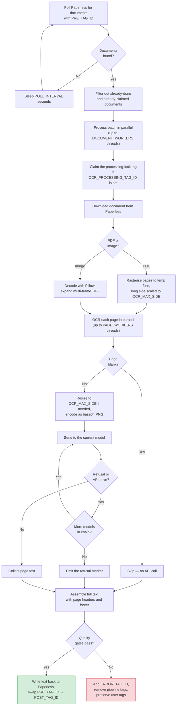

# OCR Pipeline

The OCR daemon turns document images into machine-readable text using a vision LLM. It polls Paperless-ngx for tagged documents, downloads each one, rasterises its pages to images, transcribes every page through a vision model, and writes the assembled text back — swapping the queue tag for the done tag, or applying the error tag on failure.

**Entry point:** `src/ocr/daemon.py` (CLI command: `paperless-ai`)

The daemon is **stateless** — all of its state lives in Paperless tags — so it is safe to run as multiple instances. Its only internal dependency is `common`; it never touches the search index. Configuration is re-read at the top of every poll, so a saved change takes effect on the next cycle with no restart (the one exception is `POLL_INTERVAL` / `DOCUMENT_WORKERS`, which are fixed for the loop's lifetime).

---

## Processing Flow



---

## Document Queue Filtering

The daemon polls Paperless every `POLL_INTERVAL` seconds (default: 15) for documents carrying `PRE_TAG_ID`. A document is skipped when it already has:

- `POST_TAG_ID` — already OCR'd. The stale `PRE_TAG_ID` is stripped automatically so the document leaves the queue cleanly.
- `OCR_PROCESSING_TAG_ID` — claimed by another worker instance (only when the lock tag is configured).
- `ERROR_TAG_ID` — previously failed.

**Source:** `src/common/document_iter.py`

---

## Image Conversion

Documents are converted to page images before transcription. Memory is the binding constraint — the daemon runs `DOCUMENT_WORKERS` documents at once, each fanning pages across `PAGE_WORKERS`, on a memory-capped container — so the converter is built to keep peak RSS bounded:

- **PDFs** are rasterised by Poppler **one image file per page into a temp directory**, and the worker opens, OCRs, and deletes one page at a time. The whole document never sits in RAM; at most `PAGE_WORKERS` page bitmaps are resident at once.
- **Rasterised at the target size, not full DPI.** Poppler is asked to scale each page's longer side to `OCR_MAX_SIDE` (`pdftoppm -scale-to`), so the bitmap that reaches RAM is roughly a quarter of the bytes a full 300-DPI render would cost. `OCR_DPI` (default: 300) is still passed so DPI-dependent hinting stays sensible, but the size cap drives the output dimensions.
- **Images** (JPEG, PNG, ...) are decoded in one shot by Pillow and held in memory — these are small and need no streaming.
- **Multi-frame images** (e.g. multi-page TIFF) are expanded into one image per frame, each processed as a separate page.

An undecodable or corrupt download raises `ImageConversionError`; the worker catches it and routes the document to the error path rather than crashing.

**Source:** `src/ocr/image_converter.py`

---

## Parallel Page Processing

Pages within a document are OCR'd in parallel by a thread pool of `PAGE_WORKERS` threads (default: 8). At the daemon level, up to `DOCUMENT_WORKERS` documents (default: 4) run concurrently. So the daemon can have up to `PAGE_WORKERS × DOCUMENT_WORKERS` (default: 32) vision API calls in flight — bounded further by `LLM_MAX_CONCURRENT` if you set it.

Each page is loaded only when its worker thread starts and its bitmap is closed the moment transcription returns, so the document is streamed, never fully unpacked. Page order is always preserved regardless of which page finishes first.

**Source:** `src/ocr/worker.py`

---

## Blank Page Detection

Before any API call, each page is checked for blankness with a greyscale histogram: a page with fewer than 5 non-white pixels is treated as blank and skipped entirely — no vision call is made. This saves cost on scanned documents with blank backs. A blank page contributes nothing to the assembled text.

**Source:** `src/ocr/provider.py` (`is_blank`)

---

## Vision Model Integration

Each non-blank page is:

1. Resized so its longer side fits within `OCR_MAX_SIDE` pixels (default: 1600). Pages already within the cap — the common case once a PDF is rasterised at target size — are encoded without a copy; the original image is never mutated.
2. Encoded as a base64 PNG.
3. Sent to the model as a single `image_url` user message, with the transcription system prompt. The image carries `OCR_IMAGE_DETAIL` (default: `high`), which maps to OpenAI's `image_url.detail` field. When the provider is OpenAI, `OCR_REASONING_EFFORT` (default: `medium`) is attached too; both are omitted for non-OpenAI providers.

The system prompt (`src/ocr/prompts.py`) tells the model to:

- Output **only** the text visible in the image — no summary, paraphrase, or commentary.
- Preserve the original language (no translation).
- Preserve spacing, indentation, and line breaks.
- Reproduce tables using Markdown table syntax.
- Mark graphical elements (logos, signatures, stamps, barcodes, QR codes, watermarks, checkboxes) with bracketed markers.
- Output one specific failure string when transcription is impossible.

**Source:** `src/ocr/provider.py`, `src/ocr/prompts.py`

---

## Model Fallback Chain

`OCR_MODELS` is an ordered list of models. The first model is the **primary**; the rest are fallbacks (the list is deduplicated, preserving order). For each page:

1. Send the page to the current model.
2. If the model **refuses** or **redacts** (output matches any `OCR_REFUSAL_MARKERS` phrase, or contains a `[REDACTED…]` marker) or throws an **API error**, advance to the next model.
3. Continue down the chain until a model succeeds, or every model has failed.

If all models fail or refuse, the page text becomes the configured refusal marker (`REFUSAL_MARK`, default `CHATGPT REFUSED TO TRANSCRIBE`), which the quality gates later catch.

Default chains (provider-dependent):

- **OpenAI:** `gpt-5.4-mini` → `gpt-5.4` → `gpt-5.5`
- **Ollama:** `gemma3:27b` → `gemma3:12b`

This lets cheap, fast models handle most pages and reserves the more capable ones for the hard cases. Per-document statistics are tracked: `attempts`, `refusals`, `api_errors`, and `fallback_successes` (a non-primary model carrying the page). They are logged once per document.

> Refusal and redaction detection is shared with the classifier via `common.content_checks.is_error_content` — the same comparison, case-insensitive on both sides.

**Source:** `src/ocr/provider.py`, `src/common/content_checks.py`

---

## Text Assembly & Output Format

Once every page is transcribed, `src/ocr/text_assembly.py` assembles one document body. Pages whose transcription is empty (blank or skipped) are omitted.

**Single-page documents** produce plain text with no page header.

**Multi-page documents** get `--- Page N ---` separator headers, followed by a footer:

```
--- Page 1 ---
[transcribed text of page 1]

--- Page 2 ---
[transcribed text of page 2]

Transcribed by model: gpt-5.4-mini, gpt-5.5
```

When `OCR_INCLUDE_PAGE_MODELS=true` (default: false), each header names the model that produced that page:

```
--- Page 1 (gpt-5.4-mini) ---
```

A **footer** — `Transcribed by model: …` listing the distinct models used, sorted — is appended whenever at least one page was transcribed. The classification daemon later parses this footer and turns the model names into tags, so it is load-bearing, not cosmetic.

### Graphical Element Markers

| Element | With readable text | Without text |
|:---|:---|:---|
| Logo | `[Logo: Company Name]` | `[Logo]` |
| Handwritten signature | `[Signature: John Smith]` | `[Signature]` |
| Official stamp | `[Stamp: Official Seal]` | `[Stamp]` |
| Barcode | — | `[Barcode]` |
| QR code | — | `[QR Code]` |
| Watermark | `[Watermark: DRAFT]` | `[Watermark]` |
| Checkbox (checked) | — | `[x]` |
| Checkbox (empty) | — | `[ ]` |

Tables are reproduced with Markdown table syntax, and every document is transcribed in its **original language** — no translation.

---

## Quality Gates

Before writing back, the assembled text must clear these checks. Any failure routes the document to the error path:

| Check | Condition | Why |
|:---|:---|:---|
| Empty text | Output is blank after trimming | Every page was blank or failed — prevents an empty-content requeue loop |
| OCR error marker | Text contains `[OCR ERROR]` | At least one page threw an unexpected exception during transcription |
| Refusal / redaction | Text matches an `OCR_REFUSAL_MARKERS` phrase or contains a `[REDACTED…]` marker | A page's model chain refused outright, or a model redacted content instead of transcribing it faithfully |

The refusal and redaction checks share `is_error_content` with the per-page fallback logic, so the same phrases that trigger a model fallback also fail the gate when they survive to the final text.

**Source:** `src/ocr/worker.py`, `src/common/content_checks.py`

---

## Error Handling & Quarantine

When a document fails the quality gates:

1. `ERROR_TAG_ID` is added (if configured).
2. All pipeline tags (`PRE_TAG_ID`, `POST_TAG_ID`, `OCR_PROCESSING_TAG_ID`, and the classifier's pipeline tags) are removed.
3. **All user-assigned tags are preserved** — only automation tags are touched.
4. Without `PRE_TAG_ID`, the document is never picked up again.

When a single page throws during its API call, an `[OCR ERROR] Failed to OCR page N.` marker is inserted in its place and the other pages still assemble; the document then fails the OCR-error gate and lands in the error path.

**Write-back quarantine.** The vision tokens for a document are spent the moment its pages are transcribed. If Paperless then *permanently* rejects the write-back (a 4xx), re-queuing would re-OCR the whole document next poll and burn those tokens again, forever — so the document is **quarantined**: error-tagged with the transcription it has, so it leaves the queue. A *transient* failure (5xx / network) is re-raised for the daemon loop to retry once Paperless recovers.

**Write-back circuit breaker.** A process-lifetime circuit breaker tracks the write-back failure streak. If Paperless keeps rejecting writes, the breaker trips and **halts** the daemon so a systemic fault cannot burn one LLM call per queued document. A saved transcription clears the streak; a configuration change resets the breaker (the operator's signal that the fault may now be fixed). For the shared resilience model, see [Resilience](resilience.md).

**Source:** `src/ocr/worker.py`, `src/common/tags.py`, `src/common/circuit_breaker.py`

---

## File Index

| File | Purpose |
|:---|:---|
| `daemon.py` | Entry point — polling loop, config hot-reload, heartbeat, circuit breaker |
| `worker.py` | `OcrProcessor` — per-document orchestration: claim, download, OCR, assemble, write back |
| `image_converter.py` | `open_page_source` / `PageSource` — streamable, memory-bounded page conversion |
| `provider.py` | `OcrProvider` — model fallback, image encoding, blank-page and refusal detection |
| `text_assembly.py` | `assemble_full_text` / `PageResult` — page headers and the model footer |
| `prompts.py` | The vision transcription system prompt |
