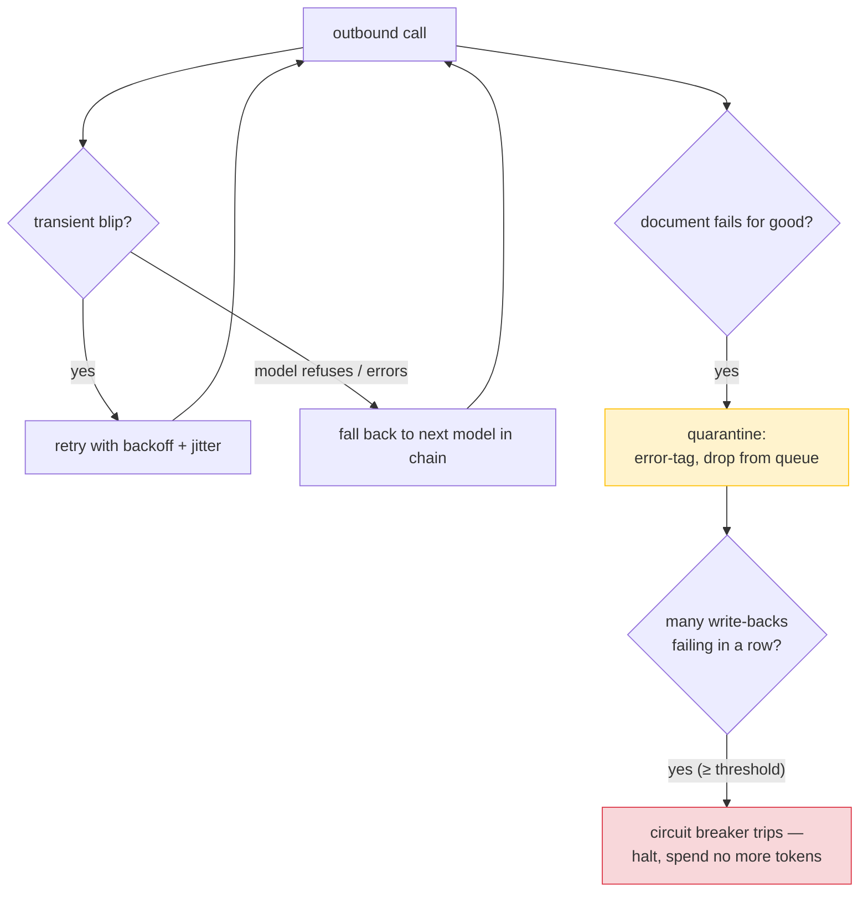
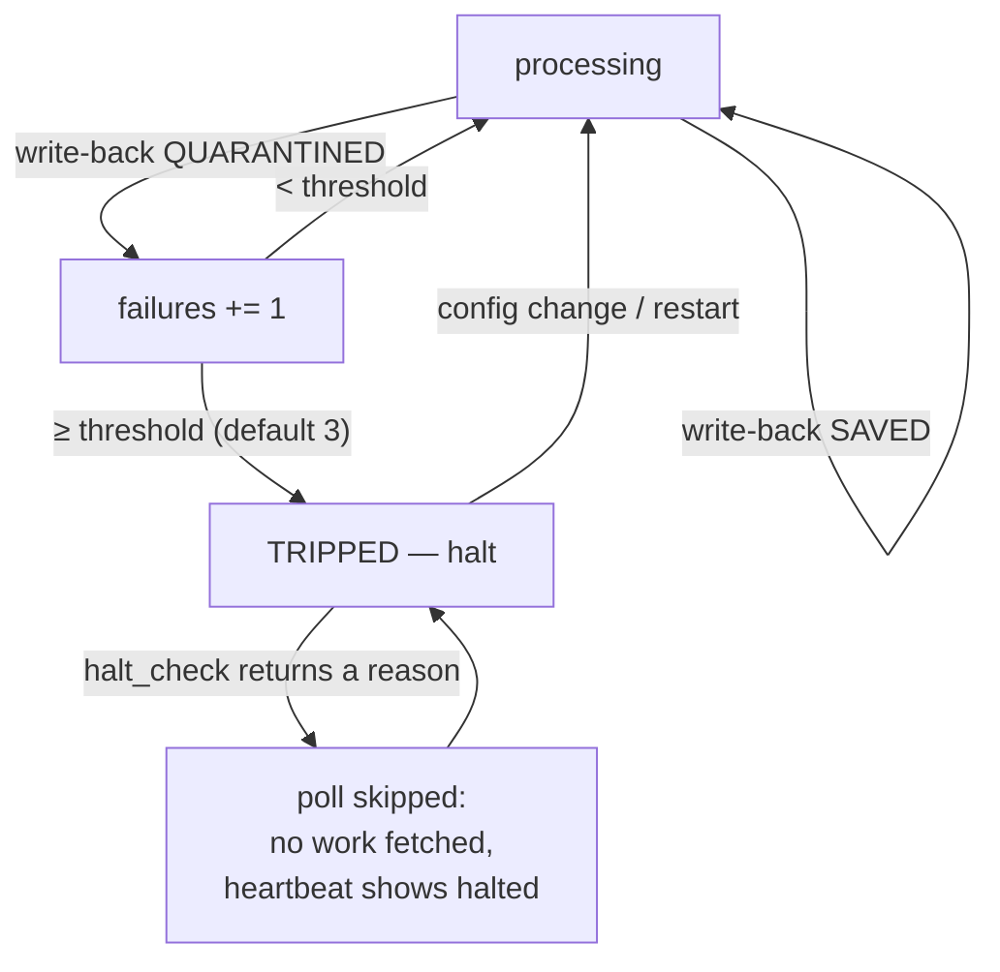
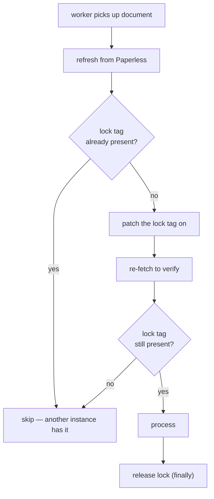

# Resilience & Error Handling

Things go wrong: the network drops, an API rate-limits you, a model refuses to answer, a daemon crashes mid-batch, a second copy starts up by accident. This document is the catalogue of defences that keep any one of those from corrupting data or turning into a cascade — and where each defence lives.

## In a nutshell

The system is built to **fail closed and fail loud** (`CODE_GUIDELINES.md` §1.11): a refused operation can always be retried, but a silent corruption can never be undone — so when in doubt it stops rather than carries on wrong.

A handful of mechanisms do the work, from smallest blast radius to largest:

- **Retry** — every outbound call retries a transient blip (a network drop, a rate limit) a few times before giving up, with randomised waits so instances don't all retry in lockstep.
- **Model fallback** — if one model refuses or errors, the next model in a configured chain takes over.
- **Fault isolation** — one document's failure is caught and logged; the rest of the batch carries on. A daemon never dies because of a single bad document.
- **Quarantine** — a document that fails for good is tagged as errored and dropped from the queue, so it never loops forever burning tokens.
- **The circuit breaker** — if write-backs start failing *en masse* (a deleted tag, a bad field), the daemon halts itself rather than spend one LLM call per queued document discovering the same fault thousands of times.
- **Locks** — processing-lock tags stop two daemon instances working the same document; an OS file-lock stops two indexers writing the same database.
- **Graceful shutdown** — on Ctrl-C or `docker stop`, in-flight work finishes, locks are released, handles are closed, and the process exits cleanly.

The single most important idea: **a failure should cost you one document, not the whole queue, and never your data.**



---

## Retry with exponential backoff and jitter

The first line of defence is just trying again. Every outbound call goes through one of three shared clients, and each retries transient failures using the `@retry` decorator (`src/common/retry.py`):

- Paperless HTTP — `PaperlessClient` (`src/common/paperless.py`)
- LLM chat — the `common/llm` wrapper
- Embeddings — `EmbeddingClient` (`src/common/embeddings.py`)

A call is attempted up to `MAX_RETRIES` times (default: **3**, so two retries), sleeping between attempts. The sleep before attempt *n* (1-based) is:

```
delay = min(2**n × uniform(0.8, 1.2), MAX_RETRY_BACKOFF_SECONDS)
```

With the defaults (`MAX_RETRIES=3`, `MAX_RETRY_BACKOFF_SECONDS=30`) that is roughly **2s then 4s** before the final attempt. Raise `MAX_RETRIES` for more persistence; the cap keeps any single sleep bounded once `2**n` grows past it.

The `uniform(0.8, 1.2)` jitter is the important detail. It de-synchronises retries so several daemon instances hammered by the same outage do not all retry at the same instant — the thundering-herd problem.

**A 4xx is never retried.** A retry only helps a problem that might fix itself; a bad request or an auth failure will not. So the Paperless client raises (and therefore retries) only on server errors — 5xx — and returns a 4xx as-is for the caller to handle. The LLM and embedding clients retry only the connection / timeout / rate-limit / server-error set below; a `BadRequestError` or `AuthenticationError` propagates immediately.

After the final attempt fails, the exception is logged **with its traceback** and re-raised — the failure is never swallowed.

### Retried error types

| Error | Source | Retried by |
|:---|:---|:---|
| `httpx.RequestError` | Network connectivity failure | Paperless client |
| `httpx.HTTPStatusError` (5xx only) | Paperless server error | Paperless client |
| `openai.APIConnectionError` | LLM/embedding connectivity | LLM + embedding clients |
| `openai.APITimeoutError` | LLM/embedding timeout | LLM + embedding clients |
| `openai.RateLimitError` | Rate limiting | LLM + embedding clients |
| `openai.InternalServerError` | LLM/embedding server error | LLM + embedding clients |

---

## Model fallback chains

When a retry can't help — the model itself refuses, or keeps erroring even after its retries — the next defence is to try a *different* model. OCR uses the `OCR_MODELS` chain; classification uses the `CLASSIFY_MODELS` chain. Each chain is tried **in order**, falling to the next model when the current one:

- **refuses** (OCR only — the response matches an `OCR_REFUSAL_MARKERS` phrase), or
- **returns unusable output** (classification only — unparseable JSON), or
- **errors** after exhausting its own retries (rate limit, server error, timeout).

The first model to produce a usable result wins. If *every* model fails, OCR writes the fixed refusal marker into the document content and the classifier returns no result — and in both cases the document is then quarantined (see [Per-document fault isolation](#per-document-fault-isolation) below).

Default chains (provider-dependent, the same for both stages unless overridden):

- **OpenAI:** `gpt-5.4-mini` → `gpt-5.4` → `gpt-5.5`
- **Ollama:** `gemma3:27b` → `gemma3:12b`

Each provider tracks per-request statistics — `attempts`, `refusals` / `invalid_json`, `api_errors`, `fallback_successes` — and logs them after each document for observability.

**Source:** `src/ocr/provider.py`, `src/classifier/provider.py`

> **Aside — adaptive parameter compatibility.** The shared LLM wrapper (`src/common/llm.py`) handles a subtler failure: a model that rejects an *optional* parameter it doesn't support (`temperature`, `reasoning_effort`, a `json_schema` response format, `max_tokens`). On a 400 that names the offending parameter, the wrapper strips that one parameter, retries the same model, and caches the discovery per model — so the next call to that model omits it from the start rather than failing again. A 400 bills no tokens, so a first-time discovery costs only one extra round-trip.

---

## Per-document fault isolation

A single document failure **never crashes a daemon**. This is the property that lets a 2 a.m. batch of ten thousand documents survive one malformed file. Two layers guarantee it:

1. **The worker-dispatch boundary** (`src/common/daemon_loop.py`) catches every exception raised while processing one document, logs it with full context (document ID, traceback), and lets the rest of the batch complete.
2. **The polling loop** catches transient Paperless errors around the whole poll, logs a warning, and sleeps before retrying — a Paperless outage *pauses* the daemon, it does not kill it.

When a document fails **permanently** — the model could not produce output, or Paperless rejected the write-back with a 4xx — it is *quarantined*:

1. `ERROR_TAG_ID` is applied (if configured).
2. All pipeline tags are removed, so it leaves the queue instead of looping.
3. User-assigned tags are preserved.
4. The processing-lock tag is released (in a `finally` block).
5. The daemon moves on.

The processor reports the outcome (`SAVED` / `QUARANTINED`, via `WriteBackOutcome` in `src/common/per_document.py`) so the circuit breaker can act on a run of failures. A skipped, requeued, or already-errored document reports `None`, which the breaker ignores.

---

## The write-back circuit breaker

Quarantine stops a single bad document from looping. But it doesn't stop a *systemic* fault from being expensive. A tag daemon spends LLM tokens on a document *before* it writes the result back. If every write-back is being rejected the same way — a deleted tag, a misconfigured custom field, a Paperless API change — then quarantining each document one at a time would still burn one LLM call per document across the whole queue before anything noticed the pattern.

The breaker (`src/common/circuit_breaker.py`) is the guard against that one-pass burn. It counts **consecutive** failed write-backs:



- A single success resets the streak, so one unlucky bad document never trips it.
- Once tripped, the polling loop's `halt_check` skips every poll — **no work is fetched and no tokens are spent** — and the daemon's heartbeat reports the halt on the Index dashboard.
- The breaker is reset by a **configuration change** (the operator's signal the cause may be fixed) or a restart. It is per-process and in-memory: two daemon instances each keep their own and halt independently.

---

## Processing-lock claims (multi-instance)

The defences so far protect a *single* daemon. The next two protect against a second copy of the work running at the same time.

When `OCR_PROCESSING_TAG_ID` or `CLASSIFY_PROCESSING_TAG_ID` is set, each daemon uses a best-effort optimistic lock to stop two instances processing the same document (`src/common/claims.py`). The dance is: look before you leap, then check you actually got it.



This eliminates almost all duplicate processing but is **not** a strict distributed lock — in a rare race two instances may both claim and process the same document. That is safe because the operations are idempotent: processing it twice produces the same result, it just wastes the work.

---

## Stale-lock recovery (tag daemons)

A lock is only safe if it gets released. If a daemon crashes mid-processing, it leaves a document carrying a processing-lock tag with no daemon working on it — a document that would otherwise be stuck forever, claimed by a ghost.

So on startup each tag daemon sweeps for these orphans (`src/common/stale_lock.py`):

1. Find every document carrying its processing-lock tag.
2. Remove the lock tag and re-add the queue tag.
3. The document is picked up again on the next poll.

This is why a crashed daemon never leaves work permanently stuck. (It runs only when a processing-lock tag is configured.)

---

## The indexer's single-writer lock

The indexer has a stronger requirement than the tag daemons: it is the **sole writer** of `index.db`, and two writers would corrupt it outright. A best-effort tag-claim isn't enough here, so the indexer enforces single-writer with an OS-level exclusive `flock` on a companion `<index.db>.lock` file (`src/indexer/lock.py`).

On startup it takes the lock **non-blocking**. If another indexer already holds it, the new process logs `CRITICAL` and **exits non-zero** rather than risk two writers corrupting the index. The lock is held for the process lifetime and released when the handle closes.

This is a structural guarantee, not a convention. The search server reaches the index only through the write-free `StoreReader` API, and the `flock` stops a second writer — so a bug on the read side has no write surface to misuse, and a mis-deployment of two indexers fails fast and loud (`CODE_GUIDELINES.md` §8.4, §10.5).

For recovering a genuinely corrupt index, see [Store — Corruption Recovery](store.md#corruption-recovery).

---

## Indexer cycle isolation & crash safety

The indexer applies the same fault-isolation idea as the tag daemons, plus a database-level guarantee against a crash mid-write.

**Cycle isolation.** The reconcile loop wraps each cycle's sync / sweep / checkpoint in a fault-isolation boundary (`src/indexer/daemon/_loop.py`): a transient failure anywhere in a cycle is logged with its traceback, and the loop falls through to its wait and retries next cycle. A failed cycle never advances the deletion-sweep clock, so a missed sweep is simply retried.

**Crash safety** comes from the store's transaction discipline. A document's upsert — delete its old chunks, vectors and FTS rows, insert the new ones, update its metadata row — is **one transaction**. A crash mid-document leaves the previous version fully intact; there is never a half-indexed document (`CODE_GUIDELINES.md` §9.6).

---

## Graceful shutdown

Every daemon and the search server respond to **SIGINT** (Ctrl-C) and **SIGTERM** (`docker stop`) via a thread-safe flag (`src/common/shutdown.py`):

1. The signal handler sets the flag.
2. The loop checks it before each sleep and exits cleanly.
3. In-flight work finishes; nothing new is started.
4. Processing-lock tags are released in `finally` blocks.
5. HTTP sessions and database handles are closed; the indexer releases its `flock`.

The process exits 0 on a graceful shutdown — the signal that it stopped on purpose, not from a crash.

---

## Investigating failed documents

When something does fall to the error path, here is how to find and fix it. Documents that failed OCR or classification carry `ERROR_TAG_ID`. To investigate:

1. In Paperless, filter by the error tag to find them.
2. Find the document ID in the daemon logs — the failure is logged with full context.
3. Common causes:
   - Every model in the chain refused or failed (try different models, or adjust `OCR_REFUSAL_MARKERS`).
   - A Paperless write-back was rejected (a deleted tag, a bad `CLASSIFY_PERSON_FIELD_ID`, a permissions issue) — if this is systemic the circuit breaker will have halted the daemon; fix the cause and save config or restart.
   - The document is a format the image converter cannot handle.
4. To retry: remove `ERROR_TAG_ID` and re-add the queue tag (`PRE_TAG_ID` for OCR, `CLASSIFY_PRE_TAG_ID` for classification).
