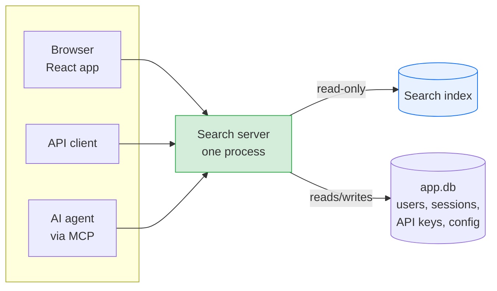

# The Search Server

The search server is the one part of the system that faces the network. It lets you ask questions of your document archive — in a web browser, over a JSON API, or from an AI agent — and answers them by reading the documents you have indexed. It only ever reads the index; it never writes to it.

## In a nutshell

You have a pile of scanned, OCR'd, indexed documents. This server lets you search them in plain language — not just "find the word invoice", but "what did I pay npower last winter?" — and get a written answer with links to the documents it used.

One process does three jobs at once:

- It serves the **React web app** you use in a browser.
- It serves a **JSON API** that the web app (and any other client) calls.
- It serves an **MCP endpoint**, so an AI assistant can search your archive as a tool.

Behind all three sits the same **search pipeline**: it plans the search, pulls the most relevant documents out of the index, judges which ones actually fit, and writes an answer that cites them. The single most important thing to understand: **this server only reads.** A separate indexer daemon owns the only write lock on the index, so the search server can never corrupt it.

**Entry point:** `search.api:main` (CLI command: `paperless-search-server`)

The index — the document data — is read through `StoreReader`, which has no write methods at all. Accounts, sessions, API keys, and runtime configuration live in a separate small database, `app.db`.

---

## How it works

One uvicorn process serves everything. There is no second process and no extra port. The process is assembled from a handful of routers — each owning a slice of the API — plus the MCP endpoint and the web app:

| Router / mount | What it serves |
|:---|:---|
| `routes.py` | The core search API: health, search, facets, stats, the Library browse, reconcile |
| `account_routes.py` | First-run setup, login / logout / me, the public splash stats, user accounts |
| `settings_routes.py` | Read and update runtime config, connection test |
| `api_key_routes.py` | Mint, list, edit, and revoke API keys |
| `document_routes/` | One document at a time: summary, metadata edit, delete, re-queue, taxonomy editing, and the PDF / thumbnail proxy |
| `index_routes.py` | The Index dashboard: daemon status, reconcile activity, failed documents, and the destructive rebuild |
| `mcp_server.py` | The MCP endpoint, mounted at `/mcp` — two tools |
| `spa.py` | The built React app, mounted at `/` |

The MCP endpoint and every `/api` router are mounted **before** the web app's catch-all, so a real API call always wins over static file serving.

**One connection per request.** Each incoming request opens its own short-lived `app.db` connection and closes it when the request ends. (A SQLite connection cannot be safely shared across the threads FastAPI serves requests on, so each request gets its own.) The index `StoreReader`, by contrast, is a single shared instance — it is read-only, so sharing it is safe.

**A heartbeat for the dashboard.** The search server has no polling loop of its own, so a background daemon thread writes a periodic `daemon_status` heartbeat to `app.db` every 30 seconds. That is what keeps the dashboard's "search" tile showing the server as alive. The heartbeat is best-effort: if it can't open `app.db`, the server still serves requests — only the tile goes stale.

**Configuration without a restart.** When you save a setting in the web UI, the next search picks it up. The search handler resolves its pipeline **per request** from `app.db` — a cheap one-row read — and rebuilds the configuration-derived parts only when the config version has actually changed. A new answer model, a new top-k, an edited prompt, a different concurrency cap: all take effect on the next query, no restart needed.

---

## The search pipeline

When you ask a question, the server runs it through a fixed sequence of stages. The shape is always the same:

1. **Plan** — one LLM call turns your free-text question into a search plan: a few rephrasings to search semantically, exact terms to match literally, and guesses at filters (a correspondent, a document type, a date range).
2. **Retrieve** — pure code. It runs those searches against the index — vector similarity for the rephrasings, full-text for the exact terms — and fuses the ranked lists together.
3. **Judge** — one cheap LLM call screens the retrieved documents and keeps only the ones genuinely relevant to what you asked.
4. **Synthesise** — one LLM call reads the surviving documents and writes the answer, citing each document it drew from.
5. **Refine (optional)** — if the answer-writer says it needs more context, the server re-plans, retrieves again, and synthesises once more — up to a configured number of passes — before settling on a final answer.

That is the high-level view. **For the stage-by-stage deep dive — the exact prompts, the filter resolution, the RRF fusion maths, the judge's scoring rules, the refinement loop, and a fully worked example — see [Search Pipeline Architecture](search-pipeline.md).** This page covers the *server* around the pipeline; that page covers the pipeline *internals*.

A few properties of the pipeline matter at the server level:

**It is bounded, not open-ended.** There is no agent that loops indefinitely. The number of LLM calls per query is fixed by the configuration: one planner call, one judge call (when the judge is on), one synthesise call, plus one re-plan + synthesise (and a re-judge) per refinement pass. With the defaults (one refinement pass, judge on) that is at most six calls. The exact ceiling is `2 + j + R × (2 + j)`, where `j` is 1 when the relevance judge is enabled (`SEARCH_GATE_JUDGE`, default on) and `R` is `SEARCH_MAX_REFINEMENTS` (default 1). The operator sets `SEARCH_MAX_REFINEMENTS` from the UI, so cost and latency scale with it — there is no hard cap. (The query embedding is not a chat call and is not counted.)

**The ceiling is enforced two ways.** Structurally, the loop simply cannot run more passes than configured. Defensively, every LLM call is recorded against an `_LlmBudget` counter that raises `LlmBudgetExceededError` if the total would ever exceed the ceiling — a plain `raise`, not an `assert` (which `python -O` would strip), so a future logic bug that tried an extra call fails loudly on the billable endpoint rather than quietly overspending.

**Cheaper paths exist, never more expensive ones.** Several things let a query finish with *fewer* calls: a repeated query is served from a result cache with **zero** LLM calls; a query that is too short or too vague is rejected before any synthesis; a retrieval that finds nothing relevant skips synthesis entirely. These are the fail-fast gates, described next.

**The cost figure carries its price provenance.** Each result's `cost` block now also reports `prices_as_of` (the price list's effective date) and `prices_source`, so the UI can show "prices as of \<date\>". By default the prices come from a **bundled seed** table baked into the code (`prices_source` is `"bundled"`), confirmed against the operator's OpenAI account on a fixed date — so with no extra configuration the dollar figures are exactly what they have always been, computed with zero network calls. Optionally, set `PRICING_REFRESH_URL` to an operator-trusted URL serving a USD price list (there is no official OpenAI pricing API), and the server refreshes the table in the background every `PRICING_REFRESH_INTERVAL_HOURS` (default 24), caches it in `app.db` so it survives a restart, and stamps `prices_source` with that URL. A refresh that fails is logged and ignored — the previous prices stand, and the server never crashes over a flaky price host. Leaving `PRICING_REFRESH_URL` unset (the default) starts no refresh and touches no network.

### Fail-fast gates

Three cheap checks short-circuit queries that cannot be answered well, cheapest first. Each can be toggled independently, and all of them lean towards *trying* to answer rather than refusing:

- **Too short** (`SEARCH_MIN_QUERY_CHARS`, default 2) — a query that is empty or shorter than the floor after trimming is returned with a "be more specific" message before anything runs. No LLM call.
- **Too vague** (`SEARCH_GATE_ADEQUACY`, default on) — the planner's existing call can come back with "this is too broad to search a personal library" instead of a plan, and the query is sent back for clarification before retrieval. No *extra* call — it reuses the planner call that was going to happen anyway.
- **Nothing relevant** (`SEARCH_GATE_RELEVANCE` + `SEARCH_RELEVANCE_MIN_SIMILARITY`, default 0.60) — after retrieval, if the best vector similarity is below the floor **and** there was no exact keyword hit, synthesis is skipped and a "no matches" answer is returned. Requiring *both* signals to fail keeps it conservative: an exact-term match is protected by its keyword hit, a strong semantic match by its similarity. The gate also **fails open** — a similarity it cannot read never causes a rejection.

There is also a fourth screen, the **relevance judge** (Layer 3, `SEARCH_GATE_JUDGE`, default on): a cheap LLM call that, after retrieval, scores each candidate document and drops the ones that don't fit the question. Unlike the first three it costs a call, but it is what stops a near-miss document from polluting the answer. It too fails open — a broken judge keeps everything rather than blocking an answer. The deep-dive covers exactly how it scores and when it bails.

### The result cache

Answered, clarify, and no-match results are written to a process-local cache keyed on the normalised query, the UI filters, a cheap index-version signal (`document_count:chunk_count`), and the asker's identity. A cache hit makes zero LLM calls and returns the prior result directly, so an identical repeat — a back-navigation or a re-ask — is not re-run. The cache is bypassed (fail-open) when the index version cannot be read, and the degraded synthesiser fallback is never cached (so a model recovery shows on the next query). A change to the corpus moves the index-version key and invalidates prior entries — this is what evicts a stale no-match once a document is indexed, so a reconcile that indexes nothing correctly leaves it in place; a configuration change drops the cache outright so the next query recomputes. `SEARCH_CACHE_TTL_SECONDS` of 0 disables it (default 14400 = 4 h).

### The two entry points

The pipeline is a pure library — no FastAPI, no MCP — so it can be tested offline with a mock LLM client. `SearchCore` exposes two methods:

- `answer(query, filters)` — the full pipeline, ending in a synthesised answer. Backs `POST /api/search` and the MCP `search_documents` tool.
- `retrieve(query, filters)` — plan-free hybrid retrieval (vector + FTS on the raw query), no synthesis, **zero chat LLM calls**. Backs the MCP `query_documents` tool, where the calling agent writes its own answer and the saved LLM cost matters.

Every stage takes its LLM client and store reader by injection.

---

## HTTP API

The API is FastAPI on uvicorn. Pydantic models validate requests and responses at this boundary only; explicit mapping functions convert to and from the pipeline's frozen dataclasses, so the pipeline never sees a Pydantic type.

### Authentication, in one column

The "Auth" column below names the access level each endpoint requires:

- **None** — unauthenticated.
- **Session** — a signed-in browser cookie.
- **Read-only+** — a logged-in user of role Read-only or above; an API-key caller must also hold the `api` scope.
- **Member+** — role Member or above; an API key still needs the `api` scope.
- **Admin** — an admin user; an API key must also hold the `admin` scope.

These map to the FastAPI dependencies in `search/deps.py` (`require_api_scope`, `require_api_scope_member`, `require_admin`). The full model is in [Authentication](#authentication) below.

### Endpoints

| Endpoint | Auth | Purpose |
|:---|:---|:---|
| `GET /api/setup/status` | None | `{ needed }` — is first-run setup still required? |
| `POST /api/setup` | Setup token | Create the first admin account; `409` once set up |
| `POST /api/auth/login` | None | `{username, password, remember}` → session cookie + `{user}` |
| `POST /api/auth/logout` | Session | Destroy the current session |
| `GET /api/auth/me` | Session | The current user and role; `401` if unauthenticated |
| `GET /api/healthz` | None | Liveness; 503 if the index is not ready or corrupt |
| `GET /api/stats/public` | None | Minimal splash counts — `{document_count, chunk_count}` |
| `POST /api/search` | Read-only+ | `{query, filters?}` → a `SearchResult` |
| `POST /api/search/stream` | Read-only+ | Same search, streamed as NDJSON: a live phase-by-phase trace, then the result |
| `GET /api/facets` | Read-only+ | Correspondents, document types, tags, date range |
| `GET /api/stats` | Read-only+ | Index size, last reconcile timestamp, embedding model |
| `GET /api/documents` | Read-only+ | Paginated Library browse (sort, text, filters) |
| `GET /api/documents/{id}` | Read-only+ | One document's summary |
| `GET /api/documents/{id}/pdf` · `…/thumb` | Read-only+ | Stream the PDF / thumbnail, proxied from Paperless |
| `GET /api/recent-searches` | Read-only+ | The caller's own recent-search history |
| `PATCH /api/documents/{id}` | Member+ | Edit document metadata (forwarded to Paperless) |
| `POST /api/documents/{id}/reclassify` · `…/retranscribe` | Member+ | Re-queue for classification / OCR |
| `GET·POST /api/correspondents` · `/document-types` · `/tags` | Read-only+ (GET) / Member+ (POST) | Taxonomy list and create |
| `DELETE /api/documents/{id}` | Admin | Delete the document from Paperless |
| `POST /api/reconcile` | Member+ | Trigger an immediate reconciliation cycle (202 Accepted) |
| `GET·PUT /api/settings`, `POST /api/settings/test-connection` | Admin | Read and update runtime config, test the Paperless connection |
| `GET·POST·PATCH·DELETE /api/api-keys[/{id}]` | Session / owner / Admin | Mint, list, edit, revoke API keys |
| `GET /api/users` · `POST` · `PATCH /{id}` · `DELETE /{id}` | Admin | User account management |
| `GET /api/index/{status,activity,failed}` | Read-only+ | The Index dashboard |
| `POST /api/index/rebuild` | Admin | Wipe and re-index the whole archive (202 Accepted) |
| `GET /` and assets | None | Serve the built React app (with a deep-link catch-all) |
| `/mcp` | API key (`mcp` scope) / session | The MCP endpoint |

`POST /api/search` resolves the pipeline per request, so a saved configuration change takes effect on the next query (see [How it works](#how-it-works) above). A successful search by a signed-in caller is recorded in that caller's recent-search history. `POST /api/search/stream` is the same search with the same auth and concurrency bound, but it streams a sequence of newline-delimited JSON frames — one per pipeline phase as it runs, then a terminal `result` or `error` frame — which the web app renders live.

**The index is never web-reachable.** Static serving is rooted **only** at the built frontend directory (`web/dist`). The `/data` volume — where the index and `app.db` live — is under no served path. The web app's catch-all returns `index.html` for client-router deep links like `/login` and `/setup`, while leaving real assets and every `/api` and `/mcp` path untouched. And any `httpx` error escaping a route that proxies Paperless is mapped to a meaningful status (404 / 409 / 502) by a central exception handler, never leaked as a raw 500.

### Keeping the server responsive

The store, the LLM client, and the per-request SQLite connections all do **blocking** I/O. A single asyncio event loop serves every request, so blocking work must run *off* it or one slow upstream would freeze the whole server. Every such call goes through one shared helper, `run_blocking` (`search/offload.py`), which dispatches it to the loop's default thread-pool executor. This covers the search pipeline, the health check, and every document route — every `StoreReader`, Paperless, and PDF/thumbnail call.

A single `LazySemaphore` (also in `offload.py`) bounds the number of in-flight searches to `SEARCH_MAX_CONCURRENT` (default 4). The app factory (`search/api.py`) creates **one** instance and injects the *same object* into both `build_api_router` (HTTP `/api/search`) and `build_mcp_app` (the MCP tools), so the two surfaces share one ceiling rather than enforcing `SEARCH_MAX_CONCURRENT` twice — the real cap is N across both, not 2N. It is created lazily on first use (so it binds to the serving loop) and is hot-reloadable — a changed cap takes effect on the next request. A ceiling of 0 means unbounded. Together with the per-query LLM-call budget, this caps aggregate spend on an exposed, billable endpoint.

A separate per-username login throttle (`search/login_throttle.py`) limits password-guessing on `POST /api/auth/login`, blocking a burst of failures *before* any expensive password-hash work.

---

## MCP endpoint

The MCP endpoint lets an AI agent treat your archive as a tool. It uses the `FastMCP` streamable-HTTP transport — an ASGI app mounted at `/mcp` — and exposes two tools, both backed by the live `SearchCore`:

| Tool | Calls | Cost | Returns |
|:---|:---|:---|:---|
| `query_documents(query, filters?)` | `core.retrieve()` | **0 chat LLM calls** (1 embedding) | Ranked source documents with snippets and Paperless deep-links; no written answer |
| `search_documents(question, filters?)` | `core.answer()` | full agentic pipeline | The full result, including a synthesised answer |

`query_documents` is the **preferred** tool: it makes no chat LLM call (only the retriever's embedding), so it never bills the archive owner — the calling agent reads the ranked sources and synthesises its own answer. `search_documents` runs the full server-side pipeline (planner + judge + synthesiser) and spends the archive owner's LLM API budget on every call, so it is the last resort, used only when the agent genuinely cannot synthesise from the sources itself. The server's MCP `instructions` steer a host agent to prefer `query_documents` accordingly. Each tool dispatch resolves the live `SearchCore` per call through the same per-request accessor the HTTP `/api/search` handler uses (`_resolve_search_core`), so a saved configuration change — answer model, `SEARCH_MAX_CONCURRENT`, `OPENAI_API_KEY`, `SEARCH_IDENTITY_AWARE` — hot-loads for MCP callers on the very next call, with no restart. Both tool bodies run off the event loop through `run_blocking` under the shared `SEARCH_MAX_CONCURRENT` bound. (FastMCP 1.27 would otherwise run a synchronous tool directly on the loop, freezing the co-mounted REST API for the tool's multi-second, LLM-bound duration.) The query is normalised at the boundary — trimmed, non-empty, length-bounded — and any pipeline failure is logged server-side with its traceback but returned to the client as a sanitised error carrying no internal detail.

**Every MCP request is authenticated.** An ASGI bearer-token middleware wraps the MCP app: a request must carry either a `search_session` cookie (a signed-in human) or `Authorization: Bearer <api-key>` where the key holds the `mcp` scope. A missing or invalid credential gets HTTP 401 without ever reaching the MCP handler. The middleware opens a fresh `app.db` connection per request (off the loop); a successful cookie auth also refreshes `last_seen_at`. Credentials are never logged — a rejection records only whether a header or cookie was present.

---

## Authentication

Authentication is **database-backed user accounts with role-based access control**. Accounts and sessions live in `app.db` (`APP_DB_PATH`), separate from the search index.

**First-run setup.** When `app.db` has no users, the server enters *setup mode*: it generates a one-off setup token, logs it to the container (`SETUP TOKEN: … — open /setup to create the first admin account`), and `POST /api/setup` — guarded by a constant-time comparison of that token — creates the first admin. Once any user exists, `/api/setup` returns `409`.

**Sign-in.** `POST /api/auth/login` verifies the username and password (argon2id) and, on success, inserts a row in the `sessions` table and sets an opaque `search_session` cookie. The cookie is `HttpOnly`, `SameSite=Strict`, `Path=/`, and `Secure` over HTTPS (the flag is set when `request.url.scheme` is `https` — correct behind the documented proxy that runs uvicorn with `proxy_headers=True`). Its `Max-Age` is `SEARCH_SESSION_TTL` (default seven days) when "keep me signed in" is ticked, eight hours otherwise. The database stores only the SHA-256 of the token — the raw token is never persisted. `SameSite=Strict` is the CSRF defence; no separate CSRF token is needed.

**Every request.** `get_current_user` hashes the cookie token, looks the session up, checks it has not expired, loads the user, and checks the account is active. `last_seen_at` is refreshed at most once every ~5 minutes, so authentication is not a database write on every request. `POST /api/auth/logout` deletes the session row; suspending or deleting a user deletes **all** that user's sessions, so access is revoked instantly — the key advantage of server-side sessions over a stateless token.

**Roles.** Three roles rank `readonly` < `member` < `admin`:

- Search, facets, stats, and browse need **Read-only** or above.
- Reconcile, metadata edits, and re-queues need **Member** or above.
- User management, settings writes, and rebuild need **Admin**.

Two guards protect administration: a user cannot delete, suspend, or demote themselves, and the last remaining admin cannot be deleted, suspended, or demoted.

**API keys.** Programmatic and MCP access uses **API keys** minted in the web UI (Settings → API Keys), not a shared secret. A key looks like `sk-pls-<random>`; the full key is shown **once** at creation and is unrecoverable afterwards — only its SHA-256 hash and a short display prefix (`sk-pls-XXXXX`) are stored.

Each key carries **scopes**: `api` (the REST data routes), `mcp` (the `/mcp` surface), `admin` (user and key administration). A request is authorised only if the presented key holds the required scope. A key's reach is also bounded by its **owner's role** — a key never exceeds what its owner could do directly.

A key can be given an **expiry** and can be **revoked** at any time; revocation takes effect immediately. The owner can **edit** it — rename it, change its scopes, or change its expiry. Editing is owner-only: an admin may view and revoke other users' keys but not edit them.

**`SEARCH_API_KEY` is retired.** The `SEARCH_API_KEY` environment variable is no longer read by the search server (Wave 3). A fresh install has no programmatic or MCP access until an account is created and a key is minted — there is no default credential.

**Security response headers.** A global middleware (`search/security_headers.py`) stamps a conservative, SPA-safe header set onto every response — the API routers, the MCP mount, and the static SPA alike: `X-Content-Type-Options: nosniff`, `X-Frame-Options: DENY`, `Referrer-Policy: strict-origin-when-cross-origin`, `Strict-Transport-Security` (one year, `includeSubDomains`), and an **enforcing** `Content-Security-Policy`. The CSP is `default-src 'self'` with `frame-ancestors 'none'`, `base-uri 'self'`, `object-src 'none'`, and `connect-src`/`img-src`/`font-src` scoped to same-origin (plus `data:` images). `script-src` and `style-src` allow `'unsafe-inline'` because the built `index.html` carries one inline theme-bootstrap script and the Vite/React runtime injects `<style>` elements — a stricter policy would blank the app, and the bundle uses no `eval`. This is defence-in-depth: the real auth lives in the routers; the headers shrink the blast radius of a mistake elsewhere.

---

## React web UI

The frontend (`web/`) is a React + Vite + TypeScript single-page app. It is built in a Node stage of the multi-stage Dockerfile and copied into the final image, which serves `web/dist` at `/`. It is structured as a strict layer stack (`components/` → `features/` → `pages/`) with all design values in `tokens.css` — see `CODE_GUIDELINES.md` §12. All API state goes through the typed `web/src/api/` layer, which sends `credentials: 'include'` so the `HttpOnly` session cookie carries authentication; the JavaScript bundle never sees a credential.

The main screens:

- **Setup / Login** — first-run setup against the printed token, then plain username / password sign-in that sets the session cookie (no client-side key handling).
- **Search** — a search bar and filter controls (populated from `/api/facets`), an answer card (the synthesised answer with clickable `[n]` citations), and a list of source documents, plus a transparency line showing the plan and stats from the result.
- **Library** — a paginated document browse (`/api/documents`) with a detail view (summary, PDF / thumbnail proxy, reclassify / retranscribe / delete).
- **Settings** — runtime config and connection test; API Keys; Users; and the Index dashboard (daemon status, reconcile activity, failed documents, rebuild).

The app and the API ship inside the same image, so there is no version drift and no API negotiation to do.

---

## Health states

`GET /api/healthz` is unauthenticated and is the Docker healthcheck endpoint. The three-state verdict is computed by `evaluate_index_health` in `search/routes.py` — a file check plus a `get_stats` and a `quick_check`, all run off the event loop:

| HTTP status | `status` field | Meaning |
|:---|:---|:---|
| 200 | `ok` | Schema present, reconciliation has run at least once, `PRAGMA quick_check` passed |
| 503 | `index-not-ready` | DB absent, or schema not yet applied (surfaced as `SchemaNotReadyError`), or reconciliation has never completed |
| 503 | `index-corrupt` | DB exists with schema and a reconcile timestamp, but `quick_check` failed |

The handler never raises — any unexpected error becomes a clean 503. The server never crash-loops on an absent or initialising index: it starts, serves `healthz`, and waits. Docker Compose's `depends_on` handles startup ordering.

For the corruption recovery runbook, see [Store — Corruption Recovery](store.md#corruption-recovery).

---

## File Index

**Pipeline (pure library).** The internals of these files are documented in [Search Pipeline Architecture](search-pipeline.md).

| File | Purpose |
|:---|:---|
| `core.py` | `SearchCore` — orchestrates the bounded pipeline, the fail-fast gates, the `_LlmBudget`, and result-cache wiring |
| `planner.py` | `QueryPlanner` — one LLM call → a query plan or a clarify request (Layer 1) |
| `retriever.py` | `Retriever` — vector + keyword searches, filter resolution, RRF fusion (`_RRF_K = 60`) |
| `judge.py` | `RelevanceJudge` — one cheap LLM call screening retrieved documents for relevance (Layer 3) |
| `synthesizer.py` | `Synthesizer` — one LLM call → an answer or a request for more context |
| `refinement.py` | Plan mutation and chunk merging for the refinement pass |
| `sources.py` | `assemble_sources` — fuse chunks into source documents with resolved names and deep-links |
| `dates.py` | Deterministic date-range extraction and ISO-date validation |
| `relevance.py` | The relevance-tier (strong / good / partial / weak) cut-points |
| `cache.py` | The process-local result cache and its index-version key |
| `text.py` | Query-normalisation and trivial-query helpers |
| `models.py` | The frozen dataclasses the pipeline passes around |
| `prompts.py` | The system prompts and the per-request nonce data-fence layout |
| `errors.py` | `SearchError` / `LlmBudgetExceededError` |

**Interfaces and HTTP plumbing.**

| File | Purpose |
|:---|:---|
| `api.py` | The FastAPI app factory — router / MCP / SPA wiring, the per-request core cache, the uvicorn entry point |
| `routes.py` | The core `/api` router: search, search-stream, facets, stats, browse, reconcile, healthz |
| `account_routes.py` · `accounts.py` | Setup, login / logout / me, public stats, user management; the self / last-admin guards |
| `settings_routes.py` · `settings_service.py` | Read / update runtime config and the connection test |
| `api_key_routes.py` | Mint / list / edit / revoke API keys |
| `document_routes/` | `_documents` (summary, edit, delete, re-queue, recent searches), `_taxonomy` (CRUD), `_proxy` (PDF / thumb) |
| `index_routes.py` · `index_service.py` | The Index dashboard and `rebuild` |
| `mcp_server.py` | The MCP server — two tools over `SearchCore`, plus the bearer-token middleware |
| `spa.py` | The web-app static mount with its deep-link catch-all |
| `wire/` | Pydantic request / response models and mapping functions (the HTTP boundary only) |
| `offload.py` | `run_blocking` (event-loop offload) and `LazySemaphore` (the concurrency bound) |

**Auth.**

| File | Purpose |
|:---|:---|
| `auth.py` | Bearer extraction, role ranking, the session-cookie name |
| `sessions.py` | Opaque session tokens, SHA-256 hashing, the DB-backed session lifecycle |
| `api_keys.py` | API-key scopes, hashing, and resolution |
| `deps.py` | The FastAPI dependencies — `get_current_user`, `require_api_scope`, `require_api_scope_member`, `require_admin`, `get_app_db` |
| `setup.py` | First-run setup-token generation, comparison, and setup-mode detection |
| `login_throttle.py` | The per-username login-attempt throttle |
| `cookies.py` | The session-cookie attributes (`HttpOnly`, `Secure`, `SameSite=Strict`) |
| `security_headers.py` | The global response-header middleware (CSP, HSTS, nosniff, frame/referrer policy) |
| `identity.py` | Resolves the "who is asking" signal threaded to the identity-aware pipeline |
