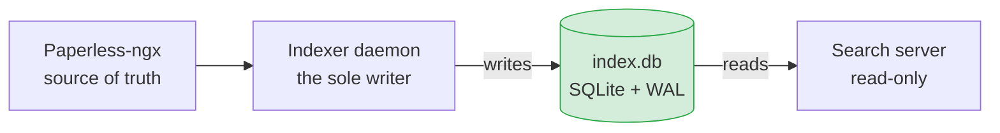

# The Search Index Store

`src/store/` is the database layer for semantic search. It owns a single SQLite file, `index.db`, and every line of SQL that touches it. The rest of the system never speaks SQL to the index — it calls typed methods on this package and gets dataclasses back.

## In a nutshell

The store holds everything search needs to find a document: the document's metadata, its text broken into chunks, and a vector embedding per chunk. It is a **search cache, not a system of record** — every byte is derived from Paperless-ngx and can be rebuilt from scratch at any time. There is no backup to keep.

One rule shapes the whole design: **one writer, many readers.** The indexer daemon is the sole process allowed to write the index; the search server only ever reads it. SQLite is run in WAL mode so those reads never block the writes. Because the index is disposable, a corrupt or stale file is never a crisis — you delete it and let the indexer build a fresh one.



> **Two databases, two packages.** This store (`src/store/`) is the **search index** and is entirely separate from the **application database** (`src/appdb/`, file `app.db`), which holds user accounts, sessions, API keys, runtime config, and daemon status. They are independent files with independent schemas and migration histories, so rebuilding the index never touches accounts or configuration. This document covers the index store only.

**Source:** `src/store/`

---

## How it works

The store is split cleanly down the middle: one class for writing, one package for reading. Everything else — the schema, the connection tuning, the migration runner — exists to serve that split safely.

### The sole-writer model

`StoreWriter` (`store/writer.py`) owns every write. `StoreReader` (`store/reader/`) owns every read. The indexer daemon constructs and holds one `StoreWriter`; the search server constructs and holds one `StoreReader`. No other code anywhere touches `sqlite3` for the index — no raw SQL, no `sqlite3.Row`, and no connection object ever crosses the package boundary.

Both halves are shared across many threads, so both serialise their work with an internal lock:

- **`StoreWriter`** holds a `threading.Lock` (`_write_lock`) around every write transaction, so the indexer's worker pool can share one instance safely. It runs `ensure_schema()` in its constructor, so migrations happen once, automatically, on startup. Its three read methods (`get_index_state`, `get_all_document_ids`, `read_meta`) need no lock — WAL allows concurrent reads on the same connection.
- **`StoreReader`** is a thin facade (`store/reader/_reader.py`) over three concept-modules: `_ranked` (vector and keyword search), `_lookups` (document, chunk, taxonomy, facet, stats, and integrity reads), and `_browse` (the Library document list). It holds a `threading.Lock` (`_query_lock`) around every query, so the search server can call it concurrently from many request threads.

Read-only access for the search server is enforced **structurally**, not by a flag: the `StoreReader` API simply has no write methods, and the indexer's `flock` makes it the only writer. (A connection-level `mode=ro` URI is deliberately avoided — a read-only SQLite connection cannot maintain the WAL `-shm` coordination file while a separate writer process is live.)

**Source:** `store/writer.py`, `store/reader/_reader.py`

### What a write looks like

The indexer drives writes through a handful of methods. The two that matter most:

- **`upsert_document(meta, chunks)`** is the workhorse. In one transaction it deletes the document's old chunks, inserts the new ones (each with its embedding), and writes the `documents` row. A crash mid-document leaves the prior version fully intact.
- **`refresh_taxonomy(entries)`** replaces the entire taxonomy table (DELETE all, INSERT new) at the start of each reconciliation cycle. This is why a rename in Paperless takes effect instantly everywhere with zero document rewrites — only one row changes.

The full method lists are in the [reference tables](#storewriter-public-methods) at the bottom.

### What a read looks like

The search server's two ranked queries — `vector_search` and `keyword_search` — both take a `SearchFilters` and apply it as a SQL `WHERE` clause **before** ranking. That ordering matters: filtered recall is exact, with no "KNN returned k rows, all of which were then filtered out" failure. Everything else the reader exposes is a look-up by id, a facet aggregation, or the paginated Library browse. The detail of how vectors are searched is under [Vector search](#vector-search) below.

---

## Schema

A single SQLite file at `INDEX_DB_PATH` (default `/data/index.db`). The DDL lives in `store/schema.py` as `CREATE TABLE IF NOT EXISTS` / `CREATE VIRTUAL TABLE IF NOT EXISTS` / `CREATE INDEX IF NOT EXISTS` statements — there is no ORM. There are five tables: `documents`, `taxonomy`, `chunks`, `chunks_fts`, and `meta`. The current schema version is **2** (`SCHEMA_VERSION` in `schema.py`).

### `documents`

One row per Paperless document.

```sql
documents(
  id               INTEGER PRIMARY KEY,   -- the Paperless document id
  title            TEXT,
  correspondent_id INTEGER,               -- FK-by-value into taxonomy; nullable
  document_type_id INTEGER,               -- FK-by-value into taxonomy; nullable
  tag_ids          TEXT NOT NULL,         -- JSON array of tag ids
  created          TEXT,                  -- document date, normalised UTC ISO-8601
  modified         TEXT NOT NULL,         -- Paperless 'modified', normalised UTC ISO-8601
  content_hash     TEXT NOT NULL,         -- SHA-256 of OCR content
  page_count       INTEGER,
  chunk_count      INTEGER,
  indexed_at       TEXT NOT NULL          -- when this row was last written
)
```

`documents` stores correspondent and document-type **ids**, not names. The `taxonomy` table maps `(kind, id) → name` and is refreshed every reconciliation cycle, so a rename in Paperless updates one row and is reflected everywhere at once, with no document rewrites.

Dates are normalised to UTC ISO-8601 at the store boundary (via `common.clock`) so range comparisons behave correctly.

### `taxonomy`

Maps each correspondent, document type, and tag id to its current display name.

```sql
taxonomy(
  kind  TEXT NOT NULL,   -- 'correspondent' | 'document_type' | 'tag'
  id    INTEGER NOT NULL,
  name  TEXT NOT NULL,
  PRIMARY KEY (kind, id)
)
```

Refreshed atomically (DELETE all, INSERT new) at the start of each reconciliation cycle.

### `chunks`

One row per text chunk, carrying its embedding.

```sql
chunks(
  id          INTEGER PRIMARY KEY,
  document_id INTEGER NOT NULL REFERENCES documents(id) ON DELETE CASCADE,
  chunk_index INTEGER NOT NULL,
  text        TEXT NOT NULL,
  page_hint   INTEGER,      -- page number for citations; nullable
  embedding   BLOB NOT NULL -- float32 vector, sqlite-vec serialised
)
```

The embedding is a plain `BLOB` column, **not** a `vec0` virtual table. `sqlite-vec` is loaded as an extension purely to supply the `vec_distance_cosine` scalar function and the `serialize_float32` blob helper; the vector search itself is an exact full scan (see [Vector search](#vector-search) below).

**The rowid invariant:** `chunks.id == chunks_fts.rowid` is load-bearing — both `vector_search` and `keyword_search` key a result back to its chunk by this id. `StoreWriter` inserts the `chunks` row first, captures the auto-assigned `id`, and reuses it as the explicit `rowid` for the `chunks_fts` insert, all inside one transaction.

### `chunks_fts`

The full-text search index over the chunk text.

```sql
CREATE VIRTUAL TABLE chunks_fts USING fts5 (text)
```

This is a **standalone** FTS5 table (not an external-content `content=chunks` table). It keeps its own copy of the chunk text, keyed by `rowid == chunks.id`. Standalone is chosen deliberately: an external-content table does not auto-sync when `chunks` rows vanish via FK cascade, which would silently leave a stale keyword index. Instead the writer keeps `chunks_fts` in step explicitly, by rowid, inside every delete transaction. The mechanics are under [FK cascade and FTS5](#fk-cascade-and-fts5) below.

### `meta`

A small key–value table for runtime state.

```sql
meta(key TEXT PRIMARY KEY, value TEXT)
```

Known keys:

| Key | Purpose |
|:---|:---|
| `schema_version` | Current migration version (currently 2) |
| `embedding_model` | Model name stored at the last index build |
| `embedding_dimensions` | Vector width stored at the last index build |
| `modified_watermark` | Highest Paperless `modified` timestamp seen by the incremental sync, minus a small overlap |
| `last_full_sweep_at` | Timestamp of the last completed deletion sweep |
| `last_reconcile_at` | Timestamp of the last completed reconciliation cycle |
| `failed_documents` | JSON object mapping `str(doc_id) → consecutive_failure_count` (the indexer's dead-letter ledger) |

### Indexes

```sql
CREATE INDEX idx_documents_modified         ON documents (modified);
CREATE INDEX idx_documents_correspondent_id ON documents (correspondent_id);
CREATE INDEX idx_documents_document_type_id ON documents (document_type_id);
CREATE INDEX idx_documents_created          ON documents (created);
CREATE INDEX idx_documents_indexed_at       ON documents (indexed_at);  -- v2
CREATE INDEX idx_chunks_document_id         ON chunks (document_id);
```

`idx_documents_indexed_at` (added in schema v2) backs the Library browse's default "recently added" sort (`ORDER BY indexed_at DESC, id DESC`); without it that very common view would do a full-table sort on every page request.

**Source:** `store/schema.py`

---

## Connection configuration: WAL and performance pragmas

Every connection opened by `store.schema.connect()` is configured identically. SQLite only honours a new `page_size` on an as-yet-empty database file, so it is set before `journal_mode=WAL` and any table creation; on an existing index it is a harmless no-op.

| Pragma | Value | Rationale |
|:---|:---|:---|
| `page_size` | `8192` | An 8 KiB page holds a 1536-dim float32 embedding (6,144 bytes) plus its row header on one leaf page, instead of spilling onto a 4 KiB overflow chain the brute-force scan must traverse for every chunk (~4% faster scans at 40k chunks) |
| `journal_mode` | `WAL` | One writer + concurrent readers across processes; no shared-lock contention |
| `synchronous` | `NORMAL` | Safe with WAL — a crash can lose the last checkpoint, never a committed transaction |
| `foreign_keys` | `ON` | Activates `ON DELETE CASCADE` on `chunks.document_id` |
| `busy_timeout` | `5000` ms | Prevents indefinite hangs when another connection holds a write lock |
| `cache_size` | `-262144` (256 MiB) | Keeps hot index/leaf pages resident and lets the indexer batch dirty pages during a bulk backfill instead of thrashing the 2 MiB default |
| `mmap_size` | `536870912` (512 MiB) | Memory-mapped reads serve committed embedding pages zero-copy, eliminating the per-`pread` userspace `memcpy` that dominates a full scan |
| `temp_store` | `MEMORY` | Keeps transient B-trees and sort spills in memory, not on disk |

The page-cache and mmap pragmas trade resident memory for read throughput — a deliberate win on the RAM-rich deployment target. Measured: a full vector scan over 40k chunks drops from ~93 ms to ~56 ms (≈40% faster), reproducible warm-cache. `mmap` only maps up to the file size, so resident memory tracks the database, not the 512 MiB ceiling.

Connections are opened with `check_same_thread=False`. This is required because `StoreWriter` shares one connection across the indexer's worker threads, serialised by its internal lock; without the flag Python's `sqlite3` raises a `ProgrammingError` when the lock-protected write runs on a thread other than the one that opened the connection.

The indexer calls `checkpoint()` at the end of every reconciliation cycle (see [WAL checkpoint and planner stats](#wal-checkpoint-and-planner-stats)), so the search server never chases an unbounded WAL file.

**Source:** `store/schema.py`

---

## Vector search

`vector_search` performs an **exact scalar-distance KNN** over the filtered candidate set — a brute-force scan, deliberately, at this scale:

```sql
SELECT c.id, c.document_id, c.text, c.page_hint,
       vec_distance_cosine(c.embedding, :q) AS distance
FROM chunks c
JOIN documents d ON d.id = c.document_id
WHERE <resolved filters on d>
ORDER BY distance
LIMIT :k
```

The query blob is passed straight to `vec_distance_cosine` with no per-row dimension check. That is safe because `check_embedding_model()` wipes and rebuilds every chunk whenever the model or dimension changes, so all stored embeddings always share one width (see [Embedding-Model Change Rebuild](#embedding-model-change-rebuild)).

At the project's target scale of roughly 1,000–10,000 documents (tens of thousands of chunks) this full scan runs in single-digit-to-low-tens-of-milliseconds. An approximate-nearest-neighbour index is added only if measured against a real corpus to be necessary.

`keyword_search` runs FTS5 BM25 over the same filtered set: `FROM chunks_fts AS fts JOIN chunks c ON c.id = fts.rowid JOIN documents d ON d.id = c.document_id WHERE <filters> AND fts.text MATCH ?`. Each term is quoted (`escape_fts_term`, which doubles embedded double-quotes so a term like `foo OR bar` is matched as one literal phrase rather than a boolean expression) and the terms are combined with `AND`; the text is bound as a parameter.

The dynamic `WHERE` clauses are built by `store/reader/_filters.py` from a fixed whitelist of columns and `?` placeholders only — no caller value is ever spliced into a SQL string. Results from both searches are fused in the retriever with Reciprocal Rank Fusion (see [Search](search.md)).

**Source:** `store/reader/_ranked.py`, `store/reader/_filters.py`

---

## Migration runner

`store/migrations.py` holds an ordered list of `(version, function)` pairs. On startup, `ensure_schema()` calls `run_migrations(conn)`, which:

1. Reads `meta.schema_version` (0 for a fresh database — a missing `meta` table is detected by the `no such table` marker and mapped to version 0; **any other** `OperationalError`, such as a malformed image or a locked file, propagates rather than being masked as fresh).
2. Raises `StoreError` if the stored version exceeds the highest known version — the database was written by newer code, and proceeding could corrupt or misinterpret the schema.
3. Applies each pending migration inside its own explicit `BEGIN` / `COMMIT`. The `schema_version` is persisted inside the same transaction, so a crash mid-migration rolls back entirely to the pre-migration state.

The registered migrations:

| Version | Migration |
|:---|:---|
| 1 | Create all tables, virtual tables, and indexes |
| 2 | Add `idx_documents_indexed_at` (the Library "added" sort) |

`conn.executescript()` is deliberately avoided in migration functions: it issues an implicit `COMMIT` before executing, which would break atomicity. Each DDL statement is executed individually with `conn.execute()` inside the surrounding transaction (comment lines are stripped first, so a `;` inside a comment cannot split into a broken fragment).

The mechanism exists from the first commit so that long-lived indexes never need a manual wipe to upgrade.

**Source:** `store/migrations.py`

---

## WAL checkpoint and planner stats

`checkpoint()` runs at the end of every reconciliation cycle. It does two things, in order:

1. `PRAGMA optimize` — refreshes `sqlite_stat1` statistics. After a large backfill the tables have no stats, so the read-side planner (the search server's filter and browse queries) plans against default uniform-distribution assumptions and can pick a worse index. `optimize` is self-throttling — a no-op when nothing changed — so it is safe to call every cycle.
2. `PRAGMA wal_checkpoint(TRUNCATE)` — truncates the WAL so the search server never chases an unbounded file. Running `optimize` first folds its small `sqlite_stat1` write into the same truncation.

**Source:** `store/writer.py`

---

## FK Cascade and FTS5

`chunks` declares `REFERENCES documents(id) ON DELETE CASCADE`, so deleting a `documents` row automatically removes its `chunks` rows. The `chunks_fts` FTS5 virtual table is **standalone** (not `content=chunks`) and does **not** honour FK cascade.

Every delete operation in `StoreWriter` therefore follows this sequence within one transaction:

1. Collect the `chunks.id` values for the target document(s).
2. Delete from `chunks_fts` by rowid explicitly.
3. Delete from `documents` (the cascade removes `chunks`).

This ordering is documented at the delete site with a `# why` comment. The same step-1-before-delete ordering is why the per-document upsert deletes the document's old chunks first (while the ids are still available) before re-inserting.

**Source:** `store/writer.py`

---

## Embedding-Model Change Rebuild

On startup, `StoreWriter.check_embedding_model()` compares `EMBEDDING_MODEL` and `EMBEDDING_DIMENSIONS` against the values stored in `meta`:

- **Match** — returns `False`; no action needed.
- **Mismatch or first run** — wipes `chunks`, `chunks_fts`, `documents`, and `taxonomy`, clears `modified_watermark`, writes the new model name and dimensions to `meta`, and returns `True`. The next reconciliation cycle then re-indexes and re-embeds everything from scratch (with the watermark cleared, the incremental sync sees no server-side filter and re-walks the whole archive).

Wiping `documents` alongside the chunks is the subtle, load-bearing part: if the document rows survived, the reconcile's content-hash check would classify every document as unchanged and take a metadata-only pass — leaving the index permanently chunk-less after a model change. The model/dimensions are stamped in the **same transaction** as the wipe, so a crash can never leave the stored model disagreeing with the (now empty) chunk set.

Vectors from different embedding models or dimensions are incomparable; silently serving stale vectors would produce wrong results, so the wipe is correct and necessary. But because a full re-embed is the single most expensive event in the system, `store/_reembed_guard.py` emits a **CRITICAL** `store.full_reembed_projected` log naming the trigger and the projected scope (document and chunk counts) *before* the wipe — so an unintended trigger (for example an unpinned `EMBEDDING_MODEL` changing under a Watchtower auto-update) is loud in the logs. The guard is observability only: if a read error stops it projecting the scope, it degrades to a CRITICAL log with the scope marked unknown (`-1`) and the wipe proceeds — only its loudness is at stake, never its correctness. The same guard fires for the operator `rebuild_index()`.

**Source:** `store/writer.py`, `store/_reembed_guard.py`

---

## Corruption Recovery

The index is a **derived artefact** — every byte is reconstructable from Paperless-ngx. There is no backup requirement.

The search server's `GET /api/healthz` checks the index on every request and surfaces a bad index as `503`. The check runs `get_stats` and `PRAGMA quick_check` under the reader's lock, offloaded to the thread pool so the Docker healthcheck never stalls the event loop. The three states are decided by `evaluate_index_health` in `search/routes.py`:

| Status | Meaning |
|:---|:---|
| `index-not-ready` | The DB file is absent; **or** it exists but the schema has not been applied (surfaced as `SchemaNotReadyError`); **or** the schema exists but `last_reconcile_at` is unset (reconciliation has never completed); **or** `get_stats` failed unexpectedly |
| `index-corrupt` | The schema and a `last_reconcile_at` timestamp are present, but `PRAGMA quick_check` reports corruption |
| `ok` | Schema present, at least one reconciliation completed, `quick_check` passed |

`SchemaNotReadyError` exists precisely so the healthz handler can tell "the indexer has not built the index yet" apart from genuine corruption without inspecting `sqlite3` internals — `sqlite3.connect` auto-creates an empty file the moment a path is opened, so a present-but-empty file is *not* a ready index.

### Operator runbook (rebuild from scratch)

There are two ways to force a full rebuild. Both are safe — `app.db` (accounts, keys, config) is a separate file and is untouched.

**In-app (preferred).** An admin triggers **Rebuild index** from the Index dashboard (`POST /api/index/rebuild`). The search server writes a `rebuild.request` sentinel beside `index.db`; the indexer consumes it at the top of its next cycle, calls `StoreWriter.rebuild_index()` (one transaction — the index is either wholly intact or wholly empty, never half-wiped), and the same cycle's incremental sync re-indexes the whole archive. No file deletion, no restart.

**Manual (when the index file itself is unreadable).** If `quick_check` fails so hard the DB cannot be opened:

1. Observe `503 index-corrupt` from `GET /api/healthz`.
2. Stop the indexer daemon.
3. Delete `<INDEX_DB_PATH>` and its companion lock and WAL files (e.g. `rm /data/index.db /data/index.db.lock /data/index.db-wal /data/index.db-shm`).
4. Restart the indexer daemon. The next reconciliation rebuilds the index from an empty store — a full backfill that re-embeds every document.
5. Monitor progress on the Index dashboard (`GET /api/index/status`, which reports the indexer heartbeat and document count). `GET /api/stats` shows the same counts but requires an authenticated Read-only-or-above caller; the search server keeps returning `503 index-not-ready` from `healthz` until the first reconciliation completes.

**Source:** `search/routes.py`, `store/writer.py`

---

## Reference: public methods

### `StoreWriter` public methods

| Method | Purpose |
|:---|:---|
| `ensure_schema()` (called in `__init__`) | Run pending migrations |
| `get_index_state() → dict[int, IndexState]` | Current `(modified, content_hash)` per document |
| `get_all_document_ids() → set[int]` | All document ids in the index |
| `read_meta(key) / write_meta(key, value)` | Access the `meta` table |
| `upsert_document(meta, chunks)` | Atomic full upsert: delete old chunks, insert new, write the `documents` row |
| `update_metadata(meta)` | Metadata-only update; no re-chunk, no re-embed. Raises if zero rows match (the index has diverged) |
| `delete_documents(ids)` | Delete documents and all their chunks |
| `refresh_taxonomy(entries)` | Replace the entire taxonomy atomically |
| `check_embedding_model() → bool` | Detect a model/dimension mismatch; wipe and reset the watermark if needed |
| `rebuild_index(*, embedding_model, embedding_dimensions)` | Operator "Rebuild index": wipe all chunks, documents, taxonomy, and the watermark, then stamp the passed (live) model/dimensions |
| `checkpoint()` | `PRAGMA optimize`, then a `wal_checkpoint(TRUNCATE)` |
| `close()` | Close the connection |

### `StoreReader` public methods

| Method | Purpose |
|:---|:---|
| `vector_search(query_embedding, k, filters)` | Exact cosine-distance KNN over the filtered set |
| `keyword_search(terms, k, filters)` | FTS5 BM25 search over the filtered set |
| `get_documents(ids) → list[IndexedDocument]` | Document rows with resolved taxonomy names |
| `get_document_summary(id) → DocumentSummary \| None` | One document row (with `page_count`) for the Library detail view |
| `get_chunks(ids) → list[ChunkHit]` | Chunk rows by id |
| `get_taxonomy(kind) → list[TaxonomyEntry]` | All entries of one kind, ordered by name |
| `list_facets() → FacetSet` | All taxonomy entries + the index's date range |
| `get_stats() → IndexStats` | Document count, chunk count, last reconcile timestamp, embedding model |
| `get_failed_documents() → list[FailedDocument]` | The indexer's dead-letter ledger, joined to titles, for the Index dashboard |
| `list_documents(query) → DocumentPage` | Paginated, sorted, filtered Library browse |
| `quick_check() → bool` | Run `PRAGMA quick_check` |
| `close()` | Close the connection |

`SearchFilters` — used by both search methods — is a frozen dataclass defined in `store/models.py` and re-exported from both `store/__init__.py` and `store/reader/__init__.py`:

```python
@dataclass(frozen=True, slots=True)
class SearchFilters:
    date_from: str | None          # inclusive lower bound on documents.created (date portion)
    date_to: str | None            # inclusive upper bound on documents.created (date portion)
    correspondent_id: int | None   # exact match
    document_type_id: int | None   # exact match
    tag_ids: tuple[int, ...]       # all ids must be present in documents.tag_ids
```

Filters are applied as SQL `WHERE` clauses *before* ranking, so filtered recall is exact — there is no "KNN returned k rows, all then filtered out" failure. The date bounds compare against `date(d.created)`, which strips the stored timestamp's time and timezone, so a bare `YYYY-MM-DD` bound correctly includes any document on that date; the `tag_ids` test uses `json_each(d.tag_ids)` and requires every supplied id to be present.

**Source:** `store/writer.py`, `store/reader/`, `store/models.py`

---

## Reference: data models (`store/models.py`)

All values crossing the store boundary are frozen dataclasses with `slots=True`. Raw `sqlite3.Row` objects never leave `src/store/`.

| Class | Crosses boundary |
|:---|:---|
| `DocumentMeta` | Input to `upsert_document` / `update_metadata` |
| `ChunkInput` | Input to `upsert_document` — one chunk + embedding |
| `TaxonomyEntry` | Input to `refresh_taxonomy`; output of `list_facets` / `get_taxonomy` |
| `SearchFilters` | Input to `vector_search` / `keyword_search` |
| `DocumentBrowseQuery` | Input to `list_documents` |
| `IndexState` | Output of `get_index_state` |
| `ChunkHit` | Output of `vector_search` / `keyword_search` / `get_chunks` |
| `IndexedDocument` | Output of `get_documents` — row joined to taxonomy names |
| `DocumentSummary` | Output of `get_document_summary` — like `IndexedDocument` plus `page_count` |
| `DocumentPage` | Output of `list_documents` — a page of `DocumentSummary` plus the total match count |
| `FacetSet` | Output of `list_facets` |
| `IndexStats` | Output of `get_stats` |
| `FailedDocument` | Output of `get_failed_documents` — the dead-letter ledger for the dashboard |
